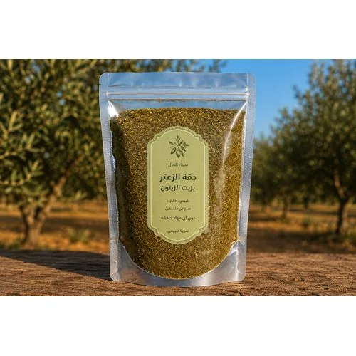
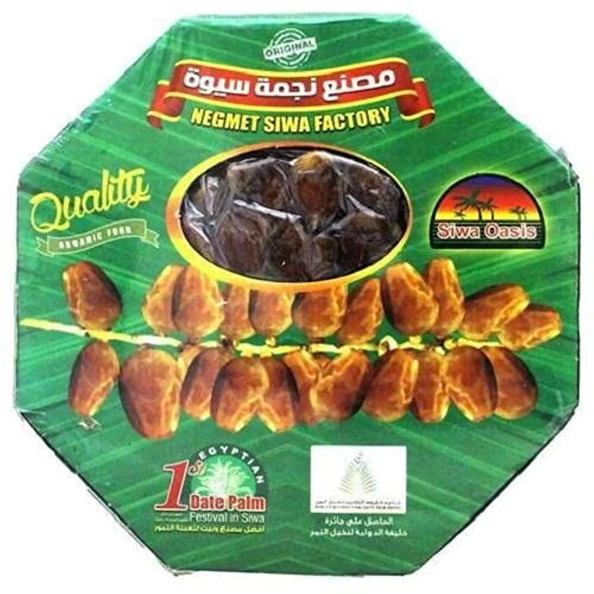
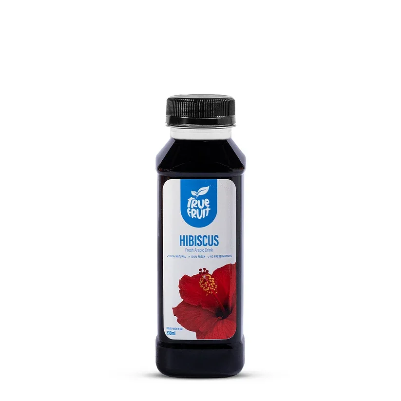
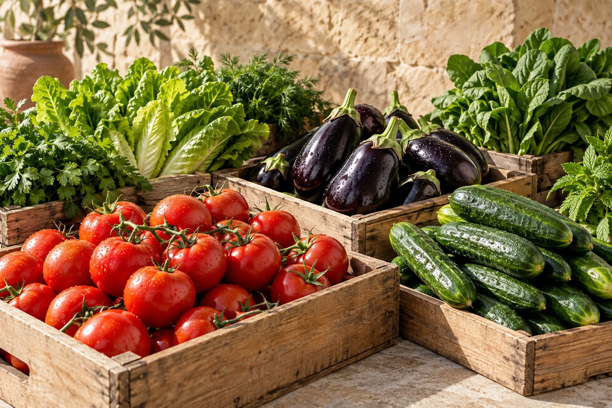
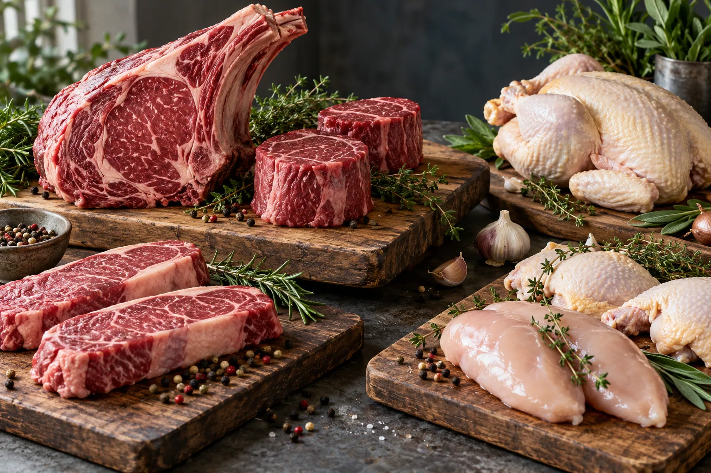
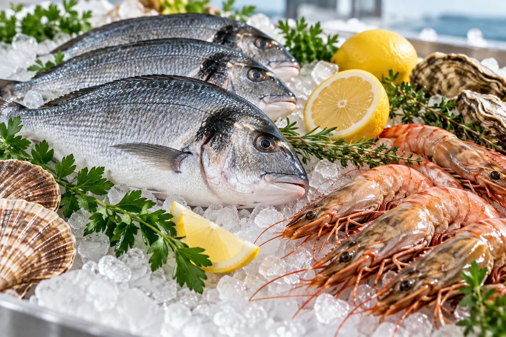
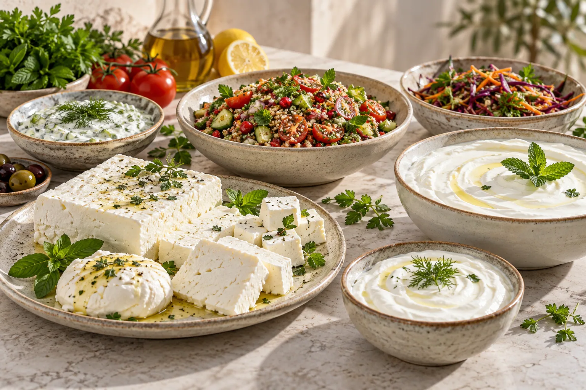
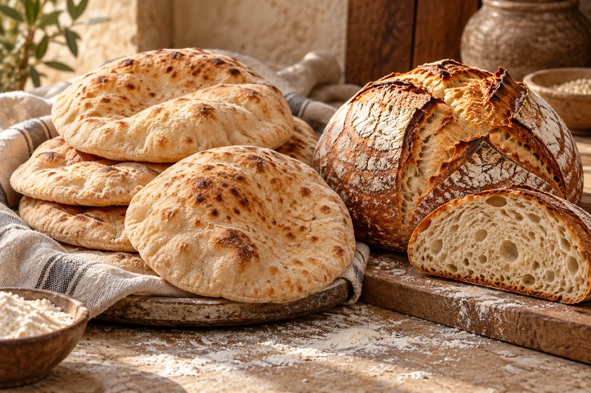
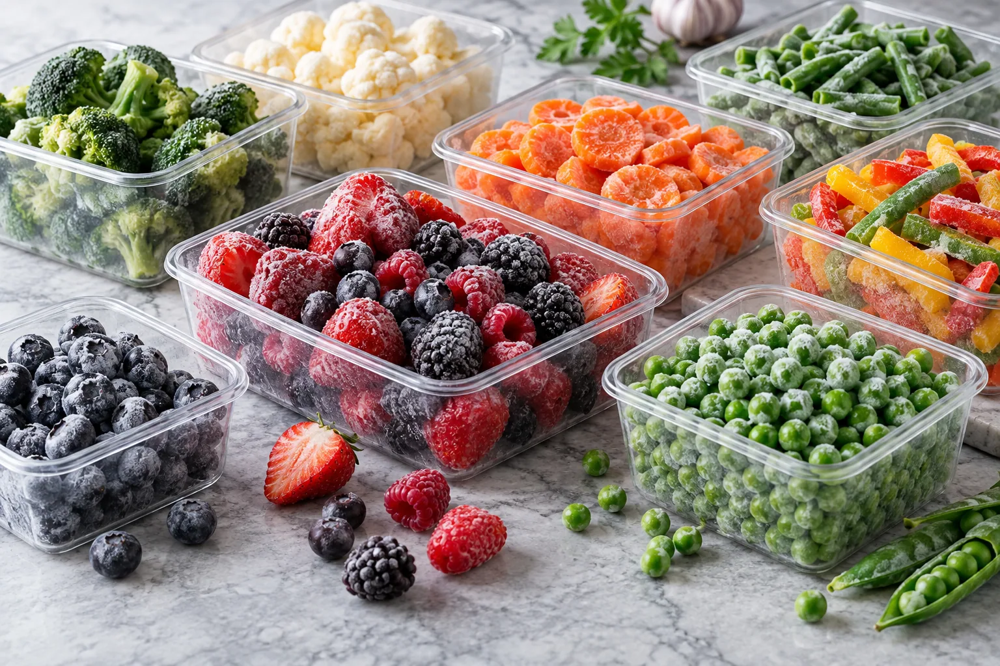
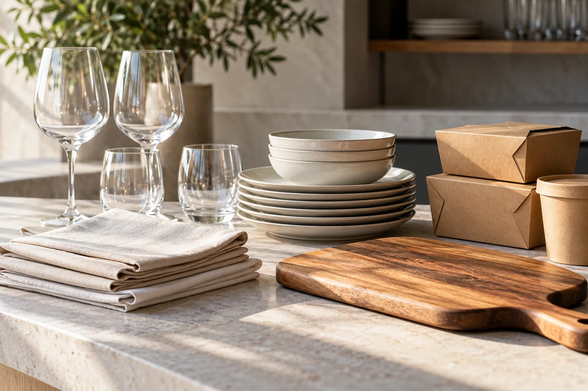

# Chef Central website

Concept website for professional kitchens in Egypt.

## Upload to GitHub Pages

Upload **the contents** of this folder to the root of the `main` branch. In Settings → Pages, select **Deploy from a branch**, `main`, `/ (root)`. Keep both HTML pages, both product JSON files, the `product-sheets` folder, and all image files in their relative positions.

Named products are sourcing candidates, not confirmed stock, partnerships or wholesale prices. The catalog artwork is AI-generated illustrative imagery for product types, not genuine product or packaging photography. The contact form opens the visitor's email application.

## Full website code

The HTML pages and research data are included below as requested. Edit the actual `.html` or `.json` files for GitHub Pages; changing only this README does not change the website.

### `index.html`

```html
<!doctype html><html lang="en"><head><meta charset="utf-8"><meta name="viewport" content="width=device-width,initial-scale=1"><title>Chef Central — Horeca supplier for Egypt's finest local produce</title><meta name="description" content="A concept for a premium Egyptian horeca supplier, connecting professional kitchens with a curated assortment of local produce and specialty ingredients."><link rel="preconnect" href="https://fonts.googleapis.com"><link rel="preconnect" href="https://fonts.gstatic.com" crossorigin><link href="https://fonts.googleapis.com/css2?family=DM+Sans:wght@400;500;600;700&family=Playfair+Display:wght@400;500&display=swap" rel="stylesheet"><link rel="icon" type="image/svg+xml" href="data:image/svg+xml,%3Csvg xmlns='http://www.w3.org/2000/svg' viewBox='0 0 64 64'%3E%3Crect width='64' height='64' rx='12' fill='%2326211e'/%3E%3Cpath d='M44 18a19 19 0 1 0 0 28M32 46V18m0 14c-7-2-10-6-10-12m10 9c7-2 10-6 10-12' fill='none' stroke='%23dec39c' stroke-width='3'/%3E%3C/svg%3E"><style>
:root{--ink:#26211e;--dark:#2a3028;--green:#354638;--cream:#f6f3ec;--line:#dedbd2;--gold:#b67c44;--white:#fff}*{box-sizing:border-box}html{scroll-behavior:smooth}body{margin:0;color:var(--ink);background:var(--cream);font:16px 'DM Sans',sans-serif}button,input{font:inherit}button{cursor:pointer}a{color:inherit;text-decoration:none}.utility{background:var(--dark);color:#e9e5da;padding:9px 5%;display:flex;justify-content:space-between;gap:20px;font-size:12px;letter-spacing:.03em}.utility span:last-child{color:#d9c8aa}.header{background:#fff;border-bottom:1px solid var(--line);padding:18px 5%;display:grid;grid-template-columns:auto minmax(230px,1fr) auto;gap:40px;align-items:center}.brand{font:500 31px 'Playfair Display',serif;letter-spacing:-.05em;white-space:nowrap}.brand small{display:block;font:700 9px 'DM Sans',sans-serif;letter-spacing:.22em;color:var(--gold);text-transform:uppercase;margin-top:-1px}.search{display:flex;border:1px solid #cfcfc7;max-width:620px;width:100%;height:49px;background:#faf9f6}.search input{border:0;background:transparent;outline:0;min-width:0;flex:1;padding:0 17px;font-size:14px}.search button{border:0;background:var(--green);color:white;padding:0 20px;font-size:13px;font-weight:700}.account{display:flex;gap:20px;align-items:center;font-size:13px;font-weight:700;white-space:nowrap}.account a:last-child{background:var(--gold);padding:14px 17px;color:#fff}.categories{background:#fff;padding:0 5%;display:flex;align-items:center;gap:32px;border-bottom:1px solid var(--line);overflow-x:auto;white-space:nowrap}.categories a{padding:16px 0;display:inline-block;font-size:13px;font-weight:700}.categories a:first-child{color:#986333}.categories a:hover,.account a:hover{color:var(--gold)}.categories .producer-link{margin-left:auto}.mobile-menu{display:none}.hero{margin:26px 5% 0;min-height:455px;display:grid;grid-template-columns:46% 54%;background:var(--green);color:#fff}.hero-copy{padding:58px clamp(30px,5vw,80px);display:flex;flex-direction:column;justify-content:center}.kicker{font-size:11px;letter-spacing:.19em;text-transform:uppercase;font-weight:700;color:#e1bb89}.hero h1{font:400 clamp(42px,4.2vw,69px)/1.07 'Playfair Display',serif;letter-spacing:-.045em;margin:17px 0}.hero p{line-height:1.7;color:#e3e7dc;max-width:490px;margin:0}.hero-image{background:url('hero.png') center/cover;min-height:370px}.button{display:inline-flex;justify-content:space-between;align-items:center;gap:34px;align-self:flex-start;background:#d6af7e;color:#201c17;border:0;padding:15px 19px;margin-top:28px;font-size:12px;font-weight:700;letter-spacing:.08em;text-transform:uppercase}.button:hover{background:#efc898}.button.dark{background:var(--green);color:#fff}.benefits{margin:0 5%;display:grid;grid-template-columns:repeat(3,1fr);background:#eeeae1;border:1px solid var(--line)}.benefits div{padding:23px 28px;border-right:1px solid var(--line)}.benefits div:last-child{border:0}.benefits b{display:block;font-size:14px}.benefits span{display:block;color:#66645d;font-size:13px;margin-top:5px}.section{padding:76px 5%}.section-head{display:flex;justify-content:space-between;align-items:end;gap:30px;margin-bottom:26px}.section-head h2,.story h2,.cta h2{font:400 clamp(33px,3vw,47px)/1.1 'Playfair Display',serif;letter-spacing:-.035em;margin:8px 0 0}.section-head p{color:#66615b;max-width:420px;line-height:1.6;margin:0}.overline{color:#a16e3d;font-size:11px;letter-spacing:.18em;font-weight:700;text-transform:uppercase}.category-grid{display:grid;grid-template-columns:repeat(6,1fr);gap:11px}.category-card{border:1px solid var(--line);background:#fff;min-height:150px;padding:18px;display:flex;flex-direction:column;justify-content:space-between;transition:.2s}.category-card:hover{border-color:var(--green);transform:translateY(-3px)}.category-card .num{font-size:11px;color:#9f8062}.category-card strong{font:400 22px/1.12 'Playfair Display',serif}.category-card span:last-child{align-self:flex-end;color:var(--gold)}.products-section{background:#eae7df}.filters{display:flex;gap:8px;flex-wrap:wrap;margin:0 0 25px}.filters button{background:#fff;border:1px solid #d0cec6;padding:10px 16px;font-size:13px}.filters button.active,.filters button:hover{background:var(--green);border-color:var(--green);color:white}.products{display:grid;grid-template-columns:repeat(4,1fr);gap:16px}.product{background:white;border:1px solid var(--line);display:flex;flex-direction:column}.photo{height:190px;background:url('assortment.png') var(--pos,center)/cover}.product:nth-child(1) .photo{--pos:7% 45%}.product:nth-child(2) .photo{--pos:43% 50%}.product:nth-child(3) .photo{--pos:70% 50%}.product:nth-child(4) .photo{--pos:93% 50%}.product:nth-child(5) .photo{--pos:16% 80%}.product:nth-child(6) .photo{--pos:60% 80%}.product:nth-child(7) .photo{--pos:42% 15%}.product:nth-child(8) .photo{--pos:85% 20%}.product-info{padding:18px;display:flex;flex-direction:column;flex:1}.product small{font-size:11px;text-transform:uppercase;letter-spacing:.12em;color:#9d7046}.product h3{font:400 23px 'Playfair Display',serif;margin:9px 0 7px}.product p{font-size:13px;line-height:1.5;color:#6f6a64;margin:0 0 16px}.product .unit{border-top:1px solid var(--line);padding-top:12px;margin-top:auto;font-size:12px;color:#77716c;display:flex;justify-content:space-between}.product .unit b{color:var(--green);font-weight:700}.empty{display:none;background:#fff;padding:35px;color:#605c56}.note{font-size:12px;color:#69645e;margin-top:22px}.story{display:grid;grid-template-columns:1fr 1fr;background:#fff;margin:0 5% 70px}.story-image{background:url('assortment.png') center/cover;min-height:400px}.story-content{padding:65px 10%;align-self:center}.story-content p{line-height:1.7;color:#665f57}.text-link{border-bottom:1px solid currentColor;font-size:12px;font-weight:700;text-transform:uppercase;letter-spacing:.1em;padding-bottom:6px;display:inline-block;margin-top:10px}.cta{background:var(--green);color:#fff;padding:70px 5%;display:flex;justify-content:space-between;align-items:center;gap:40px}.cta p{color:#d7ded4;line-height:1.6;max-width:660px}.cta .button{margin:0;white-space:nowrap}footer{background:#242620;color:#d9dbd2;padding:58px 5% 25px}.footer-content{display:flex;justify-content:space-between;gap:40px;padding-bottom:65px}.footer-content p{max-width:360px;line-height:1.6;color:#aeb4aa}.footer-links{display:flex;gap:75px}.footer-links div{display:flex;flex-direction:column;gap:13px;font-size:13px}.footer-links b{color:#d7af7d;text-transform:uppercase;letter-spacing:.13em;font-size:11px;margin-bottom:7px}.footer-bottom{border-top:1px solid #ffffff25;padding-top:22px;display:flex;justify-content:space-between;color:#9ba197;font-size:12px}section[id]{scroll-margin-top:20px}@media(max-width:1000px){.header{gap:18px}.account a:first-child{display:none}.categories{gap:23px}.category-grid{grid-template-columns:repeat(3,1fr)}.products{grid-template-columns:repeat(2,1fr)}}@media(max-width:700px){.utility span:last-child{display:none}.header{grid-template-columns:1fr auto;padding:14px 5%}.brand{font-size:26px}.search{grid-row:2;grid-column:1/3;max-width:none}.account{display:none}.mobile-menu{display:block;border:0;background:none;font-size:25px}.categories{gap:22px}.hero{margin:15px 0 0;grid-template-columns:1fr}.hero-copy{padding:44px 6%;min-height:370px}.hero-image{min-height:230px}.benefits{margin:0;grid-template-columns:1fr}.benefits div{padding:17px 6%;border-right:0;border-bottom:1px solid var(--line)}.section{padding:60px 5%}.section-head{display:block}.section-head p{margin-top:16px}.category-grid{grid-template-columns:repeat(2,1fr)}.products{gap:10px}.photo{height:150px}.product-info{padding:14px}.story{margin:0;grid-template-columns:1fr}.story-image{min-height:280px}.story-content{padding:50px 6%}.cta{display:block;padding:60px 6%}.cta .button{margin-top:12px}.footer-content{display:block}.footer-links{margin-top:40px;gap:50px}.footer-bottom{display:block;line-height:1.8}}@media(max-width:430px){.products{grid-template-columns:1fr 1fr}.photo{height:125px}.product h3{font-size:19px}.product p{display:none}.category-card{min-height:125px}.category-card strong{font-size:19px}}

/* Assortment collections */
.categories{flex-wrap:wrap;gap:0 23px}.categories a{padding:13px 0}.categories .producer-link{margin-left:0}.hero h1{font-size:clamp(34px,3.55vw,56px);line-height:1.12}.hero h1 em{color:#e5c296;font-style:normal}.category-grid{grid-template-columns:repeat(3,1fr)}.category-card{min-height:205px;color:#fff;position:relative;isolation:isolate;background:#273b2d;border:0;overflow:hidden}.category-card:before{content:'';position:absolute;inset:0;background:linear-gradient(0deg,#151a15c9,#151a1510 80%),var(--card-image) center/cover;z-index:-1;transition:transform .3s}.category-card:hover:before{transform:scale(1.05)}.category-card .num,.category-card span:last-child{color:#f6e3c7}.category-card strong{font-size:28px;text-shadow:0 1px 12px #0007}.photo{background-image:var(--photo)!important;background-position:center!important;background-size:cover!important}.product .unit a{color:var(--green);font-weight:700}.product[hidden]{display:none!important}@media(max-width:700px){.categories{flex-wrap:nowrap;overflow-x:auto;gap:20px}.categories a{flex:none}.category-grid{grid-template-columns:repeat(2,1fr)}.hero h1{font-size:clamp(34px,8vw,48px)}}@media(max-width:430px){.category-card{min-height:160px}.category-card strong{font-size:21px}}
.cta{display:grid;grid-template-columns:minmax(0,1fr) minmax(380px,1fr);align-items:start;gap:8%;}.contact-intro{padding-top:26px}.contact-direct{font-size:14px}.contact-direct a{color:#eac597;border-bottom:1px solid currentColor;overflow-wrap:anywhere}.contact-form{background:#f8f6f0;color:var(--ink);padding:35px;display:flex;flex-direction:column;gap:16px}.contact-form label{display:flex;flex-direction:column;gap:8px;font-size:13px;font-weight:700}.contact-form .field-label{display:inline;line-height:1.3}.contact-form label small{font-weight:400;color:#6c675f}.contact-form input,.contact-form textarea,.contact-form select{width:100%;border:1px solid #c8c6bd;background:white;color:var(--ink);border-radius:0;padding:12px 14px;font:16px 'DM Sans',sans-serif;outline-color:var(--green)}.contact-form textarea{resize:vertical;min-height:120px}.form-row{display:grid;grid-template-columns:1fr 1fr;gap:16px}.contact-form .button{margin-top:3px;align-self:flex-start}.contact-form .form-help,.contact-form .form-status{font-size:12px;line-height:1.5;color:#655f58;margin:0}.form-status:empty{display:none}@media(max-width:850px){.cta{grid-template-columns:1fr;gap:20px}.contact-intro{padding:0}}@media(max-width:500px){.form-row{grid-template-columns:1fr}.contact-form{padding:25px 20px}}.process-section{background:#f6f3ec;padding-top:120px;padding-bottom:120px}.process-intro{display:grid;grid-template-columns:1.05fr .95fr;gap:8%;align-items:end;border-bottom:1px solid #c9c6bd;padding-bottom:48px;margin-bottom:50px}.process-intro h2{font:400 clamp(42px,4.5vw,68px)/1.08 'Playfair Display',serif;letter-spacing:-.045em;margin:14px 0 0}.process-intro p{font-size:18px;line-height:1.75;color:#5f5b53;margin:0;max-width:570px}.process-layout{display:grid;grid-template-columns:minmax(0,1.4fr) minmax(300px,.75fr);gap:7%;align-items:start}.process-steps{list-style:none;padding:0;margin:0}.process-steps li{display:grid;grid-template-columns:72px 1fr;gap:18px;padding:27px 0 30px;border-bottom:1px solid #d3cfc4}.process-steps li:first-child{padding-top:0}.process-number{font:400 26px 'Playfair Display',serif;color:#a5784f}.process-steps h3{font:400 27px/1.22 'Playfair Display',serif;letter-spacing:-.025em;margin:0 0 9px}.process-steps p{line-height:1.7;color:#615e56;margin:0;max-width:670px}.process-aside{background:#344537;color:#fff;padding:42px 38px}.process-aside .overline{color:#e1bb89}.process-aside h3{font:400 37px/1.15 'Playfair Display',serif;letter-spacing:-.03em;margin:14px 0 30px}.standard{border-top:1px solid #ffffff49;padding:19px 0}.standard b{font-size:14px}.standard p{font-size:14px;line-height:1.6;color:#dce3d9;margin:7px 0 0}.process-aside .process-note{border-top:1px solid #ffffff49;padding-top:20px;color:#dce3d9;font-size:12px;line-height:1.55;margin:18px 0 0}.process-actions{display:flex;align-items:center;gap:30px;margin-top:42px}.process-actions .button{margin:0}@media(max-width:850px){.process-intro,.process-layout{grid-template-columns:1fr;gap:35px}.process-intro{align-items:start}.process-aside{max-width:none}.process-actions{flex-wrap:wrap}}@media(max-width:550px){.process-section{padding-top:70px;padding-bottom:70px}.process-intro{padding-bottom:30px;margin-bottom:25px}.process-intro p{font-size:16px}.process-steps li{grid-template-columns:45px 1fr;gap:12px}.process-number{font-size:20px}.process-steps h3{font-size:23px}.process-aside{padding:32px 25px}.process-actions{align-items:flex-start;gap:22px}}

/* Composition and responsive refinements */
:root{--content-width:1440px;--gutter:clamp(20px,5vw,88px)}
body{-webkit-font-smoothing:antialiased}
.utility,.header,.categories,footer{padding-left:max(var(--gutter),calc((100vw - var(--content-width))/2));padding-right:max(var(--gutter),calc((100vw - var(--content-width))/2))}
.section,.cta{padding-left:max(var(--gutter),calc((100vw - var(--content-width))/2));padding-right:max(var(--gutter),calc((100vw - var(--content-width))/2))}
.hero,.benefits,.story{width:min(calc(100% - var(--gutter) - var(--gutter)),var(--content-width));margin-left:auto;margin-right:auto}
.hero{margin-top:28px;grid-template-columns:minmax(0,1fr) minmax(0,1.35fr);min-height:540px}
.hero-copy{padding:clamp(40px,4vw,72px);max-width:670px}
.hero h1{font-size:clamp(38px,3.65vw,59px);line-height:1.1;max-width:580px}
.hero p{max-width:52ch}
.hero-image{min-height:540px}
.benefits div{padding:27px clamp(20px,2.4vw,36px)}
.section{padding-top:clamp(72px,6.5vw,104px);padding-bottom:clamp(72px,6.5vw,104px)}
.section-head{margin-bottom:34px;align-items:end}
.section-head h2,.story h2,.cta h2{line-height:1.14}
.section-head p{max-width:48ch}
.categories{flex-wrap:nowrap;overflow-x:auto;gap:clamp(18px,2vw,32px);scrollbar-width:thin}
.categories a{flex:none}
.category-grid{gap:clamp(13px,1.5vw,22px)}
.category-card{min-height:220px;aspect-ratio:1.75;padding:24px}
.category-card strong{max-width:16ch}
.products{gap:clamp(14px,1.4vw,20px)}
.photo{height:auto;aspect-ratio:1.618}
.product-info{padding:20px}
.product h3{line-height:1.2}
.story{grid-template-columns:1.15fr 1fr;margin-bottom:0}
.story-image{min-height:490px}
.story-content{padding:clamp(42px,5vw,80px);max-width:690px}
.story-content p{max-width:58ch}
.process-section{padding-top:clamp(80px,7vw,112px);padding-bottom:clamp(80px,7vw,112px)}
.process-intro{grid-template-columns:1fr 1fr;gap:8%;padding-bottom:42px;margin-bottom:42px}
.process-layout{grid-template-columns:minmax(0,1.618fr) minmax(300px,1fr);gap:5.5%}
.process-aside{position:sticky;top:24px}
.cta{grid-template-columns:minmax(0,1fr) minmax(0,1.618fr);gap:6%;padding-top:clamp(75px,7vw,112px);padding-bottom:clamp(75px,7vw,112px)}
.contact-intro{max-width:510px}
.contact-form{width:100%;max-width:760px;padding:clamp(28px,3vw,44px);gap:18px}
.button,.search button,.filters button,.account a:last-child{min-height:44px}
:where(a,button,input,textarea,select):focus-visible{outline:3px solid #c78e53;outline-offset:3px}
@media(max-width:1000px){.hero{grid-template-columns:1fr 1.1fr}.hero-copy{padding:38px}.hero h1{font-size:clamp(36px,4vw,48px)}.hero-image{min-height:500px}.category-card{aspect-ratio:1.65}.process-layout{grid-template-columns:minmax(0,1.3fr) minmax(270px,1fr)}}
@media(max-width:850px){.process-aside{position:static}.cta{grid-template-columns:1fr;gap:32px}.contact-intro{max-width:700px}.contact-form{max-width:760px}}
@media(max-width:700px){.hero,.benefits,.story{width:100%}.hero{margin-top:15px;grid-template-columns:1fr;min-height:0}.hero-copy{padding:55px 6%;max-width:none}.hero h1{font-size:clamp(36px,8vw,49px)}.hero-image{min-height:0;aspect-ratio:1.5}.section{padding:68px 5%}.section-head{margin-bottom:26px}.category-card{aspect-ratio:auto;min-height:170px;padding:18px}.story{grid-template-columns:1fr}.story-image{min-height:0;aspect-ratio:1.5}.story-content{padding:58px 6%}.process-section{padding-top:76px;padding-bottom:76px}.process-intro{grid-template-columns:1fr;gap:22px}.process-layout{grid-template-columns:1fr;gap:40px}.cta{padding:72px 6%}}
@media(max-width:550px){.products{grid-template-columns:1fr;gap:14px}.product{display:flex;flex-direction:column}.photo{height:auto;min-height:0;aspect-ratio:1.7}.product-info{padding:15px}.product h3{font-size:21px}.product p{display:block;font-size:12px;line-height:1.45;margin-bottom:12px}.product .unit{font-size:11px;gap:8px}.category-card strong{font-size:21px}.process-steps li{padding:22px 0 25px}.process-actions{margin-top:32px}.contact-form{padding:26px 20px}}
@media(max-width:380px){.product{display:flex;flex-direction:column}.product-info{padding:12px}.product h3{font-size:19px}}
@media(prefers-reduced-motion:reduce){html{scroll-behavior:auto}.category-card,.category-card:before{transition:none}}

/* Keep collection photography visible beneath its text */
.category-card:before{background-image:linear-gradient(0deg,rgba(12,22,15,.76),rgba(12,22,15,.08) 78%),var(--card-image);background-position:center;background-size:cover;z-index:0}
.category-card > *{position:relative;z-index:1}

/* Hero headline: one clear reading path at first glance */
.hero{grid-template-columns:minmax(0,1.08fr) minmax(0,1fr)}
.hero-copy{padding:clamp(36px,3.5vw,60px)}
.hero h1{font-size:clamp(37px,3.35vw,53px);line-height:1.14;letter-spacing:-.025em;max-width:none;margin:19px 0 23px}
.hero h1 .headline-lead{display:block}
.hero h1 em{display:block;font-size:.82em;line-height:1.18;letter-spacing:-.02em;color:#f0cfa8;white-space:nowrap;margin-top:.16em}
@media(max-width:1000px){.hero{grid-template-columns:minmax(0,1.08fr) minmax(0,1fr)}.hero h1{font-size:clamp(34px,3.8vw,42px)}.hero h1 em{white-space:normal}}
@media(max-width:850px){.hero{grid-template-columns:1fr}.hero-copy{max-width:none;padding:52px 6%}.hero h1{max-width:650px;font-size:clamp(38px,5vw,48px)}.hero-image{min-height:0;aspect-ratio:1.7}}
@media(max-width:700px){.hero h1{font-size:clamp(35px,7.5vw,45px)}.hero h1 em{font-size:.88em;white-space:normal}}

/* Final brand lockup and catalogue rhythm */
.brand{display:inline-flex;flex-direction:column;align-items:center;justify-content:center;width:max-content;line-height:1.05}
.brand small{display:block;align-self:stretch;text-align:center;font-size:10px;line-height:1.3;letter-spacing:.19em;margin-top:8px}
.header{gap:clamp(22px,3vw,48px);padding-top:20px;padding-bottom:20px}
.account a:last-child{background:#8c5c33;color:#fff}
.account a:last-child:hover{background:#704525;color:#fff}
.benefits b{font-size:15px;line-height:1.35}
.benefits span{font-size:14px;line-height:1.5;margin-top:7px}
.products{grid-template-columns:repeat(3,minmax(0,1fr));gap:22px}
.product{min-width:0}
.product-info{padding:23px}
.product small{font-size:12px}
.product h3{font-size:25px;margin:12px 0 9px}
.product p{font-size:14px;line-height:1.58}
.filters button{font-size:14px;min-height:44px}
.category-card .num{font-size:12px}
.contact-form label{font-size:14px}
.footer-links div{font-size:14px}
@media(max-width:1000px){.products{grid-template-columns:repeat(2,minmax(0,1fr));gap:17px}}
@media(max-width:550px){.products{grid-template-columns:1fr;gap:14px}.product-info{padding:15px}.product h3{font-size:21px;margin:8px 0 6px}.product p{font-size:12px;line-height:1.45}.benefits b{font-size:14px}.benefits span{font-size:13px}}

/* Clear values hierarchy and a distinct producer link */
.categories .producer-link{margin-left:0;margin-right:6px;align-self:center;background:#354638;color:#fff;border-bottom:3px solid #d6af7e;padding:10px 17px;font-weight:700}
.categories .producer-link:hover,.categories .producer-link:focus-visible{background:#263629;color:#fff}
.process-intro{grid-template-columns:minmax(0,1.618fr) minmax(0,1fr)}
.process-aside{position:static}
.process-aside .values-intro{font-size:14px;line-height:1.65;color:#dce3d9;margin:-9px 0 24px}
.process-aside .standard.core{border-left:3px solid #d6af7e;padding-left:15px}
.process-aside .standard b{font-size:14px;line-height:1.35}
.process-aside .standard p{font-size:13px;line-height:1.55}
@media(max-width:850px){.process-intro{grid-template-columns:1fr}.categories .producer-link{margin-left:0}}

/* Read the hero statement as one sentence */
.hero h1{font-size:clamp(36px,3.15vw,50px);line-height:1.16;letter-spacing:-.02em;max-width:610px}
@media(max-width:1000px){.hero h1{font-size:clamp(34px,3.7vw,42px)}}
@media(max-width:850px){.hero h1{font-size:clamp(36px,5vw,48px)}}
@media(max-width:700px){.hero h1{font-size:clamp(34px,7.2vw,44px)}}

/* Horizontal logo lockup in header and footer */
.brand{display:inline-grid;grid-template-columns:max-content;justify-items:center;width:max-content;text-align:center;line-height:1}
.brand-name{display:block;white-space:nowrap}
.brand small{display:block;width:100%;text-align:center;justify-self:stretch;font:700 9px/1.25 'DM Sans',sans-serif;letter-spacing:.13em;text-transform:uppercase;margin:8px 0 0}

/* Visual rhythm without adding filler copy */
@media(min-width:701px){.category-card{aspect-ratio:1.618}}
.process-aside .standard.core{background:#ffffff0b;margin:0 -14px;padding:19px 15px;border-left:3px solid #d6af7e}
.process-aside .standard.core + .standard.core{margin-top:8px}
.process-aside .standard:not(.core){padding-top:20px;padding-bottom:20px}
.process-aside .standard b{display:block;letter-spacing:.01em}
.process-aside .standard p{margin-top:8px}

/* Balanced bilingual header and a compact product navigation */
.header{grid-template-columns:max-content minmax(160px,1fr) max-content max-content;gap:clamp(14px,1.8vw,28px)}
.header .search{min-width:0}
.header .arabic-brand{font-family:Tahoma,Arial,sans-serif;letter-spacing:0;justify-self:end}
.arabic-brand .brand-name{font-size:28px;line-height:1.1;font-weight:700}
.arabic-brand small{font:600 11px/1.3 Tahoma,Arial,sans-serif;letter-spacing:0;text-transform:none;margin-top:5px}
.categories{padding-inline:3.5%;gap:clamp(8px,.9vw,14px);justify-content:space-between;overflow-x:visible}
.categories a{font-size:clamp(10.5px,.91vw,12px);padding:16px 0;white-space:nowrap}
.categories .producer-link{margin-left:0;flex-shrink:0}
@media(max-width:1200px){.header .account a:first-child{display:none}.categories{gap:12px;justify-content:flex-start;overflow-x:auto}}
@media(max-width:700px){.header{grid-template-columns:max-content 1fr max-content;gap:8px 12px;padding:14px 4%}.header .arabic-brand{grid-column:3;grid-row:1}.header .search{grid-column:1/4;grid-row:2}.header .account{display:none}.header .brand:not(.arabic-brand){font-size:25px}.arabic-brand .brand-name{font-size:24px}.arabic-brand small{font-size:9px}.categories{padding-inline:4%;gap:18px}.categories a{font-size:12px}}
@media(max-width:380px){.header .brand:not(.arabic-brand){font-size:22px}.header .brand:not(.arabic-brand) small{font-size:7.5px}.arabic-brand .brand-name{font-size:21px}.arabic-brand small{font-size:8px}}
/* Reserve equal label space so collection titles start on one line. */
@media(min-width:701px){.product-info>small{display:block;min-height:2.75em;line-height:1.35}}
/* Bring the values panel closer to the height of the process steps. */
.process-aside{padding:30px 30px}.process-aside h3{margin:10px 0 16px}.process-aside .values-intro{margin-bottom:12px}.process-aside .standard{padding-top:13px;padding-bottom:13px}.process-aside .standard.core{padding-top:13px;padding-bottom:13px}.process-aside .standard p{margin-top:5px;line-height:1.45}

/* Restore the English-only header layout. */
.header{grid-template-columns:max-content minmax(160px,1fr) max-content;gap:clamp(18px,3vw,40px)}
@media(max-width:700px){.header{grid-template-columns:1fr auto;padding:14px 5%}.header .search{grid-column:1/3;grid-row:2}.header .account{display:none}}

/* Phone layout: one clear reading path, useful tap targets, no clipped cards. */
@media(max-width:700px){
  html{scroll-padding-top:12px}
  .utility{padding:8px 5%;font-size:11px;text-align:left;justify-content:flex-start}
  .header{padding:14px 5% 16px;gap:14px 10px;grid-template-columns:minmax(0,1fr) auto}
  .header .brand:not(.arabic-brand){font-size:27px}
  .header .brand small{font-size:9px}
  .mobile-menu{display:inline-flex;align-items:center;justify-content:center;min-height:44px;padding:0 15px;border:1px solid var(--green);color:var(--green);font:700 13px 'DM Sans',sans-serif;text-decoration:none;white-space:nowrap}
  .search{grid-column:1/3;grid-row:2;width:100%;min-width:0}
  .search input{min-width:0;font-size:16px}
  .search button{min-height:44px;padding-inline:16px;font-size:13px}
  .categories{padding:0 5%;gap:20px;overflow-x:auto;overflow-y:hidden;flex-wrap:nowrap;scrollbar-width:thin;scroll-snap-type:x proximity;-webkit-overflow-scrolling:touch}
  .categories a{font-size:13px;flex:none;min-height:48px;display:inline-flex;align-items:center;scroll-snap-align:start}
  .categories .producer-link{margin-left:0}
  .hero{margin:0;grid-template-columns:1fr}
  .hero-copy{padding:38px 6% 40px;min-height:0}
  .hero h1{font-size:clamp(32px,8.1vw,40px);line-height:1.18;letter-spacing:-.025em;margin:15px 0 17px}
  .hero p{font-size:16px;line-height:1.55}
  .hero .button{margin-top:24px}
  .hero-image{min-height:0;aspect-ratio:1.65;background-position:center}
  .button{min-height:48px;font-size:13px;line-height:1.25}
  .benefits{margin:0;border-left:0;border-right:0}
  .benefits div{padding:17px 6%}
  .benefits b{font-size:16px}.benefits span{font-size:14px;line-height:1.5}
  .section{padding:66px 5%}
  .section-head{margin-bottom:24px}.section-head h2,.story h2,.cta h2{font-size:clamp(32px,8vw,40px)}
  .section-head p{font-size:16px;line-height:1.55}
  .category-grid{grid-template-columns:repeat(2,minmax(0,1fr));gap:10px}
  .category-card{min-height:170px;aspect-ratio:1.06;padding:15px}
  .category-card strong{font-size:clamp(17px,4.5vw,22px);line-height:1.15;overflow-wrap:anywhere}
  .category-card .num{font-size:11px}
  .filters{display:flex;flex-wrap:nowrap;overflow-x:auto;padding-bottom:8px;margin-right:-5.55vw;scrollbar-width:thin;-webkit-overflow-scrolling:touch}
  .filters button{flex:none;min-height:44px;font-size:14px}
  .products{grid-template-columns:1fr;gap:17px}
  .product .photo{height:auto;aspect-ratio:1.7}
  .product-info{padding:20px}
  .product small{font-size:12px}.product h3{font-size:25px;margin:8px 0}
  .product p{display:block;font-size:15px;line-height:1.55;margin-bottom:18px}
  .product .unit{font-size:13px;gap:15px}
  .story{margin:0;grid-template-columns:1fr}.story-image{min-height:0;aspect-ratio:1.6}.story-content{padding:45px 6%}
  .story-content p{font-size:16px;line-height:1.6}
  .process-section{padding-top:68px;padding-bottom:68px}
  .process-intro{padding-bottom:28px;margin-bottom:15px}
  .process-intro h2{font-size:clamp(37px,9vw,46px)}
  .process-intro p{font-size:16px;line-height:1.6;margin-top:18px}
  .process-layout{grid-template-columns:1fr;gap:32px}
  .process-steps li{grid-template-columns:40px minmax(0,1fr);gap:14px;padding:22px 0}
  .process-number{font-size:20px}.process-steps h3{font-size:24px}
  .process-steps p{font-size:16px;line-height:1.6}
  .process-aside{padding:29px 23px}.process-aside h3{font-size:32px}
  .process-aside .values-intro,.process-aside .standard p{font-size:15px;line-height:1.55}
  .process-aside .standard b{font-size:15px}
  .cta{padding:65px 5%;display:grid;gap:28px}.contact-intro p{font-size:16px;line-height:1.6}
  .contact-form{padding:24px 20px;gap:17px}.contact-form label{font-size:14px}
  .contact-form input,.contact-form textarea,.contact-form select{min-height:48px;font-size:16px}
  .contact-form .button{width:100%;justify-content:center}
  .footer-content{padding-inline:5%}.footer-links{gap:28px;flex-wrap:wrap}
}
@media(max-width:380px){.header .brand:not(.arabic-brand){font-size:23px}.header .brand small{font-size:8px}.mobile-menu{font-size:12px;padding-inline:10px}.category-card{min-height:155px}.category-card strong{font-size:17px}}

/* Quiet typographic arrows and a legible producers tab. */
.link-arrow{display:inline-block;color:#111;font:400 1.08em/1 Arial,Helvetica,sans-serif;letter-spacing:0;vertical-align:baseline}
.categories a.producer-link{background:#eee3cc;color:#17271b;border:1px solid #b9a47f;border-bottom:2px solid #745839;padding:10px 15px}
.categories a.producer-link:hover,.categories a.producer-link:focus-visible{background:#e4d5b5;color:#17271b}
.category-card span.link-arrow{display:inline-grid;place-items:center;align-self:flex-end;width:30px;height:30px;background:#f6f3ec;color:#111;border-radius:50%;font-size:19px}
.button.dark .link-arrow,.account a:last-child .link-arrow{display:inline-grid;place-items:center;width:24px;height:24px;background:#fff;color:#111;border-radius:50%;font-size:17px}
@media(max-width:700px){.categories a.producer-link{font-size:14px;font-weight:800;min-height:44px;margin-block:4px;padding:8px 14px}.category-card .link-arrow{width:28px;height:28px}.product .unit .link-arrow,.text-link .link-arrow{margin-left:4px}}

/* One concise service line in the top bar. */
.utility{justify-content:flex-start}

/* Sunset yellow marks the producer path. */
.categories a.producer-link{background:#F2BD48;border-color:#B67D27;border-bottom-color:#81530D;color:#1E211A}
.categories a.producer-link:hover,.categories a.producer-link:focus-visible{background:#E8AC30;color:#1E211A}

/* Chef Central brand header: sunset yellow with clear dark-green controls. */
.utility{background:#fff;color:#22372b;border-bottom:1px solid #e5e2d9}
.header{background:#F2BD48;border-bottom:1px solid #C48B26;color:#17291e}
.header .brand{color:#17291e}
.header .brand small{color:#314335}
.header .search{background:#fff;border-color:#9b762f}
.header .search input{color:#17291e}
.header .search input::placeholder{color:#615f56}
.header .search button{background:#203b2d;color:#fff}
.header .search button:hover{background:#14291e}
.header .account a{color:#17291e}
.header .account a:last-child{background:#203b2d;color:#fff}
.header .account a:last-child:hover{background:#14291e;color:#fff}
@media(max-width:700px){.utility{color:#22372b;border-bottom:1px solid #e5e2d9}.header .mobile-menu{background:#fff;border-color:#203b2d;color:#17291e}.header .mobile-menu .link-arrow{color:#111}}

/* Sunset yellow family replaces beige surfaces; large areas use a light tint. */
:root{--cream:#FFF1C8}
.benefits{background:#FFE3A0}
.products-section{background:#FFE3A0}
.process-section{background:#FFF1C8}
.contact-form{background:#FFF5D9}
.category-card span.link-arrow{background:#F2BD48;color:#111}
.button:not(.dark){background:#F2BD48;color:#201c17}
.button:not(.dark):hover{background:#E8AC30}
.process-aside .standard.core{border-left-color:#F2BD48}
/* Producers is an editorial navigation link, not a filled tab. */
.categories a.producer-link,.categories a.producer-link:hover,.categories a.producer-link:focus-visible{background:transparent;border:0;border-bottom:2px solid #203b2d;color:#17291e;box-shadow:none;padding:11px 0 9px}
.categories a.producer-link:hover,.categories a.producer-link:focus-visible{color:#68410c;border-bottom-color:#68410c}
.producer-arrow{width:16px;height:16px;display:inline-block;vertical-align:-3px;margin-left:5px;color:#111;flex:none}
@media(max-width:700px){.categories a.producer-link{padding:9px 0 7px;margin-block:4px;background:transparent}.categories a.producer-link:hover,.categories a.producer-link:focus-visible{background:transparent}}

/* Slim service navigation inspired by a professional supplier header. */
.utility{display:flex;align-items:center;justify-content:space-between;gap:24px;background:#fff;color:#26362b;padding:0 5%;min-height:38px;border-bottom:1px solid #e1e0d9;letter-spacing:0}
.utility-links{display:flex;align-items:center;gap:21px;min-width:0}
.utility a{display:inline-flex;align-items:center;min-height:38px;white-space:nowrap;font-size:12px;font-weight:500;color:#26362b}
.utility a:hover,.utility a:focus-visible{text-decoration:underline;text-underline-offset:4px;color:#68410c}
.utility-contact{margin-left:auto;font-weight:700!important}
@media(max-width:700px){.utility{min-height:40px;padding:0 5%;gap:0;overflow-x:auto;scrollbar-width:thin;-webkit-overflow-scrolling:touch}.utility-links{gap:19px;flex:none}.utility a{min-height:40px;font-size:12px}.utility-contact{margin-left:19px;flex:none}}

/* Smaller, quieter company links above the brand header. */
.utility{min-height:32px}
.utility-links{gap:17px}
.utility a{font-size:11px;min-height:32px;line-height:1.2}
@media(max-width:700px){.utility{min-height:36px}.utility-links{gap:16px}.utility a{font-size:11px;min-height:36px}.utility-contact{margin-left:16px}}

/* Card layout across phone and compact embedded widths. */
@media(max-width:700px){
  .products-section,.products,.product{min-width:0}
  .product{display:flex;flex-direction:column}
  .product .photo{display:block;width:100%;height:auto;min-height:0;aspect-ratio:1.7;flex:none}
  .product-info{display:flex;flex-direction:column;width:100%;min-width:0;padding:20px}
  .product-info h3,.product-info p{max-width:100%;overflow-wrap:break-word}
  .product .unit{display:flex;flex-wrap:wrap;gap:8px 14px}
  .product .unit a{overflow-wrap:anywhere}
}
@media(max-width:380px){.product-info{padding:17px}.product h3{font-size:23px}.product p{font-size:15px}}

/* Responsive image and type proportions. */
.header .search input::placeholder{font-style:italic}
@media(min-width:701px) and (max-width:1000px){
  .product{display:flex;flex-direction:column;min-width:0}
  .product .photo{width:100%;aspect-ratio:1.618;height:auto}
  .product-info{min-width:0;padding:18px}
  .product h3{font-size:22px;line-height:1.2}
  .product p{font-size:14px;line-height:1.55}
  .product .unit{flex-wrap:wrap;gap:8px 12px}
}
@media(max-width:700px){
  body{overflow-x:clip}
  .filters{margin-right:0;max-width:100%}
  .category-grid,.products,.process-layout,.cta{min-width:0}
}

/* Center each arrow by its SVG shape, independent of font baseline. */
.link-arrow,.category-card span.link-arrow,.button.dark .link-arrow,.account a:last-child .link-arrow{display:inline-flex;align-items:center;justify-content:center;line-height:0;vertical-align:middle}
.link-arrow svg{display:block;width:17px;height:17px;flex:none}
.category-card span.link-arrow svg{width:18px;height:18px}

/* Collection arrows sit at the vertical middle of every card. */
.category-card{position:relative}
.category-card strong{max-width:calc(100% - 48px)}
.category-card span.link-arrow{position:absolute;right:20px;top:50%;transform:translateY(-50%);align-self:auto;margin:0}
@media(max-width:700px){.category-card span.link-arrow{right:12px}.category-card strong{max-width:calc(100% - 37px)}}

/* The original chef illustration stays still on the left rail. */
.walking-chef{position:fixed;z-index:30;left:8px;top:var(--chef-y,190px);width:clamp(54px,5vw,72px);aspect-ratio:1145/1374;pointer-events:none;opacity:1;transition:top .12s linear,opacity .25s ease;filter:drop-shadow(0 4px 4px #1b2d233b)}
.chef-figure{position:relative;width:100%;height:100%;transform:rotate(90deg);transform-origin:center}
.chef-figure img{display:block;width:100%;height:100%;object-fit:contain}
@media(max-width:700px){.walking-chef{left:6px;width:48px;filter:drop-shadow(0 2px 3px #1b2d233b)}}
@media(prefers-reduced-motion:reduce){.walking-chef{display:none}}

/* Keep collection cards inside their grid tracks at intermediate widths. */
.category-grid{grid-template-columns:repeat(3,minmax(0,1fr))}
.category-card{min-width:0}
.category-card span.link-arrow{right:26px}
@media(max-width:1200px){.category-card{aspect-ratio:auto;min-height:220px}}
@media(max-width:700px){.category-grid{grid-template-columns:repeat(2,minmax(0,1fr))}.category-card{aspect-ratio:auto;min-height:170px}.category-card span.link-arrow{right:18px}}
@media(max-width:380px){.category-card{min-height:155px}.category-card span.link-arrow{right:14px}}

/* Header bands follow the reference proportions: 34 / 96 / 53 at desktop widths. */
:root{--content-width:1376px}
@media(min-width:701px){
  .utility,.header,.categories{padding-left:max(var(--gutter),calc((100vw - var(--content-width))/2));padding-right:max(var(--gutter),calc((100vw - var(--content-width))/2))}
  .utility{min-height:34px}
  .utility a{min-height:34px}
  .header{min-height:96px;padding-top:13px;padding-bottom:13px}
  .header .search{height:44px}
  .categories{min-height:53px}
  .categories a{height:53px;padding-top:0;padding-bottom:0;display:inline-flex;align-items:center;font-size:14px;line-height:1.2}
}
@media(max-width:700px){
  .header{min-height:0;padding-top:12px;padding-bottom:12px}
  .categories{min-height:48px}
  .categories a{min-height:48px;padding-top:0;padding-bottom:0;display:inline-flex;align-items:center}
}

/* Keep the main shopping navigation visible; the utility links scroll away. */
.header{position:sticky;top:0;z-index:80}
.categories{position:sticky;top:var(--sticky-header-height,90px);z-index:79;box-shadow:0 5px 12px #1d281e12}
html{scroll-padding-top:calc(var(--sticky-header-height,90px) + var(--sticky-categories-height,54px) + 16px)}
.back-to-top{position:fixed;right:clamp(16px,3vw,40px);bottom:clamp(16px,3vw,36px);z-index:90;display:grid;place-items:center;width:46px;height:46px;border:1px solid #203b2d;background:#f2bd48;color:#17291e;border-radius:50%;box-shadow:0 4px 16px #17291e2b;opacity:0;visibility:hidden;transform:translateY(10px);transition:opacity .2s,transform .2s,visibility .2s;pointer-events:none}
.back-to-top.is-visible{opacity:1;visibility:visible;transform:none;pointer-events:auto}
.back-to-top:hover,.back-to-top:focus-visible{background:#f7ca65;outline-offset:3px}
.back-to-top svg{width:21px;height:21px;display:block}
@media(max-width:700px){.back-to-top{right:14px;bottom:18px;width:42px;height:42px}}
@media(prefers-reduced-motion:reduce){.back-to-top{transition:none}}

/* Preserve the header type hierarchy on phone screens. */
@media(max-width:700px){
  .utility{min-height:32px;padding-top:0;padding-bottom:0}
  .utility a{min-height:32px;font-size:11px;line-height:1.2}
  .header{padding-top:10px;padding-bottom:10px;gap:10px 12px}
  .header .search{height:44px}
  .header .search button{min-height:42px}
  .categories{min-height:48px;gap:22px;scrollbar-width:none}
  .categories::-webkit-scrollbar{display:none}
  .categories a{min-height:48px;height:48px;padding-top:0;padding-bottom:0;font-size:14px;font-weight:700;line-height:1.2;flex-shrink:0}
}

.featured-sourcing{background:#fff;padding:clamp(48px,5vw,78px) max(var(--gutter),calc((100vw - var(--content-width))/2))}.featured-intro{display:flex;justify-content:space-between;align-items:end;gap:25px;margin-bottom:25px}.featured-intro h2{font:400 clamp(30px,3vw,44px)/1.13 'Playfair Display',serif;letter-spacing:-.035em;margin:10px 0}.featured-intro p{max-width:610px;line-height:1.6;margin:0;color:#625e55}.featured-intro .button{margin:0;flex:none}.featured-grid{display:grid;grid-template-columns:repeat(3,minmax(0,1fr));gap:14px}.featured-item{display:grid;grid-template-columns:44% 1fr;align-items:center;background:#f4f2eb;border:1px solid #dedbd2;min-height:205px;transition:transform .2s,border-color .2s}.featured-item:hover{transform:translateY(-3px);border-color:#354638}.featured-item img{width:100%;height:205px;object-fit:contain;padding:15px;mix-blend-mode:multiply}.featured-item div{display:flex;flex-direction:column;gap:10px;padding:14px 18px 14px 0}.featured-item small{font-size:12px;color:#736f66}.featured-item strong{font:400 clamp(19px,1.7vw,26px)/1.15 'Playfair Display',serif}.featured-item span{font-size:12px;font-weight:700;color:#354638}@media(max-width:1000px){.featured-grid{grid-template-columns:1fr 1fr}.featured-item:last-child{grid-column:span 2}}@media(max-width:700px){.featured-intro{display:block}.featured-intro .button{margin-top:20px}.featured-grid{grid-template-columns:1fr}.featured-item:last-child{grid-column:auto}.featured-item{min-height:170px}.featured-item img{height:170px}}
</style></head><body><a class="back-to-top" href="#top" aria-label="Back to top"><svg viewBox="0 0 24 24" aria-hidden="true" fill="none" xmlns="http://www.w3.org/2000/svg"><path d="M12 19V5m-6 6 6-6 6 6" stroke="currentColor" stroke-width="2" stroke-linecap="round" stroke-linejoin="round"/></svg></a><div class="walking-chef" aria-hidden="true"><div class="chef-figure"></div></div><div class="utility"><nav class="utility-links" aria-label="Company links"><a href="#story">About Chef Central</a><a href="#how">How it works</a><a href="#values">Our values</a><a href="#story">Our producers</a></nav><a class="utility-contact" href="#contact">Contact us</a></div><header class="header"><a href="#top" class="brand"><span class="brand-name">Chef Central</span><small>Egyptian foodservice</small></a><form class="search" id="search-form" role="search"><input id="search-input" type="search" placeholder="Search ingredients and products" aria-label="Search ingredients and products"><button type="submit">Search</button></form><a class="mobile-menu" href="#contact">Contact <span class="link-arrow" aria-hidden="true"><svg viewBox="0 0 20 20" fill="none" xmlns="http://www.w3.org/2000/svg"><path d="M3 10h14m-6-6 6 6-6 6" stroke="currentColor" stroke-width="1.7" stroke-linecap="round" stroke-linejoin="round"/></svg></span></a><div class="account"><a href="#how">How it works</a><a href="#contact">Become a customer <span class="link-arrow" aria-hidden="true"><svg viewBox="0 0 20 20" fill="none" xmlns="http://www.w3.org/2000/svg"><path d="M3 10h14m-6-6 6 6-6 6" stroke="currentColor" stroke-width="1.7" stroke-linecap="round" stroke-linejoin="round"/></svg></span></a></div></header><nav class="categories" aria-label="Product categories"><a href="assortment.html">All products</a><a href="assortment.html?category=Fresh%20produce">Fresh produce</a><a href="assortment.html?category=Meat%2C%20game%20%26%20poultry">Meat, game & poultry</a><a href="assortment.html?category=Fish">Fish</a><a href="assortment.html?category=Cheese%2C%20dairy%20%26%20prepared%20salads">Cheese, dairy & prepared salads</a><a href="assortment.html?category=Bakery">Bakery</a><a href="assortment.html?category=Pantry">Pantry</a><a href="assortment.html?category=Frozen">Frozen</a><a href="assortment.html?category=Drinks">Drinks</a><a href="assortment.html?category=Non-food">Non-food</a></nav><main id="top"><section class="hero"><div class="hero-copy"><div class="kicker">Local sourcing for professional kitchens</div><h1>At Chef Central, you always choose the best and tastiest items we’ve handpicked for you.</h1><p>We’re building a focused foodservice range for hotels, restaurants and cafés in Egypt, starting with the products and areas we can serve reliably.</p><a href="assortment.html" class="button">Explore the assortment <span class="link-arrow" aria-hidden="true"><svg viewBox="0 0 20 20" fill="none" xmlns="http://www.w3.org/2000/svg"><path d="M3 10h14m-6-6 6 6-6 6" stroke="currentColor" stroke-width="1.7" stroke-linecap="round" stroke-linejoin="round"/></svg></span></a></div><div class="hero-image" role="img" aria-label="Fresh produce and ingredients arranged for a professional kitchen"></div></section><div class="benefits"><div><b>Discover local producers</b><span>We’re looking for Egyptian products that meet chefs’ standards for taste, origin and consistency.</span></div><div><b>Start with the kitchen</b><span>Tell us what you buy, how often you need it and what quality means for your menu.</span></div><div><b>Keep sourcing manageable</b><span>Discuss availability and suitable substitutions through one point of contact.</span></div></div><section class="featured-sourcing" aria-labelledby="featured-title"><div class="featured-intro"><div><span class="overline">On our sourcing desk</span><h2 id="featured-title">Products with a name and an origin.</h2><p>Three examples we’re looking into for professional kitchens. They are research leads, not confirmed Chef Central stock.</p></div><a class="button dark" href="assortment.html">Browse the assortment <span aria-hidden="true">↗</span></a></div><div class="featured-grid"><a href="assortment.html?category=Pantry" class="featured-item"><div><small>Siwi Olive · Egypt</small><strong>Za’atar dukkah</strong><span>See product details ↗</span></div></a><a href="assortment.html?category=Pantry" class="featured-item"><div><small>Siwa Oasis · Egypt</small><strong>Siwa dates</strong><span>See product details ↗</span></div></a><a href="assortment.html?category=Drinks" class="featured-item"><div><small>True Fruit · Market reference</small><strong>Hibiscus drink · 330 ml</strong><span>See product details ↗</span></div></a></div></section><section class="section" id="categories"><div class="section-head"><div><div class="overline">The assortment</div><h2>Explore by category</h2></div><p>From fresh ingredients to non-food essentials for professional service.</p></div><div class="category-grid"><a class="category-card" href="assortment.html?category=Fresh%20produce" style="--card-image:url('fresh.webp')"><span class="num">01 / Collection</span><strong>Fresh produce</strong><span class="link-arrow" aria-hidden="true"><svg viewBox="0 0 20 20" fill="none" xmlns="http://www.w3.org/2000/svg"><path d="M3 10h14m-6-6 6 6-6 6" stroke="currentColor" stroke-width="1.7" stroke-linecap="round" stroke-linejoin="round"/></svg></span></a><a class="category-card" href="assortment.html?category=Meat%2C%20game%20%26%20poultry" style="--card-image:url('meat.webp')"><span class="num">02 / Collection</span><strong>Meat, game & poultry</strong><span class="link-arrow" aria-hidden="true"><svg viewBox="0 0 20 20" fill="none" xmlns="http://www.w3.org/2000/svg"><path d="M3 10h14m-6-6 6 6-6 6" stroke="currentColor" stroke-width="1.7" stroke-linecap="round" stroke-linejoin="round"/></svg></span></a><a class="category-card" href="assortment.html?category=Fish" style="--card-image:url('fish.webp')"><span class="num">03 / Collection</span><strong>Fish</strong><span class="link-arrow" aria-hidden="true"><svg viewBox="0 0 20 20" fill="none" xmlns="http://www.w3.org/2000/svg"><path d="M3 10h14m-6-6 6 6-6 6" stroke="currentColor" stroke-width="1.7" stroke-linecap="round" stroke-linejoin="round"/></svg></span></a><a class="category-card" href="assortment.html?category=Cheese%2C%20dairy%20%26%20prepared%20salads" style="--card-image:url('dairy.webp')"><span class="num">04 / Collection</span><strong>Cheese, dairy & prepared salads</strong><span class="link-arrow" aria-hidden="true"><svg viewBox="0 0 20 20" fill="none" xmlns="http://www.w3.org/2000/svg"><path d="M3 10h14m-6-6 6 6-6 6" stroke="currentColor" stroke-width="1.7" stroke-linecap="round" stroke-linejoin="round"/></svg></span></a><a class="category-card" href="assortment.html?category=Bakery" style="--card-image:url('bakery.webp')"><span class="num">05 / Collection</span><strong>Bakery</strong><span class="link-arrow" aria-hidden="true"><svg viewBox="0 0 20 20" fill="none" xmlns="http://www.w3.org/2000/svg"><path d="M3 10h14m-6-6 6 6-6 6" stroke="currentColor" stroke-width="1.7" stroke-linecap="round" stroke-linejoin="round"/></svg></span></a><a class="category-card" href="assortment.html?category=Pantry" style="--card-image:url('pantry.webp')"><span class="num">06 / Collection</span><strong>Pantry</strong><span class="link-arrow" aria-hidden="true"><svg viewBox="0 0 20 20" fill="none" xmlns="http://www.w3.org/2000/svg"><path d="M3 10h14m-6-6 6 6-6 6" stroke="currentColor" stroke-width="1.7" stroke-linecap="round" stroke-linejoin="round"/></svg></span></a><a class="category-card" href="assortment.html?category=Frozen" style="--card-image:url('frozen.webp')"><span class="num">07 / Collection</span><strong>Frozen</strong><span class="link-arrow" aria-hidden="true"><svg viewBox="0 0 20 20" fill="none" xmlns="http://www.w3.org/2000/svg"><path d="M3 10h14m-6-6 6 6-6 6" stroke="currentColor" stroke-width="1.7" stroke-linecap="round" stroke-linejoin="round"/></svg></span></a><a class="category-card" href="assortment.html?category=Drinks" style="--card-image:url('drinks.webp')"><span class="num">08 / Collection</span><strong>Drinks</strong><span class="link-arrow" aria-hidden="true"><svg viewBox="0 0 20 20" fill="none" xmlns="http://www.w3.org/2000/svg"><path d="M3 10h14m-6-6 6 6-6 6" stroke="currentColor" stroke-width="1.7" stroke-linecap="round" stroke-linejoin="round"/></svg></span></a><a class="category-card" href="assortment.html?category=Non-food" style="--card-image:url('nonfood.webp')"><span class="num">09 / Collection</span><strong>Non-food</strong><span class="link-arrow" aria-hidden="true"><svg viewBox="0 0 20 20" fill="none" xmlns="http://www.w3.org/2000/svg"><path d="M3 10h14m-6-6 6 6-6 6" stroke="currentColor" stroke-width="1.7" stroke-linecap="round" stroke-linejoin="round"/></svg></span></a></div></section><section class="section products-section" id="assortment"><div class="section-head"><div><div class="overline">A working range</div><h2>Explore the sample assortment</h2></div><p>These categories show what we’re exploring with producers. The first catalogue will be smaller and confirmed against real kitchen demand.</p></div><div class="filters" role="group" aria-label="Filter sample products"><button class="active" data-filter="All">All</button><button data-filter="Fresh produce">Fresh produce</button><button data-filter="Meat, game & poultry">Meat, game & poultry</button><button data-filter="Fish">Fish</button><button data-filter="Cheese, dairy & prepared salads">Cheese, dairy & prepared salads</button><button data-filter="Bakery">Bakery</button><button data-filter="Pantry">Pantry</button><button data-filter="Frozen">Frozen</button><button data-filter="Drinks">Drinks</button><button data-filter="Non-food">Non-food</button></div><div class="products" id="products"><article class="product" data-category="Fresh produce" data-search="fresh produce seasonal vegetables"><div class="photo" style="--photo:url('fresh.webp')" role="img" aria-label="Illustrative fresh produce assortment"></div><div class="product-info"><small>Fresh produce · Sample collection</small><h3>Seasonal vegetables</h3><p>Seasonal Egyptian vegetables and herbs, with availability changing by grower and season.</p><div class="unit"><span>Illustrative</span><a href="#contact">Ask about this category <span class="link-arrow" aria-hidden="true"><svg viewBox="0 0 20 20" fill="none" xmlns="http://www.w3.org/2000/svg"><path d="M3 10h14m-6-6 6 6-6 6" stroke="currentColor" stroke-width="1.7" stroke-linecap="round" stroke-linejoin="round"/></svg></span></a></div></div></article><article class="product" data-category="Meat, game & poultry" data-search="meat, game & poultry butcher selection"><div class="photo" style="--photo:url('meat.webp')" role="img" aria-label="Illustrative meat, game & poultry assortment"></div><div class="product-info"><small>Meat, game & poultry · Sample collection</small><h3>Butcher selection</h3><p>Meat, game and poultry options to assess for origin, handling and consistent quality.</p><div class="unit"><span>Illustrative</span><a href="#contact">Ask about this category <span class="link-arrow" aria-hidden="true"><svg viewBox="0 0 20 20" fill="none" xmlns="http://www.w3.org/2000/svg"><path d="M3 10h14m-6-6 6 6-6 6" stroke="currentColor" stroke-width="1.7" stroke-linecap="round" stroke-linejoin="round"/></svg></span></a></div></div></article><article class="product" data-category="Fish" data-search="fish fish & seafood"><div class="photo" style="--photo:url('fish.webp')" role="img" aria-label="Illustrative fish assortment"></div><div class="product-info"><small>Fish · Sample collection</small><h3>Fish & seafood</h3><p>Fish and seafood options to assess for handling, quality and reliable supply.</p><div class="unit"><span>Illustrative</span><a href="#contact">Ask about this category <span class="link-arrow" aria-hidden="true"><svg viewBox="0 0 20 20" fill="none" xmlns="http://www.w3.org/2000/svg"><path d="M3 10h14m-6-6 6 6-6 6" stroke="currentColor" stroke-width="1.7" stroke-linecap="round" stroke-linejoin="round"/></svg></span></a></div></div></article><article class="product" data-category="Cheese, dairy & prepared salads" data-search="cheese dairy prepared deli salads egg salad coleslaw"><div class="photo" style="--photo:url('dairy.webp')" role="img" aria-label="Illustrative cheese, dairy & salads assortment"></div><div class="product-info"><small>Cheese, dairy & prepared salads · Sample collection</small><h3>Cheese, dairy & prepared salads</h3><p>Cheese and cultured dairy alongside prepared egg salad and coleslaw for service.</p><div class="unit"><span>Illustrative</span><a href="#contact">Ask about this category <span class="link-arrow" aria-hidden="true"><svg viewBox="0 0 20 20" fill="none" xmlns="http://www.w3.org/2000/svg"><path d="M3 10h14m-6-6 6 6-6 6" stroke="currentColor" stroke-width="1.7" stroke-linecap="round" stroke-linejoin="round"/></svg></span></a></div></div></article><article class="product" data-category="Bakery" data-search="bakery baked goods balady sourdough rolls pastries breads"><div class="photo" style="--photo:url('bakery.webp')" role="img" aria-label="Illustrative bakery assortment"></div><div class="product-info"><small>Bakery · Sample collection</small><h3>Breads & baked goods</h3><p>Balady bread, sourdough, rolls and pastries for breakfast, service and the table.</p><div class="unit"><span>Illustrative</span><a href="#contact">Ask about this category <span class="link-arrow" aria-hidden="true"><svg viewBox="0 0 20 20" fill="none" xmlns="http://www.w3.org/2000/svg"><path d="M3 10h14m-6-6 6 6-6 6" stroke="currentColor" stroke-width="1.7" stroke-linecap="round" stroke-linejoin="round"/></svg></span></a></div></div></article><article class="product" data-category="Pantry" data-search="pantry egyptian pantry staples"><div class="photo" style="--photo:url('pantry.webp')" role="img" aria-label="Illustrative pantry assortment"></div><div class="product-info"><small>Pantry · Sample collection</small><h3>Egyptian pantry staples</h3><p>Grains, pulses, oils and preserved ingredients for daily kitchen use.</p><div class="unit"><span>Illustrative</span><a href="#contact">Ask about this category <span class="link-arrow" aria-hidden="true"><svg viewBox="0 0 20 20" fill="none" xmlns="http://www.w3.org/2000/svg"><path d="M3 10h14m-6-6 6 6-6 6" stroke="currentColor" stroke-width="1.7" stroke-linecap="round" stroke-linejoin="round"/></svg></span></a></div></div></article><article class="product" data-category="Frozen" data-search="frozen frozen essentials"><div class="photo" style="--photo:url('frozen.webp')" role="img" aria-label="Illustrative frozen assortment"></div><div class="product-info"><small>Frozen · Sample collection</small><h3>Frozen essentials</h3><p>A focused frozen range for regular service and seasonal gaps.</p><div class="unit"><span>Illustrative</span><a href="#contact">Ask about this category <span class="link-arrow" aria-hidden="true"><svg viewBox="0 0 20 20" fill="none" xmlns="http://www.w3.org/2000/svg"><path d="M3 10h14m-6-6 6 6-6 6" stroke="currentColor" stroke-width="1.7" stroke-linecap="round" stroke-linejoin="round"/></svg></span></a></div></div></article><article class="product" data-category="Drinks" data-search="drinks hibiscus & refreshers"><div class="photo" style="--photo:url('drinks.webp')" role="img" aria-label="Illustrative drinks assortment"></div><div class="product-info"><small>Drinks · Sample collection</small><h3>Hibiscus & refreshers</h3><p>Sealed hibiscus, citrus and botanical drinks for cafés, bars and hotels.</p><div class="unit"><span>Illustrative</span><a href="#contact">Ask about this category <span class="link-arrow" aria-hidden="true"><svg viewBox="0 0 20 20" fill="none" xmlns="http://www.w3.org/2000/svg"><path d="M3 10h14m-6-6 6 6-6 6" stroke="currentColor" stroke-width="1.7" stroke-linecap="round" stroke-linejoin="round"/></svg></span></a></div></div></article><article class="product" data-category="Non-food" data-search="non-food restaurant essentials"><div class="photo" style="--photo:url('nonfood.webp')" role="img" aria-label="Illustrative non-food assortment"></div><div class="product-info"><small>Non-food · Sample collection</small><h3>Restaurant essentials</h3><p>Tableware, packaging and back-of-house supplies for professional service.</p><div class="unit"><span>Illustrative</span><a href="#contact">Ask about this category <span class="link-arrow" aria-hidden="true"><svg viewBox="0 0 20 20" fill="none" xmlns="http://www.w3.org/2000/svg"><path d="M3 10h14m-6-6 6 6-6 6" stroke="currentColor" stroke-width="1.7" stroke-linecap="round" stroke-linejoin="round"/></svg></span></a></div></div></article></div><div class="empty" id="empty">No sample items match that search. Try another ingredient or category.</div><p class="note">Illustrative assortment for the Chef Central concept. Availability, specifications and pricing will be confirmed with suppliers.</p></section><section class="story" id="story"><div class="story-image" role="img" aria-label="A collection of local ingredients"></div><div class="story-content"><div class="overline">Our producers</div><h2>A better route from maker to kitchen.</h2><p>Small producers can make excellent food but often lack a reliable route into professional kitchens. Chefs want more local options, yet they need consistent quality and cannot coordinate a separate order and delivery with every maker.</p><p>We’re building Chef Central around tasting and assessing products with Egyptian growers and makers, checking origin and consistency, and bringing a focused selection into one ordering conversation.</p><p>The first producer group is still being selected. We will add products when makers can meet the quality, volume and repeat-order needs of kitchens.</p><a class="text-link" href="#how">How Chef Central works <span class="link-arrow" aria-hidden="true"><svg viewBox="0 0 20 20" fill="none" xmlns="http://www.w3.org/2000/svg"><path d="M3 10h14m-6-6 6 6-6 6" stroke="currentColor" stroke-width="1.7" stroke-linecap="round" stroke-linejoin="round"/></svg></span></a></div></section><section class="section process-section" id="how"><div class="process-intro"><div><div class="overline">How it works</div><h2>From local producer<br>to your kitchen.</h2></div><p>Local sourcing only works for a professional kitchen when quality, quantities and delivery can be repeated. Our planned model starts with what chefs actually need and a small group of producers who can supply it.</p></div><div class="process-layout"><ol class="process-steps"><li><span class="process-number">01</span><div><h3>Tell us what your kitchen needs</h3><p>Share your menu, quantities, quality standards, order frequency and delivery needs. We start with the realities of your service, from everyday staples to an ingredient you have been trying to find.</p></div></li><li><span class="process-number">02</span><div><h3>We discover and assess producers</h3><p>We’re building relationships with Egyptian growers and makers, tasting products and assessing consistency, origin and quality. The first range will focus on producers we can work with reliably.</p></div></li><li><span class="process-number">03</span><div><h3>Shape a focused range for your menu</h3><p>The initial catalogue will be deliberately narrow. We’ll add products when producers can meet agreed quality and volume, and kitchens want to order them again. The assortment shown here is illustrative.</p></div></li><li><span class="process-number">04</span><div><h3>Place an order with a real person</h3><p>The planned launch model starts with direct ordering through WhatsApp, so questions and substitutions can be handled clearly. A web ordering portal is part of the longer-term plan as the catalogue grows.</p></div></li><li><span class="process-number">05</span><div><h3>Receive, serve and refine</h3><p>The first delivery area is planned around selected service areas, with grouped routes shaped by demand. Your feedback will help us decide what to stock and where to expand next.</p></div></li></ol><aside class="process-aside" id="values"><div class="overline">The values behind Chef Central</div><h3>Local products. Clear origins.</h3><p class="values-intro">These two commitments are at the centre of the concept. Four practical choices guide how we want to operate.</p><div class="standard core"><b>Local products</b><p>Prioritize food and drink grown or made in Egypt, and make the producer visible to the kitchen.</p></div><div class="standard core"><b>Transparent supply chains</b><p>Know the origin and producer practices behind each product.</p></div><div class="standard"><b>Plant-based options and trusted meat</b><p>Explore plant-based products while sourcing meat only from suppliers with clear quality and origin checks.</p></div><div class="standard"><b>Circular products</b><p>Look for useful products made from ingredients that might otherwise go to waste.</p></div><div class="standard"><b>Grouped delivery</b><p>Plan deliveries by service area so orders from several producers can travel on one route.</p></div><div class="standard"><b>Less packaging</b><p>Favor practical, minimal packaging where food safety and transport allow.</p></div></aside></div><div class="process-actions"><a class="button dark" href="assortment.html">Explore the assortment <span class="link-arrow" aria-hidden="true"><svg viewBox="0 0 20 20" fill="none" xmlns="http://www.w3.org/2000/svg"><path d="M3 10h14m-6-6 6 6-6 6" stroke="currentColor" stroke-width="1.7" stroke-linecap="round" stroke-linejoin="round"/></svg></span></a><a class="text-link" href="#contact">Talk to us about your kitchen <span class="link-arrow" aria-hidden="true"><svg viewBox="0 0 20 20" fill="none" xmlns="http://www.w3.org/2000/svg"><path d="M3 10h14m-6-6 6 6-6 6" stroke="currentColor" stroke-width="1.7" stroke-linecap="round" stroke-linejoin="round"/></svg></span></a></div></section><section class="cta" id="contact"><div class="contact-intro"><div class="kicker">Contact us</div><h2>Let’s talk.</h2><p>Have a product to propose, a kitchen to source for, a collaboration idea or an application? Send us the details and we’ll reply directly.</p><p>For sourcing enquiries, include the products, approximate quantities and delivery area. We’re assessing demand for a focused first phase in selected initial service areas and can discuss whether your request fits that phase or a later one.</p><p class="contact-direct">Or email us directly at <a href="mailto:shahenazhegazy@gmail.com">shahenazhegazy@gmail.com</a>. If you’re applying, you can attach your CV to that email.</p></div><form class="contact-form" id="contact-form"><label for="contact-topic"><span class="field-label">What is your enquiry about? <span aria-hidden="true">*</span></span><select id="contact-topic" name="topic" required><option value="" disabled selected>Choose a topic</option><option value="Products and sourcing">Products and sourcing</option><option value="Producer or business collaboration">Producer or business collaboration</option><option value="Career or application">Career or application</option><option value="Something else">Something else</option></select></label><div class="form-row"><label for="contact-name"><span class="field-label">Name <span aria-hidden="true">*</span></span><input id="contact-name" name="name" type="text" autocomplete="name" required></label><label for="contact-company"><span class="field-label">Company name <small>(if applicable)</small></span><input id="contact-company" name="company" type="text" autocomplete="organization"></label></div><div class="form-row"><label for="contact-email"><span class="field-label">Email address <span aria-hidden="true">*</span></span><input id="contact-email" name="email" type="email" autocomplete="email" required></label><label for="contact-location"><span class="field-label">Location <small>(optional)</small></span><input id="contact-location" name="location" type="text" placeholder="City or area" autocomplete="address-level2"></label></div><label for="contact-message"><span class="field-label">Your message <span aria-hidden="true">*</span></span><textarea id="contact-message" name="message" rows="6" placeholder="Tell us a little about your enquiry" required></textarea></label><button class="button dark" type="submit">Send email <span class="link-arrow" aria-hidden="true"><svg viewBox="0 0 20 20" fill="none" xmlns="http://www.w3.org/2000/svg"><path d="M3 10h14m-6-6 6 6-6 6" stroke="currentColor" stroke-width="1.7" stroke-linecap="round" stroke-linejoin="round"/></svg></span></button><p class="form-help">This opens your email app with your message ready to send. For applications, attach your CV there before sending.</p><p id="form-status" class="form-status" role="status" aria-live="polite"></p></form></section></main><footer><div class="footer-content"><div><div class="brand"><span class="brand-name">Chef Central</span><small>Egyptian foodservice</small></div><p>A developing sourcing concept connecting Egyptian producers with professional kitchens in Egypt.</p></div><div class="footer-links"><div><b>Explore</b><a href="#categories">Categories</a><a href="assortment.html">Assortment</a><a href="#story">Our producers</a><a href="#values">Our values</a><a href="#contact">Contact us</a></div><div><b>For horeca</b><a href="#how">How it works</a><a href="#contact">Become a customer</a></div></div></div><div class="footer-bottom"><span>© 2026 Chef Central · Concept presentation</span><span>Sample assortment and imagery are illustrative.</span></div></footer><script>
const cards=[...document.querySelectorAll('.product')],buttons=[...document.querySelectorAll('[data-filter]')],search=document.querySelector('#search-input'),empty=document.querySelector('#empty');let category='All';function render(){const q=search.value.trim().toLowerCase();let count=0;cards.forEach(card=>{const show=(category==='All'||card.dataset.category===category)&&(!q||card.dataset.search.includes(q)||card.textContent.toLowerCase().includes(q));card.hidden=!show;if(show)count++});empty.style.display=count?'none':'block';buttons.forEach(b=>b.classList.toggle('active',b.dataset.filter===category))}buttons.forEach(b=>b.addEventListener('click',()=>{category=b.dataset.filter;render()}));document.querySelector('#search-form').addEventListener('submit',e=>{e.preventDefault();window.location.href='assortment.html?q='+encodeURIComponent(search.value.trim())});search.addEventListener('input',()=>{category='All';render()});
const productEnquiry=new URLSearchParams(location.search).get('product');if(productEnquiry){document.querySelector('#contact-topic').value='Products and sourcing';document.querySelector('#contact-message').value='I would like to enquire about '+productEnquiry+'.\nPlease let me know about sourcing, pack size and indicative wholesale pricing.'}document.querySelector('#contact-form').addEventListener('submit',event=>{event.preventDefault();const form=event.currentTarget;if(!form.reportValidity())return;const data=new FormData(form);const topic=String(data.get('topic')).trim(),name=String(data.get('name')).trim(),company=String(data.get('company')).trim(),email=String(data.get('email')).trim(),location=String(data.get('location')).trim(),message=String(data.get('message')).trim();const body=['Enquiry: '+topic,'Name: '+name,company?'Company: '+company:null,'Email: '+email,location?'Location: '+location:null,'','Message:',''+message].filter(line=>line!==null).join('\n');const subject='Chef Central — '+topic+' — '+name;document.querySelector('#form-status').textContent='Your email app should open now. Please send the message there to complete your enquiry.';window.location.href='mailto:shahenazhegazy@gmail.com?subject='+encodeURIComponent(subject)+'&body='+encodeURIComponent(body)});
const backToTop=document.querySelector('.back-to-top'),siteHeader=document.querySelector('.header'),categoryNav=document.querySelector('.categories');function updateStickyHeights(){document.documentElement.style.setProperty('--sticky-header-height',siteHeader.offsetHeight+'px');document.documentElement.style.setProperty('--sticky-categories-height',categoryNav.offsetHeight+'px')}new ResizeObserver(updateStickyHeights).observe(siteHeader);new ResizeObserver(updateStickyHeights).observe(categoryNav);updateStickyHeights();
const chef=document.querySelector('.walking-chef'),contactSection=document.querySelector('#contact'),footer=document.querySelector('footer');let chefFrame=0;
function updateChef(){chefFrame=0;backToTop.classList.toggle('is-visible',scrollY>500);const total=Math.max(1,document.documentElement.scrollHeight-innerHeight),progress=Math.min(1,Math.max(0,scrollY/total));const start=Math.min(220,innerHeight*.28),end=Math.max(start+40,innerHeight*.68);chef.style.setProperty('--chef-y',Math.round(start+(end-start)*progress)+'px');const footerTop=footer.getBoundingClientRect().top;chef.style.opacity=footerTop<innerHeight*.78?Math.max(0,Math.min(1,(footerTop-innerHeight*.18)/(innerHeight*.6))):1;chef.classList.toggle('at-contact',contactSection.getBoundingClientRect().top<innerHeight*.7&&footerTop>innerHeight*.25)}
function scheduleChef(){if(!chefFrame)chefFrame=requestAnimationFrame(updateChef)}
addEventListener('scroll',scheduleChef,{passive:true});addEventListener('resize',scheduleChef);updateChef();
</script></body></html>

```

### `assortment.html`

```html
<!doctype html><html lang="en"><head><meta charset="utf-8"><meta name="viewport" content="width=device-width,initial-scale=1"><title>Assortment | Chef Central</title><meta name="description" content="Browse product research leads and planned categories for Chef Central’s Egyptian foodservice concept."><link rel="preconnect" href="https://fonts.googleapis.com"><link rel="preconnect" href="https://fonts.gstatic.com" crossorigin><link href="https://fonts.googleapis.com/css2?family=DM+Sans:wght@400;500;600;700&family=Playfair+Display:wght@400;500&display=swap" rel="stylesheet"><link rel="icon" type="image/svg+xml" href="data:image/svg+xml,%3Csvg xmlns='http://www.w3.org/2000/svg' viewBox='0 0 64 64'%3E%3Crect width='64' height='64' rx='12' fill='%2326211e'/%3E%3Cpath d='M44 18a19 19 0 1 0 0 28M32 46V18m0 14c-7-2-10-6-10-12m10 9c7-2 10-6 10-12' fill='none' stroke='%23dec39c' stroke-width='3'/%3E%3C/svg%3E"><style>
:root{--ink:#26211e;--dark:#2a3028;--green:#354638;--cream:#f6f3ec;--line:#dedbd2;--gold:#b67c44;--white:#fff}*{box-sizing:border-box}html{scroll-behavior:smooth}body{margin:0;color:var(--ink);background:var(--cream);font:16px 'DM Sans',sans-serif}button,input{font:inherit}button{cursor:pointer}a{color:inherit;text-decoration:none}.utility{background:var(--dark);color:#e9e5da;padding:9px 5%;display:flex;justify-content:space-between;gap:20px;font-size:12px;letter-spacing:.03em}.utility span:last-child{color:#d9c8aa}.header{background:#fff;border-bottom:1px solid var(--line);padding:18px 5%;display:grid;grid-template-columns:auto minmax(230px,1fr) auto;gap:40px;align-items:center}.brand{font:500 31px 'Playfair Display',serif;letter-spacing:-.05em;white-space:nowrap}.brand small{display:block;font:700 9px 'DM Sans',sans-serif;letter-spacing:.22em;color:var(--gold);text-transform:uppercase;margin-top:-1px}.search{display:flex;border:1px solid #cfcfc7;max-width:620px;width:100%;height:49px;background:#faf9f6}.search input{border:0;background:transparent;outline:0;min-width:0;flex:1;padding:0 17px;font-size:14px}.search button{border:0;background:var(--green);color:white;padding:0 20px;font-size:13px;font-weight:700}.account{display:flex;gap:20px;align-items:center;font-size:13px;font-weight:700;white-space:nowrap}.account a:last-child{background:var(--gold);padding:14px 17px;color:#fff}.categories{background:#fff;padding:0 5%;display:flex;align-items:center;gap:32px;border-bottom:1px solid var(--line);overflow-x:auto;white-space:nowrap}.categories a{padding:16px 0;display:inline-block;font-size:13px;font-weight:700}.categories a:first-child{color:#986333}.categories a:hover,.account a:hover{color:var(--gold)}.categories .producer-link{margin-left:auto}.mobile-menu{display:none}.hero{margin:26px 5% 0;min-height:455px;display:grid;grid-template-columns:46% 54%;background:var(--green);color:#fff}.hero-copy{padding:58px clamp(30px,5vw,80px);display:flex;flex-direction:column;justify-content:center}.kicker{font-size:11px;letter-spacing:.19em;text-transform:uppercase;font-weight:700;color:#e1bb89}.hero h1{font:400 clamp(42px,4.2vw,69px)/1.07 'Playfair Display',serif;letter-spacing:-.045em;margin:17px 0}.hero p{line-height:1.7;color:#e3e7dc;max-width:490px;margin:0}.hero-image{background:url('hero.png') center/cover;min-height:370px}.button{display:inline-flex;justify-content:space-between;align-items:center;gap:34px;align-self:flex-start;background:#d6af7e;color:#201c17;border:0;padding:15px 19px;margin-top:28px;font-size:12px;font-weight:700;letter-spacing:.08em;text-transform:uppercase}.button:hover{background:#efc898}.button.dark{background:var(--green);color:#fff}.benefits{margin:0 5%;display:grid;grid-template-columns:repeat(3,1fr);background:#eeeae1;border:1px solid var(--line)}.benefits div{padding:23px 28px;border-right:1px solid var(--line)}.benefits div:last-child{border:0}.benefits b{display:block;font-size:14px}.benefits span{display:block;color:#66645d;font-size:13px;margin-top:5px}.section{padding:76px 5%}.section-head{display:flex;justify-content:space-between;align-items:end;gap:30px;margin-bottom:26px}.section-head h2,.story h2,.cta h2{font:400 clamp(33px,3vw,47px)/1.1 'Playfair Display',serif;letter-spacing:-.035em;margin:8px 0 0}.section-head p{color:#66615b;max-width:420px;line-height:1.6;margin:0}.overline{color:#a16e3d;font-size:11px;letter-spacing:.18em;font-weight:700;text-transform:uppercase}.category-grid{display:grid;grid-template-columns:repeat(6,1fr);gap:11px}.category-card{border:1px solid var(--line);background:#fff;min-height:150px;padding:18px;display:flex;flex-direction:column;justify-content:space-between;transition:.2s}.category-card:hover{border-color:var(--green);transform:translateY(-3px)}.category-card .num{font-size:11px;color:#9f8062}.category-card strong{font:400 22px/1.12 'Playfair Display',serif}.category-card span:last-child{align-self:flex-end;color:var(--gold)}.products-section{background:#eae7df}.filters{display:flex;gap:8px;flex-wrap:wrap;margin:0 0 25px}.filters button{background:#fff;border:1px solid #d0cec6;padding:10px 16px;font-size:13px}.filters button.active,.filters button:hover{background:var(--green);border-color:var(--green);color:white}.products{display:grid;grid-template-columns:repeat(4,1fr);gap:16px}.product{background:white;border:1px solid var(--line);display:flex;flex-direction:column}.photo{height:190px;background:url('assortment.png') var(--pos,center)/cover}.product:nth-child(1) .photo{--pos:7% 45%}.product:nth-child(2) .photo{--pos:43% 50%}.product:nth-child(3) .photo{--pos:70% 50%}.product:nth-child(4) .photo{--pos:93% 50%}.product:nth-child(5) .photo{--pos:16% 80%}.product:nth-child(6) .photo{--pos:60% 80%}.product:nth-child(7) .photo{--pos:42% 15%}.product:nth-child(8) .photo{--pos:85% 20%}.product-info{padding:18px;display:flex;flex-direction:column;flex:1}.product small{font-size:11px;text-transform:uppercase;letter-spacing:.12em;color:#9d7046}.product h3{font:400 23px 'Playfair Display',serif;margin:9px 0 7px}.product p{font-size:13px;line-height:1.5;color:#6f6a64;margin:0 0 16px}.product .unit{border-top:1px solid var(--line);padding-top:12px;margin-top:auto;font-size:12px;color:#77716c;display:flex;justify-content:space-between}.product .unit b{color:var(--green);font-weight:700}.empty{display:none;background:#fff;padding:35px;color:#605c56}.note{font-size:12px;color:#69645e;margin-top:22px}.story{display:grid;grid-template-columns:1fr 1fr;background:#fff;margin:0 5% 70px}.story-image{background:url('assortment.png') center/cover;min-height:400px}.story-content{padding:65px 10%;align-self:center}.story-content p{line-height:1.7;color:#665f57}.text-link{border-bottom:1px solid currentColor;font-size:12px;font-weight:700;text-transform:uppercase;letter-spacing:.1em;padding-bottom:6px;display:inline-block;margin-top:10px}.cta{background:var(--green);color:#fff;padding:70px 5%;display:flex;justify-content:space-between;align-items:center;gap:40px}.cta p{color:#d7ded4;line-height:1.6;max-width:660px}.cta .button{margin:0;white-space:nowrap}footer{background:#242620;color:#d9dbd2;padding:58px 5% 25px}.footer-content{display:flex;justify-content:space-between;gap:40px;padding-bottom:65px}.footer-content p{max-width:360px;line-height:1.6;color:#aeb4aa}.footer-links{display:flex;gap:75px}.footer-links div{display:flex;flex-direction:column;gap:13px;font-size:13px}.footer-links b{color:#d7af7d;text-transform:uppercase;letter-spacing:.13em;font-size:11px;margin-bottom:7px}.footer-bottom{border-top:1px solid #ffffff25;padding-top:22px;display:flex;justify-content:space-between;color:#9ba197;font-size:12px}section[id]{scroll-margin-top:20px}@media(max-width:1000px){.header{gap:18px}.account a:first-child{display:none}.categories{gap:23px}.category-grid{grid-template-columns:repeat(3,1fr)}.products{grid-template-columns:repeat(2,1fr)}}@media(max-width:700px){.utility span:last-child{display:none}.header{grid-template-columns:1fr auto;padding:14px 5%}.brand{font-size:26px}.search{grid-row:2;grid-column:1/3;max-width:none}.account{display:none}.mobile-menu{display:block;border:0;background:none;font-size:25px}.categories{gap:22px}.hero{margin:15px 0 0;grid-template-columns:1fr}.hero-copy{padding:44px 6%;min-height:370px}.hero-image{min-height:230px}.benefits{margin:0;grid-template-columns:1fr}.benefits div{padding:17px 6%;border-right:0;border-bottom:1px solid var(--line)}.section{padding:60px 5%}.section-head{display:block}.section-head p{margin-top:16px}.category-grid{grid-template-columns:repeat(2,1fr)}.products{gap:10px}.photo{height:150px}.product-info{padding:14px}.story{margin:0;grid-template-columns:1fr}.story-image{min-height:280px}.story-content{padding:50px 6%}.cta{display:block;padding:60px 6%}.cta .button{margin-top:12px}.footer-content{display:block}.footer-links{margin-top:40px;gap:50px}.footer-bottom{display:block;line-height:1.8}}@media(max-width:430px){.products{grid-template-columns:1fr 1fr}.photo{height:125px}.product h3{font-size:19px}.product p{display:none}.category-card{min-height:125px}.category-card strong{font-size:19px}}

/* Assortment collections */
.categories{flex-wrap:wrap;gap:0 23px}.categories a{padding:13px 0}.categories .producer-link{margin-left:0}.hero h1{font-size:clamp(34px,3.55vw,56px);line-height:1.12}.hero h1 em{color:#e5c296;font-style:normal}.category-grid{grid-template-columns:repeat(3,1fr)}.category-card{min-height:205px;color:#fff;position:relative;isolation:isolate;background:#273b2d;border:0;overflow:hidden}.category-card:before{content:'';position:absolute;inset:0;background:linear-gradient(0deg,#151a15c9,#151a1510 80%),var(--card-image) center/cover;z-index:-1;transition:transform .3s}.category-card:hover:before{transform:scale(1.05)}.category-card .num,.category-card span:last-child{color:#f6e3c7}.category-card strong{font-size:28px;text-shadow:0 1px 12px #0007}.photo{background-image:var(--photo)!important;background-position:center!important;background-size:cover!important}.product .unit a{color:var(--green);font-weight:700}.product[hidden]{display:none!important}@media(max-width:700px){.categories{flex-wrap:nowrap;overflow-x:auto;gap:20px}.categories a{flex:none}.category-grid{grid-template-columns:repeat(2,1fr)}.hero h1{font-size:clamp(34px,8vw,48px)}}@media(max-width:430px){.category-card{min-height:160px}.category-card strong{font-size:21px}}
.cta{display:grid;grid-template-columns:minmax(0,1fr) minmax(380px,1fr);align-items:start;gap:8%;}.contact-intro{padding-top:26px}.contact-direct{font-size:14px}.contact-direct a{color:#eac597;border-bottom:1px solid currentColor;overflow-wrap:anywhere}.contact-form{background:#f8f6f0;color:var(--ink);padding:35px;display:flex;flex-direction:column;gap:16px}.contact-form label{display:flex;flex-direction:column;gap:8px;font-size:13px;font-weight:700}.contact-form .field-label{display:inline;line-height:1.3}.contact-form label small{font-weight:400;color:#6c675f}.contact-form input,.contact-form textarea,.contact-form select{width:100%;border:1px solid #c8c6bd;background:white;color:var(--ink);border-radius:0;padding:12px 14px;font:16px 'DM Sans',sans-serif;outline-color:var(--green)}.contact-form textarea{resize:vertical;min-height:120px}.form-row{display:grid;grid-template-columns:1fr 1fr;gap:16px}.contact-form .button{margin-top:3px;align-self:flex-start}.contact-form .form-help,.contact-form .form-status{font-size:12px;line-height:1.5;color:#655f58;margin:0}.form-status:empty{display:none}@media(max-width:850px){.cta{grid-template-columns:1fr;gap:20px}.contact-intro{padding:0}}@media(max-width:500px){.form-row{grid-template-columns:1fr}.contact-form{padding:25px 20px}}.process-section{background:#f6f3ec;padding-top:120px;padding-bottom:120px}.process-intro{display:grid;grid-template-columns:1.05fr .95fr;gap:8%;align-items:end;border-bottom:1px solid #c9c6bd;padding-bottom:48px;margin-bottom:50px}.process-intro h2{font:400 clamp(42px,4.5vw,68px)/1.08 'Playfair Display',serif;letter-spacing:-.045em;margin:14px 0 0}.process-intro p{font-size:18px;line-height:1.75;color:#5f5b53;margin:0;max-width:570px}.process-layout{display:grid;grid-template-columns:minmax(0,1.4fr) minmax(300px,.75fr);gap:7%;align-items:start}.process-steps{list-style:none;padding:0;margin:0}.process-steps li{display:grid;grid-template-columns:72px 1fr;gap:18px;padding:27px 0 30px;border-bottom:1px solid #d3cfc4}.process-steps li:first-child{padding-top:0}.process-number{font:400 26px 'Playfair Display',serif;color:#a5784f}.process-steps h3{font:400 27px/1.22 'Playfair Display',serif;letter-spacing:-.025em;margin:0 0 9px}.process-steps p{line-height:1.7;color:#615e56;margin:0;max-width:670px}.process-aside{background:#344537;color:#fff;padding:42px 38px}.process-aside .overline{color:#e1bb89}.process-aside h3{font:400 37px/1.15 'Playfair Display',serif;letter-spacing:-.03em;margin:14px 0 30px}.standard{border-top:1px solid #ffffff49;padding:19px 0}.standard b{font-size:14px}.standard p{font-size:14px;line-height:1.6;color:#dce3d9;margin:7px 0 0}.process-aside .process-note{border-top:1px solid #ffffff49;padding-top:20px;color:#dce3d9;font-size:12px;line-height:1.55;margin:18px 0 0}.process-actions{display:flex;align-items:center;gap:30px;margin-top:42px}.process-actions .button{margin:0}@media(max-width:850px){.process-intro,.process-layout{grid-template-columns:1fr;gap:35px}.process-intro{align-items:start}.process-aside{max-width:none}.process-actions{flex-wrap:wrap}}@media(max-width:550px){.process-section{padding-top:70px;padding-bottom:70px}.process-intro{padding-bottom:30px;margin-bottom:25px}.process-intro p{font-size:16px}.process-steps li{grid-template-columns:45px 1fr;gap:12px}.process-number{font-size:20px}.process-steps h3{font-size:23px}.process-aside{padding:32px 25px}.process-actions{align-items:flex-start;gap:22px}}

/* Composition and responsive refinements */
:root{--content-width:1440px;--gutter:clamp(20px,5vw,88px)}
body{-webkit-font-smoothing:antialiased}
.utility,.header,.categories,footer{padding-left:max(var(--gutter),calc((100vw - var(--content-width))/2));padding-right:max(var(--gutter),calc((100vw - var(--content-width))/2))}
.section,.cta{padding-left:max(var(--gutter),calc((100vw - var(--content-width))/2));padding-right:max(var(--gutter),calc((100vw - var(--content-width))/2))}
.hero,.benefits,.story{width:min(calc(100% - var(--gutter) - var(--gutter)),var(--content-width));margin-left:auto;margin-right:auto}
.hero{margin-top:28px;grid-template-columns:minmax(0,1fr) minmax(0,1.35fr);min-height:540px}
.hero-copy{padding:clamp(40px,4vw,72px);max-width:670px}
.hero h1{font-size:clamp(38px,3.65vw,59px);line-height:1.1;max-width:580px}
.hero p{max-width:52ch}
.hero-image{min-height:540px}
.benefits div{padding:27px clamp(20px,2.4vw,36px)}
.section{padding-top:clamp(72px,6.5vw,104px);padding-bottom:clamp(72px,6.5vw,104px)}
.section-head{margin-bottom:34px;align-items:end}
.section-head h2,.story h2,.cta h2{line-height:1.14}
.section-head p{max-width:48ch}
.categories{flex-wrap:nowrap;overflow-x:auto;gap:clamp(18px,2vw,32px);scrollbar-width:thin}
.categories a{flex:none}
.category-grid{gap:clamp(13px,1.5vw,22px)}
.category-card{min-height:220px;aspect-ratio:1.75;padding:24px}
.category-card strong{max-width:16ch}
.products{gap:clamp(14px,1.4vw,20px)}
.photo{height:auto;aspect-ratio:1.618}
.product-info{padding:20px}
.product h3{line-height:1.2}
.story{grid-template-columns:1.15fr 1fr;margin-bottom:0}
.story-image{min-height:490px}
.story-content{padding:clamp(42px,5vw,80px);max-width:690px}
.story-content p{max-width:58ch}
.process-section{padding-top:clamp(80px,7vw,112px);padding-bottom:clamp(80px,7vw,112px)}
.process-intro{grid-template-columns:1fr 1fr;gap:8%;padding-bottom:42px;margin-bottom:42px}
.process-layout{grid-template-columns:minmax(0,1.618fr) minmax(300px,1fr);gap:5.5%}
.process-aside{position:sticky;top:24px}
.cta{grid-template-columns:minmax(0,1fr) minmax(0,1.618fr);gap:6%;padding-top:clamp(75px,7vw,112px);padding-bottom:clamp(75px,7vw,112px)}
.contact-intro{max-width:510px}
.contact-form{width:100%;max-width:760px;padding:clamp(28px,3vw,44px);gap:18px}
.button,.search button,.filters button,.account a:last-child{min-height:44px}
:where(a,button,input,textarea,select):focus-visible{outline:3px solid #c78e53;outline-offset:3px}
@media(max-width:1000px){.hero{grid-template-columns:1fr 1.1fr}.hero-copy{padding:38px}.hero h1{font-size:clamp(36px,4vw,48px)}.hero-image{min-height:500px}.category-card{aspect-ratio:1.65}.process-layout{grid-template-columns:minmax(0,1.3fr) minmax(270px,1fr)}}
@media(max-width:850px){.process-aside{position:static}.cta{grid-template-columns:1fr;gap:32px}.contact-intro{max-width:700px}.contact-form{max-width:760px}}
@media(max-width:700px){.hero,.benefits,.story{width:100%}.hero{margin-top:15px;grid-template-columns:1fr;min-height:0}.hero-copy{padding:55px 6%;max-width:none}.hero h1{font-size:clamp(36px,8vw,49px)}.hero-image{min-height:0;aspect-ratio:1.5}.section{padding:68px 5%}.section-head{margin-bottom:26px}.category-card{aspect-ratio:auto;min-height:170px;padding:18px}.story{grid-template-columns:1fr}.story-image{min-height:0;aspect-ratio:1.5}.story-content{padding:58px 6%}.process-section{padding-top:76px;padding-bottom:76px}.process-intro{grid-template-columns:1fr;gap:22px}.process-layout{grid-template-columns:1fr;gap:40px}.cta{padding:72px 6%}}
@media(max-width:550px){.products{grid-template-columns:1fr;gap:14px}.product{display:flex;flex-direction:column}.photo{height:auto;min-height:0;aspect-ratio:1.7}.product-info{padding:15px}.product h3{font-size:21px}.product p{display:block;font-size:12px;line-height:1.45;margin-bottom:12px}.product .unit{font-size:11px;gap:8px}.category-card strong{font-size:21px}.process-steps li{padding:22px 0 25px}.process-actions{margin-top:32px}.contact-form{padding:26px 20px}}
@media(max-width:380px){.product{display:flex;flex-direction:column}.product-info{padding:12px}.product h3{font-size:19px}}
@media(prefers-reduced-motion:reduce){html{scroll-behavior:auto}.category-card,.category-card:before{transition:none}}

/* Keep collection photography visible beneath its text */
.category-card:before{background-image:linear-gradient(0deg,rgba(12,22,15,.76),rgba(12,22,15,.08) 78%),var(--card-image);background-position:center;background-size:cover;z-index:0}
.category-card > *{position:relative;z-index:1}

/* Hero headline: one clear reading path at first glance */
.hero{grid-template-columns:minmax(0,1.08fr) minmax(0,1fr)}
.hero-copy{padding:clamp(36px,3.5vw,60px)}
.hero h1{font-size:clamp(37px,3.35vw,53px);line-height:1.14;letter-spacing:-.025em;max-width:none;margin:19px 0 23px}
.hero h1 .headline-lead{display:block}
.hero h1 em{display:block;font-size:.82em;line-height:1.18;letter-spacing:-.02em;color:#f0cfa8;white-space:nowrap;margin-top:.16em}
@media(max-width:1000px){.hero{grid-template-columns:minmax(0,1.08fr) minmax(0,1fr)}.hero h1{font-size:clamp(34px,3.8vw,42px)}.hero h1 em{white-space:normal}}
@media(max-width:850px){.hero{grid-template-columns:1fr}.hero-copy{max-width:none;padding:52px 6%}.hero h1{max-width:650px;font-size:clamp(38px,5vw,48px)}.hero-image{min-height:0;aspect-ratio:1.7}}
@media(max-width:700px){.hero h1{font-size:clamp(35px,7.5vw,45px)}.hero h1 em{font-size:.88em;white-space:normal}}

/* Final brand lockup and catalogue rhythm */
.brand{display:inline-flex;flex-direction:column;align-items:center;justify-content:center;width:max-content;line-height:1.05}
.brand small{display:block;align-self:stretch;text-align:center;font-size:10px;line-height:1.3;letter-spacing:.19em;margin-top:8px}
.header{gap:clamp(22px,3vw,48px);padding-top:20px;padding-bottom:20px}
.account a:last-child{background:#8c5c33;color:#fff}
.account a:last-child:hover{background:#704525;color:#fff}
.benefits b{font-size:15px;line-height:1.35}
.benefits span{font-size:14px;line-height:1.5;margin-top:7px}
.products{grid-template-columns:repeat(3,minmax(0,1fr));gap:22px}
.product{min-width:0}
.product-info{padding:23px}
.product small{font-size:12px}
.product h3{font-size:25px;margin:12px 0 9px}
.product p{font-size:14px;line-height:1.58}
.filters button{font-size:14px;min-height:44px}
.category-card .num{font-size:12px}
.contact-form label{font-size:14px}
.footer-links div{font-size:14px}
@media(max-width:1000px){.products{grid-template-columns:repeat(2,minmax(0,1fr));gap:17px}}
@media(max-width:550px){.products{grid-template-columns:1fr;gap:14px}.product-info{padding:15px}.product h3{font-size:21px;margin:8px 0 6px}.product p{font-size:12px;line-height:1.45}.benefits b{font-size:14px}.benefits span{font-size:13px}}

/* Clear values hierarchy and a distinct producer link */
.categories .producer-link{margin-left:0;margin-right:6px;align-self:center;background:#354638;color:#fff;border-bottom:3px solid #d6af7e;padding:10px 17px;font-weight:700}
.categories .producer-link:hover,.categories .producer-link:focus-visible{background:#263629;color:#fff}
.process-intro{grid-template-columns:minmax(0,1.618fr) minmax(0,1fr)}
.process-aside{position:static}
.process-aside .values-intro{font-size:14px;line-height:1.65;color:#dce3d9;margin:-9px 0 24px}
.process-aside .standard.core{border-left:3px solid #d6af7e;padding-left:15px}
.process-aside .standard b{font-size:14px;line-height:1.35}
.process-aside .standard p{font-size:13px;line-height:1.55}
@media(max-width:850px){.process-intro{grid-template-columns:1fr}.categories .producer-link{margin-left:0}}

/* Read the hero statement as one sentence */
.hero h1{font-size:clamp(36px,3.15vw,50px);line-height:1.16;letter-spacing:-.02em;max-width:610px}
@media(max-width:1000px){.hero h1{font-size:clamp(34px,3.7vw,42px)}}
@media(max-width:850px){.hero h1{font-size:clamp(36px,5vw,48px)}}
@media(max-width:700px){.hero h1{font-size:clamp(34px,7.2vw,44px)}}

/* Horizontal logo lockup in header and footer */
.brand{display:inline-grid;grid-template-columns:max-content;justify-items:center;width:max-content;text-align:center;line-height:1}
.brand-name{display:block;white-space:nowrap}
.brand small{display:block;width:100%;text-align:center;justify-self:stretch;font:700 9px/1.25 'DM Sans',sans-serif;letter-spacing:.13em;text-transform:uppercase;margin:8px 0 0}

/* Visual rhythm without adding filler copy */
@media(min-width:701px){.category-card{aspect-ratio:1.618}}
.process-aside .standard.core{background:#ffffff0b;margin:0 -14px;padding:19px 15px;border-left:3px solid #d6af7e}
.process-aside .standard.core + .standard.core{margin-top:8px}
.process-aside .standard:not(.core){padding-top:20px;padding-bottom:20px}
.process-aside .standard b{display:block;letter-spacing:.01em}
.process-aside .standard p{margin-top:8px}

/* Balanced bilingual header and a compact product navigation */
.header{grid-template-columns:max-content minmax(160px,1fr) max-content max-content;gap:clamp(14px,1.8vw,28px)}
.header .search{min-width:0}
.header .arabic-brand{font-family:Tahoma,Arial,sans-serif;letter-spacing:0;justify-self:end}
.arabic-brand .brand-name{font-size:28px;line-height:1.1;font-weight:700}
.arabic-brand small{font:600 11px/1.3 Tahoma,Arial,sans-serif;letter-spacing:0;text-transform:none;margin-top:5px}
.categories{padding-inline:3.5%;gap:clamp(8px,.9vw,14px);justify-content:space-between;overflow-x:visible}
.categories a{font-size:clamp(10.5px,.91vw,12px);padding:16px 0;white-space:nowrap}
.categories .producer-link{margin-left:0;flex-shrink:0}
@media(max-width:1200px){.header .account a:first-child{display:none}.categories{gap:12px;justify-content:flex-start;overflow-x:auto}}
@media(max-width:700px){.header{grid-template-columns:max-content 1fr max-content;gap:8px 12px;padding:14px 4%}.header .arabic-brand{grid-column:3;grid-row:1}.header .search{grid-column:1/4;grid-row:2}.header .account{display:none}.header .brand:not(.arabic-brand){font-size:25px}.arabic-brand .brand-name{font-size:24px}.arabic-brand small{font-size:9px}.categories{padding-inline:4%;gap:18px}.categories a{font-size:12px}}
@media(max-width:380px){.header .brand:not(.arabic-brand){font-size:22px}.header .brand:not(.arabic-brand) small{font-size:7.5px}.arabic-brand .brand-name{font-size:21px}.arabic-brand small{font-size:8px}}
/* Reserve equal label space so collection titles start on one line. */
@media(min-width:701px){.product-info>small{display:block;min-height:2.75em;line-height:1.35}}
/* Bring the values panel closer to the height of the process steps. */
.process-aside{padding:30px 30px}.process-aside h3{margin:10px 0 16px}.process-aside .values-intro{margin-bottom:12px}.process-aside .standard{padding-top:13px;padding-bottom:13px}.process-aside .standard.core{padding-top:13px;padding-bottom:13px}.process-aside .standard p{margin-top:5px;line-height:1.45}

/* Restore the English-only header layout. */
.header{grid-template-columns:max-content minmax(160px,1fr) max-content;gap:clamp(18px,3vw,40px)}
@media(max-width:700px){.header{grid-template-columns:1fr auto;padding:14px 5%}.header .search{grid-column:1/3;grid-row:2}.header .account{display:none}}

/* Phone layout: one clear reading path, useful tap targets, no clipped cards. */
@media(max-width:700px){
  html{scroll-padding-top:12px}
  .utility{padding:8px 5%;font-size:11px;text-align:left;justify-content:flex-start}
  .header{padding:14px 5% 16px;gap:14px 10px;grid-template-columns:minmax(0,1fr) auto}
  .header .brand:not(.arabic-brand){font-size:27px}
  .header .brand small{font-size:9px}
  .mobile-menu{display:inline-flex;align-items:center;justify-content:center;min-height:44px;padding:0 15px;border:1px solid var(--green);color:var(--green);font:700 13px 'DM Sans',sans-serif;text-decoration:none;white-space:nowrap}
  .search{grid-column:1/3;grid-row:2;width:100%;min-width:0}
  .search input{min-width:0;font-size:16px}
  .search button{min-height:44px;padding-inline:16px;font-size:13px}
  .categories{padding:0 5%;gap:20px;overflow-x:auto;overflow-y:hidden;flex-wrap:nowrap;scrollbar-width:thin;scroll-snap-type:x proximity;-webkit-overflow-scrolling:touch}
  .categories a{font-size:13px;flex:none;min-height:48px;display:inline-flex;align-items:center;scroll-snap-align:start}
  .categories .producer-link{margin-left:0}
  .hero{margin:0;grid-template-columns:1fr}
  .hero-copy{padding:38px 6% 40px;min-height:0}
  .hero h1{font-size:clamp(32px,8.1vw,40px);line-height:1.18;letter-spacing:-.025em;margin:15px 0 17px}
  .hero p{font-size:16px;line-height:1.55}
  .hero .button{margin-top:24px}
  .hero-image{min-height:0;aspect-ratio:1.65;background-position:center}
  .button{min-height:48px;font-size:13px;line-height:1.25}
  .benefits{margin:0;border-left:0;border-right:0}
  .benefits div{padding:17px 6%}
  .benefits b{font-size:16px}.benefits span{font-size:14px;line-height:1.5}
  .section{padding:66px 5%}
  .section-head{margin-bottom:24px}.section-head h2,.story h2,.cta h2{font-size:clamp(32px,8vw,40px)}
  .section-head p{font-size:16px;line-height:1.55}
  .category-grid{grid-template-columns:repeat(2,minmax(0,1fr));gap:10px}
  .category-card{min-height:170px;aspect-ratio:1.06;padding:15px}
  .category-card strong{font-size:clamp(17px,4.5vw,22px);line-height:1.15;overflow-wrap:anywhere}
  .category-card .num{font-size:11px}
  .filters{display:flex;flex-wrap:nowrap;overflow-x:auto;padding-bottom:8px;margin-right:-5.55vw;scrollbar-width:thin;-webkit-overflow-scrolling:touch}
  .filters button{flex:none;min-height:44px;font-size:14px}
  .products{grid-template-columns:1fr;gap:17px}
  .product .photo{height:auto;aspect-ratio:1.7}
  .product-info{padding:20px}
  .product small{font-size:12px}.product h3{font-size:25px;margin:8px 0}
  .product p{display:block;font-size:15px;line-height:1.55;margin-bottom:18px}
  .product .unit{font-size:13px;gap:15px}
  .story{margin:0;grid-template-columns:1fr}.story-image{min-height:0;aspect-ratio:1.6}.story-content{padding:45px 6%}
  .story-content p{font-size:16px;line-height:1.6}
  .process-section{padding-top:68px;padding-bottom:68px}
  .process-intro{padding-bottom:28px;margin-bottom:15px}
  .process-intro h2{font-size:clamp(37px,9vw,46px)}
  .process-intro p{font-size:16px;line-height:1.6;margin-top:18px}
  .process-layout{grid-template-columns:1fr;gap:32px}
  .process-steps li{grid-template-columns:40px minmax(0,1fr);gap:14px;padding:22px 0}
  .process-number{font-size:20px}.process-steps h3{font-size:24px}
  .process-steps p{font-size:16px;line-height:1.6}
  .process-aside{padding:29px 23px}.process-aside h3{font-size:32px}
  .process-aside .values-intro,.process-aside .standard p{font-size:15px;line-height:1.55}
  .process-aside .standard b{font-size:15px}
  .cta{padding:65px 5%;display:grid;gap:28px}.contact-intro p{font-size:16px;line-height:1.6}
  .contact-form{padding:24px 20px;gap:17px}.contact-form label{font-size:14px}
  .contact-form input,.contact-form textarea,.contact-form select{min-height:48px;font-size:16px}
  .contact-form .button{width:100%;justify-content:center}
  .footer-content{padding-inline:5%}.footer-links{gap:28px;flex-wrap:wrap}
}
@media(max-width:380px){.header .brand:not(.arabic-brand){font-size:23px}.header .brand small{font-size:8px}.mobile-menu{font-size:12px;padding-inline:10px}.category-card{min-height:155px}.category-card strong{font-size:17px}}

/* Quiet typographic arrows and a legible producers tab. */
.link-arrow{display:inline-block;color:#111;font:400 1.08em/1 Arial,Helvetica,sans-serif;letter-spacing:0;vertical-align:baseline}
.categories a.producer-link{background:#eee3cc;color:#17271b;border:1px solid #b9a47f;border-bottom:2px solid #745839;padding:10px 15px}
.categories a.producer-link:hover,.categories a.producer-link:focus-visible{background:#e4d5b5;color:#17271b}
.category-card span.link-arrow{display:inline-grid;place-items:center;align-self:flex-end;width:30px;height:30px;background:#f6f3ec;color:#111;border-radius:50%;font-size:19px}
.button.dark .link-arrow,.account a:last-child .link-arrow{display:inline-grid;place-items:center;width:24px;height:24px;background:#fff;color:#111;border-radius:50%;font-size:17px}
@media(max-width:700px){.categories a.producer-link{font-size:14px;font-weight:800;min-height:44px;margin-block:4px;padding:8px 14px}.category-card .link-arrow{width:28px;height:28px}.product .unit .link-arrow,.text-link .link-arrow{margin-left:4px}}

/* One concise service line in the top bar. */
.utility{justify-content:flex-start}

/* Sunset yellow marks the producer path. */
.categories a.producer-link{background:#F2BD48;border-color:#B67D27;border-bottom-color:#81530D;color:#1E211A}
.categories a.producer-link:hover,.categories a.producer-link:focus-visible{background:#E8AC30;color:#1E211A}

/* Chef Central brand header: sunset yellow with clear dark-green controls. */
.utility{background:#fff;color:#22372b;border-bottom:1px solid #e5e2d9}
.header{background:#F2BD48;border-bottom:1px solid #C48B26;color:#17291e}
.header .brand{color:#17291e}
.header .brand small{color:#314335}
.header .search{background:#fff;border-color:#9b762f}
.header .search input{color:#17291e}
.header .search input::placeholder{color:#615f56}
.header .search button{background:#203b2d;color:#fff}
.header .search button:hover{background:#14291e}
.header .account a{color:#17291e}
.header .account a:last-child{background:#203b2d;color:#fff}
.header .account a:last-child:hover{background:#14291e;color:#fff}
@media(max-width:700px){.utility{color:#22372b;border-bottom:1px solid #e5e2d9}.header .mobile-menu{background:#fff;border-color:#203b2d;color:#17291e}.header .mobile-menu .link-arrow{color:#111}}

/* Sunset yellow family replaces beige surfaces; large areas use a light tint. */
:root{--cream:#FFF1C8}
.benefits{background:#FFE3A0}
.products-section{background:#FFE3A0}
.process-section{background:#FFF1C8}
.contact-form{background:#FFF5D9}
.category-card span.link-arrow{background:#F2BD48;color:#111}
.button:not(.dark){background:#F2BD48;color:#201c17}
.button:not(.dark):hover{background:#E8AC30}
.process-aside .standard.core{border-left-color:#F2BD48}
/* Producers is an editorial navigation link, not a filled tab. */
.categories a.producer-link,.categories a.producer-link:hover,.categories a.producer-link:focus-visible{background:transparent;border:0;border-bottom:2px solid #203b2d;color:#17291e;box-shadow:none;padding:11px 0 9px}
.categories a.producer-link:hover,.categories a.producer-link:focus-visible{color:#68410c;border-bottom-color:#68410c}
.producer-arrow{width:16px;height:16px;display:inline-block;vertical-align:-3px;margin-left:5px;color:#111;flex:none}
@media(max-width:700px){.categories a.producer-link{padding:9px 0 7px;margin-block:4px;background:transparent}.categories a.producer-link:hover,.categories a.producer-link:focus-visible{background:transparent}}

/* Slim service navigation inspired by a professional supplier header. */
.utility{display:flex;align-items:center;justify-content:space-between;gap:24px;background:#fff;color:#26362b;padding:0 5%;min-height:38px;border-bottom:1px solid #e1e0d9;letter-spacing:0}
.utility-links{display:flex;align-items:center;gap:21px;min-width:0}
.utility a{display:inline-flex;align-items:center;min-height:38px;white-space:nowrap;font-size:12px;font-weight:500;color:#26362b}
.utility a:hover,.utility a:focus-visible{text-decoration:underline;text-underline-offset:4px;color:#68410c}
.utility-contact{margin-left:auto;font-weight:700!important}
@media(max-width:700px){.utility{min-height:40px;padding:0 5%;gap:0;overflow-x:auto;scrollbar-width:thin;-webkit-overflow-scrolling:touch}.utility-links{gap:19px;flex:none}.utility a{min-height:40px;font-size:12px}.utility-contact{margin-left:19px;flex:none}}

/* Smaller, quieter company links above the brand header. */
.utility{min-height:32px}
.utility-links{gap:17px}
.utility a{font-size:11px;min-height:32px;line-height:1.2}
@media(max-width:700px){.utility{min-height:36px}.utility-links{gap:16px}.utility a{font-size:11px;min-height:36px}.utility-contact{margin-left:16px}}

/* Card layout across phone and compact embedded widths. */
@media(max-width:700px){
  .products-section,.products,.product{min-width:0}
  .product{display:flex;flex-direction:column}
  .product .photo{display:block;width:100%;height:auto;min-height:0;aspect-ratio:1.7;flex:none}
  .product-info{display:flex;flex-direction:column;width:100%;min-width:0;padding:20px}
  .product-info h3,.product-info p{max-width:100%;overflow-wrap:break-word}
  .product .unit{display:flex;flex-wrap:wrap;gap:8px 14px}
  .product .unit a{overflow-wrap:anywhere}
}
@media(max-width:380px){.product-info{padding:17px}.product h3{font-size:23px}.product p{font-size:15px}}

/* Responsive image and type proportions. */
.header .search input::placeholder{font-style:italic}
@media(min-width:701px) and (max-width:1000px){
  .product{display:flex;flex-direction:column;min-width:0}
  .product .photo{width:100%;aspect-ratio:1.618;height:auto}
  .product-info{min-width:0;padding:18px}
  .product h3{font-size:22px;line-height:1.2}
  .product p{font-size:14px;line-height:1.55}
  .product .unit{flex-wrap:wrap;gap:8px 12px}
}
@media(max-width:700px){
  body{overflow-x:clip}
  .filters{margin-right:0;max-width:100%}
  .category-grid,.products,.process-layout,.cta{min-width:0}
}

/* Center each arrow by its SVG shape, independent of font baseline. */
.link-arrow,.category-card span.link-arrow,.button.dark .link-arrow,.account a:last-child .link-arrow{display:inline-flex;align-items:center;justify-content:center;line-height:0;vertical-align:middle}
.link-arrow svg{display:block;width:17px;height:17px;flex:none}
.category-card span.link-arrow svg{width:18px;height:18px}

/* Collection arrows sit at the vertical middle of every card. */
.category-card{position:relative}
.category-card strong{max-width:calc(100% - 48px)}
.category-card span.link-arrow{position:absolute;right:20px;top:50%;transform:translateY(-50%);align-self:auto;margin:0}
@media(max-width:700px){.category-card span.link-arrow{right:12px}.category-card strong{max-width:calc(100% - 37px)}}

/* The original chef illustration stays still on the left rail. */
.walking-chef{position:fixed;z-index:30;left:8px;top:var(--chef-y,190px);width:clamp(54px,5vw,72px);aspect-ratio:1145/1374;pointer-events:none;opacity:1;transition:top .12s linear,opacity .25s ease;filter:drop-shadow(0 4px 4px #1b2d233b)}
.chef-figure{position:relative;width:100%;height:100%;transform:rotate(90deg);transform-origin:center}
.chef-figure img{display:block;width:100%;height:100%;object-fit:contain}
@media(max-width:700px){.walking-chef{left:6px;width:48px;filter:drop-shadow(0 2px 3px #1b2d233b)}}
@media(prefers-reduced-motion:reduce){.walking-chef{display:none}}

/* Keep collection cards inside their grid tracks at intermediate widths. */
.category-grid{grid-template-columns:repeat(3,minmax(0,1fr))}
.category-card{min-width:0}
.category-card span.link-arrow{right:26px}
@media(max-width:1200px){.category-card{aspect-ratio:auto;min-height:220px}}
@media(max-width:700px){.category-grid{grid-template-columns:repeat(2,minmax(0,1fr))}.category-card{aspect-ratio:auto;min-height:170px}.category-card span.link-arrow{right:18px}}
@media(max-width:380px){.category-card{min-height:155px}.category-card span.link-arrow{right:14px}}

/* Header bands follow the reference proportions: 34 / 96 / 53 at desktop widths. */
:root{--content-width:1376px}
@media(min-width:701px){
  .utility,.header,.categories{padding-left:max(var(--gutter),calc((100vw - var(--content-width))/2));padding-right:max(var(--gutter),calc((100vw - var(--content-width))/2))}
  .utility{min-height:34px}
  .utility a{min-height:34px}
  .header{min-height:96px;padding-top:13px;padding-bottom:13px}
  .header .search{height:44px}
  .categories{min-height:53px}
  .categories a{height:53px;padding-top:0;padding-bottom:0;display:inline-flex;align-items:center;font-size:14px;line-height:1.2}
}
@media(max-width:700px){
  .header{min-height:0;padding-top:12px;padding-bottom:12px}
  .categories{min-height:48px}
  .categories a{min-height:48px;padding-top:0;padding-bottom:0;display:inline-flex;align-items:center}
}

/* Keep the main shopping navigation visible; the utility links scroll away. */
.header{position:sticky;top:0;z-index:80}
.categories{position:sticky;top:var(--sticky-header-height,90px);z-index:79;box-shadow:0 5px 12px #1d281e12}
html{scroll-padding-top:calc(var(--sticky-header-height,90px) + var(--sticky-categories-height,54px) + 16px)}
.back-to-top{position:fixed;right:clamp(16px,3vw,40px);bottom:clamp(16px,3vw,36px);z-index:90;display:grid;place-items:center;width:46px;height:46px;border:1px solid #203b2d;background:#f2bd48;color:#17291e;border-radius:50%;box-shadow:0 4px 16px #17291e2b;opacity:0;visibility:hidden;transform:translateY(10px);transition:opacity .2s,transform .2s,visibility .2s;pointer-events:none}
.back-to-top.is-visible{opacity:1;visibility:visible;transform:none;pointer-events:auto}
.back-to-top:hover,.back-to-top:focus-visible{background:#f7ca65;outline-offset:3px}
.back-to-top svg{width:21px;height:21px;display:block}
@media(max-width:700px){.back-to-top{right:14px;bottom:18px;width:42px;height:42px}}
@media(prefers-reduced-motion:reduce){.back-to-top{transition:none}}

/* Preserve the header type hierarchy on phone screens. */
@media(max-width:700px){
  .utility{min-height:32px;padding-top:0;padding-bottom:0}
  .utility a{min-height:32px;font-size:11px;line-height:1.2}
  .header{padding-top:10px;padding-bottom:10px;gap:10px 12px}
  .header .search{height:44px}
  .header .search button{min-height:42px}
  .categories{min-height:48px;gap:22px;scrollbar-width:none}
  .categories::-webkit-scrollbar{display:none}
  .categories a{min-height:48px;height:48px;padding-top:0;padding-bottom:0;font-size:14px;font-weight:700;line-height:1.2;flex-shrink:0}
}

.featured-sourcing{background:#fff;padding:clamp(48px,5vw,78px) max(var(--gutter),calc((100vw - var(--content-width))/2))}.featured-intro{display:flex;justify-content:space-between;align-items:end;gap:25px;margin-bottom:25px}.featured-intro h2{font:400 clamp(30px,3vw,44px)/1.13 'Playfair Display',serif;letter-spacing:-.035em;margin:10px 0}.featured-intro p{max-width:610px;line-height:1.6;margin:0;color:#625e55}.featured-intro .button{margin:0;flex:none}.featured-grid{display:grid;grid-template-columns:repeat(3,minmax(0,1fr));gap:14px}.featured-item{display:grid;grid-template-columns:44% 1fr;align-items:center;background:#f4f2eb;border:1px solid #dedbd2;min-height:205px;transition:transform .2s,border-color .2s}.featured-item:hover{transform:translateY(-3px);border-color:#354638}.featured-item img{width:100%;height:205px;object-fit:contain;padding:15px;mix-blend-mode:multiply}.featured-item div{display:flex;flex-direction:column;gap:10px;padding:14px 18px 14px 0}.featured-item small{font-size:12px;color:#736f66}.featured-item strong{font:400 clamp(19px,1.7vw,26px)/1.15 'Playfair Display',serif}.featured-item span{font-size:12px;font-weight:700;color:#354638}@media(max-width:1000px){.featured-grid{grid-template-columns:1fr 1fr}.featured-item:last-child{grid-column:span 2}}@media(max-width:700px){.featured-intro{display:block}.featured-intro .button{margin-top:20px}.featured-grid{grid-template-columns:1fr}.featured-item:last-child{grid-column:auto}.featured-item{min-height:170px}.featured-item img{height:170px}}
</style><style>
body{background:#fff}.catalog-page{max-width:1480px;margin:auto;padding:22px var(--gutter) 100px}.crumb{font-size:13px;color:#777;margin-bottom:24px}.crumb a{text-decoration:underline;text-underline-offset:3px}.catalog-layout{display:grid;grid-template-columns:235px minmax(0,1fr);gap:25px}.filter-rail{border-top:1px solid #dcdcd5}.filter-rail h2{font-size:20px;margin:14px 0 13px}.filter-rail fieldset{border:0;border-top:1px solid #dcdcd5;padding:15px 0;margin:0}.filter-rail legend{font-size:14px;font-weight:700;padding:15px 0 0;float:left;width:100%}.filter-rail fieldset label{clear:both;display:flex;align-items:flex-start;gap:9px;font-size:13px;line-height:1.3;color:#383d36;margin:10px 0;cursor:pointer}.filter-rail input{accent-color:#354638;flex:none;margin:2px 0 0}.filter-rail label span{min-width:0}.catalog-toolbar{display:flex;align-items:center;justify-content:space-between;gap:15px;margin-bottom:20px;border-bottom:1px solid #ddd;padding-bottom:17px}.catalog-toolbar h2{font:400 30px 'Playfair Display',serif;margin:0}.catalog-toolbar p{margin:4px 0 0;color:#6a685f;font-size:13px}.sort-label{font-size:13px;font-weight:700;white-space:nowrap}.sort-label select{margin-left:8px;padding:9px;border:1px solid #c5c6bc;background:#fff;color:#292a25}.catalog-grid{display:grid;grid-template-columns:repeat(4,minmax(0,1fr));gap:15px}.catalog-card{border:1px solid #d8dbd3;background:#fff;display:flex;flex-direction:column;min-width:0}.catalog-card[hidden]{display:none}.catalog-image{height:185px;background:#f5f6f2;display:flex;align-items:center;justify-content:center;padding:16px}.catalog-image img{display:block;width:100%;height:100%;object-fit:contain;mix-blend-mode:multiply}.catalog-copy{padding:18px;display:flex;flex-direction:column;flex:1}.catalog-copy small{font-size:12px;color:#6f776c}.catalog-copy h3{font:400 23px/1.2 'Playfair Display',serif;margin:8px 0}.catalog-copy p{font-size:13px;line-height:1.5;color:#565b53;margin:0 0 15px}.catalog-copy dl{border-top:1px solid #e5e6df;margin:0 0 12px;padding-top:9px}.catalog-copy dl div{display:flex;justify-content:space-between;gap:10px;padding:4px 0;font-size:12px}.catalog-copy dt{color:#74766f}.catalog-copy dd{margin:0;text-align:right}.catalog-status{font-size:11px;letter-spacing:.04em;color:#6a4a19;background:#fff1d1;align-self:flex-start;padding:6px 8px;margin:0 0 14px}.price{border-top:1px solid #e0e2da;padding:12px 0;display:flex;justify-content:space-between;align-items:center;margin-top:auto;color:#687064;font-size:12px}.price strong{font-size:18px;color:#253f2b}.enquire{display:flex;justify-content:space-between;align-items:center;padding:12px;background:#354638;color:#fff;font-size:12px;font-weight:700}.enquire:hover{background:#243828}.source-note{font-size:11px;line-height:1.5;color:#71766d;padding-top:12px}.source-note a{display:inline-block;color:#254b34;text-decoration:underline}.range-card .catalog-image img{object-fit:cover;mix-blend-mode:normal}.range-card .catalog-image{padding:0}.empty-state{display:none;border:1px solid #ddd;padding:30px;color:#50554d}.catalog-disclosure{background:#f1f3ed;padding:22px 26px;margin-top:24px;font-size:13px;line-height:1.6;color:#454b43}.catalog-disclosure p{margin:0}.filter-toggle{display:none}@media(max-width:1250px){.catalog-grid{grid-template-columns:repeat(3,minmax(0,1fr))}}@media(max-width:980px){.catalog-grid{grid-template-columns:repeat(2,minmax(0,1fr))}}@media(max-width:760px){.catalog-page{padding:16px 5% 65px}.catalog-layout{display:block}.filter-toggle{display:block;background:#fff;border:1px solid #b9bdb3;padding:11px 14px;width:100%;text-align:left;font-size:14px;font-weight:700;margin-bottom:16px}.filter-rail{display:none;padding:0 16px 10px;border:1px solid #d8dbd3;margin-bottom:18px}.filter-rail.open{display:block}.catalog-toolbar h2{font-size:27px}.catalog-toolbar{align-items:start;flex-wrap:wrap}.sort-label select{max-width:170px}}@media(max-width:500px){.catalog-grid{grid-template-columns:1fr}.catalog-image{height:205px}.catalog-copy{padding:16px}}
.facet{border-top:1px solid #dcdcd5}.facet summary{list-style:none;position:relative;cursor:pointer;padding:16px 18px 16px 0;font-size:14px;font-weight:700;line-height:1.3}.facet summary::-webkit-details-marker{display:none}.facet summary:after{content:'⌄';position:absolute;right:3px;top:11px;color:#50684e;font-size:19px;font-weight:400;transform:rotate(-90deg)}.facet[open] summary:after{transform:none}.facet-body{padding:0 0 13px}.facet-body label{display:flex;align-items:flex-start;gap:9px;font-size:13px;line-height:1.35;color:#343a33;margin:8px 0;cursor:pointer}.facet-body input{accent-color:#354638;flex:none;margin:2px 0 0}.facet-body span{min-width:0}.facet-muted{font-size:12px;line-height:1.45;color:#6d726b;margin:0 0 5px}.catalog-toolbar{min-height:68px}.catalog-toolbar h2{font-size:clamp(29px,2.4vw,39px)}@media(max-width:760px){.catalog-page{padding-top:14px}.crumb{margin-bottom:14px}.catalog-toolbar{min-height:0}}
.reference-card{background:#fff;border-color:#dedede}.reference-card .catalog-copy{padding:15px 17px 17px}.reference-card .catalog-copy h3{font:500 18px/1.3 'DM Sans',sans-serif;min-height:48px;margin:5px 0 19px}.reference-card .catalog-copy p{font-size:12px;color:#6d6c61}.reference-card .catalog-status{background:#f7edcf;color:#503e19}.reference-photo{width:min(100%,240px);aspect-ratio:1;margin:auto;position:relative;overflow:hidden;background-color:#fff;background-size:400% 400%;background-repeat:no-repeat}.reference-photo span{position:absolute;bottom:5px;left:8px;background:#fff;color:#70766f;font-size:11px;padding:3px 5px}.catalog-pagination{display:flex;align-items:center;justify-content:center;gap:18px;margin:28px 0}.catalog-pagination[hidden]{display:none}.catalog-pagination button{background:#fff;border:1px solid #aab0a5;padding:10px 15px;font-size:13px;color:#243828}.catalog-pagination button:disabled{opacity:.4;cursor:default}.catalog-pagination span{font-size:13px;color:#4e554b}.facet-body .brand-search{width:100%;padding:9px 11px;margin:1px 0 8px;border:1px solid #cbd0c7;background:#fff;font-size:13px}.facet-body .brand-options{max-height:230px;overflow:auto;padding-right:4px}.facet-body label[hidden]{display:none}.catalog-disclosure a{text-decoration:underline}
</style></head><body><div class="utility"><nav class="utility-links" aria-label="Company links"><a href="index.html#story">About Chef Central</a><a href="index.html#how">How it works</a><a href="index.html#values">Our values</a><a href="index.html#story">Our producers</a></nav><a class="utility-contact" href="index.html#contact">Contact us</a></div><header class="header"><a href="index.html" class="brand"><span class="brand-name">Chef Central</span><small>Egyptian foodservice</small></a><form class="search" id="search-form" role="search"><input id="search-input" type="search" placeholder="Search this assortment" aria-label="Search ingredients and products"><button type="submit">Search</button></form><a class="mobile-menu" href="index.html#contact">Contact <span class="link-arrow" aria-hidden="true"><svg viewBox="0 0 20 20" fill="none" xmlns="http://www.w3.org/2000/svg"><path d="M3 10h14m-6-6 6 6-6 6" stroke="currentColor" stroke-width="1.7" stroke-linecap="round" stroke-linejoin="round"/></svg></span></a><div class="account"><a href="index.html#how">How it works</a><a href="index.html#contact">Become a customer <span class="link-arrow" aria-hidden="true"><svg viewBox="0 0 20 20" fill="none" xmlns="http://www.w3.org/2000/svg"><path d="M3 10h14m-6-6 6 6-6 6" stroke="currentColor" stroke-width="1.7" stroke-linecap="round" stroke-linejoin="round"/></svg></span></a></div></header><nav class="categories" aria-label="Product categories"><a href="assortment.html">All products</a><a href="assortment.html?category=Fresh%20produce">Fresh produce</a><a href="assortment.html?category=Meat%2C%20game%20%26%20poultry">Meat, game & poultry</a><a href="assortment.html?category=Fish">Fish</a><a href="assortment.html?category=Cheese%2C%20dairy%20%26%20prepared%20salads">Cheese, dairy & prepared salads</a><a href="assortment.html?category=Bakery">Bakery</a><a href="assortment.html?category=Pantry">Pantry</a><a href="assortment.html?category=Frozen">Frozen</a><a href="assortment.html?category=Drinks">Drinks</a><a href="assortment.html?category=Non-food">Non-food</a></nav><main class="catalog-page" id="top"><div class="crumb"><a href="index.html">Home</a> / Assortment</div><div class="catalog-layout"><button class="filter-toggle" type="button" aria-expanded="false" aria-controls="filter-rail">Filters and categories +</button><aside class="filter-rail" id="filter-rail" aria-label="Assortment filters"><h2>Filter</h2><form id="filters"><details class="facet" open><summary>Product category</summary><div class="facet-body"><label><input type="radio" name="category" value="All products" checked><span>All products</span></label><label><input type="radio" name="category" value="Fresh produce"><span>Fresh produce</span></label><label><input type="radio" name="category" value="Meat, game &amp; poultry"><span>Meat, game &amp; poultry</span></label><label><input type="radio" name="category" value="Fish"><span>Fish</span></label><label><input type="radio" name="category" value="Cheese, dairy &amp; prepared salads"><span>Cheese, dairy &amp; prepared salads</span></label><label><input type="radio" name="category" value="Bakery"><span>Bakery</span></label><label><input type="radio" name="category" value="Pantry"><span>Pantry</span></label><label><input type="radio" name="category" value="Frozen"><span>Frozen</span></label><label><input type="radio" name="category" value="Drinks"><span>Drinks</span></label><label><input type="radio" name="category" value="Non-food"><span>Non-food</span></label></div></details><details class="facet"><summary>Brand</summary><div class="facet-body"><label><input type="checkbox" name="brand" value="Siwi Olive Oil"><span>Siwi Olive Oil</span></label><label><input type="checkbox" name="brand" value="Negmet Siwa"><span>Negmet Siwa</span></label><label><input type="checkbox" name="brand" value="True Fruit"><span>True Fruit</span></label></div></details><details class="facet"><summary>Conscious choices</summary><div class="facet-body"><label><input type="checkbox" id="egypt-only"><span>Egyptian origin</span></label></div></details><details class="facet"><summary>Packaging</summary><div class="facet-body"><label><input type="checkbox" name="packaging" value="Pouch"><span>Pouch</span></label><label><input type="checkbox" name="packaging" value="Pack"><span>Pack</span></label><label><input type="checkbox" name="packaging" value="Bottle"><span>Bottle</span></label></div></details></form></aside><div class="catalog-results"><div class="catalog-toolbar"><div><h2 id="result-heading">All products</h2><p><span id="result-count">10</span> products · supply to confirm</p></div><label class="sort-label" for="sort">Sort by <select id="sort"><option value="default">Featured</option><option value="name">Name A–Z</option><option value="category">Category A–Z</option></select></label></div><div class="catalog-grid" id="catalog-grid"><article class="catalog-card" data-category="Pantry" data-type="product" data-origin="Egypt" data-brand="Siwi Olive Oil" data-packaging="Pouch" data-search="siwi olive oil za’atar dukkah siwa-style za’atar blend with sesame, sumac and spices. producer lists 125 g, 250 g and 500 g formats; exact supplied variant to be confirmed."><div class="catalog-image"></div><div class="catalog-copy"><small>Siwi Olive Oil · Pantry</small><h3>Za’atar dukkah</h3><p>Siwa-style za’atar blend with sesame, sumac and spices. Producer lists 125 g, 250 g and 500 g formats; exact supplied variant to be confirmed.</p><dl><div><dt>Origin</dt><dd>Egypt · Siwa</dd></div><div><dt>Format</dt><dd>125 / 250 / 500 g listed by maker</dd></div></dl><div class="catalog-status">Egyptian producer lead</div><div class="price">Trade price <strong>On enquiry</strong></div><a class="enquire" href="index.html?product=Za%E2%80%99atar%20dukkah#contact">Enquire about this product <span aria-hidden="true">↗</span></a><div class="source-note">Maker’s retail page listed EGP 40 at research time; variant and current rate require confirmation. <a href="https://siwiolive.com/products/%D8%AF%D9%82%D8%A9-%D8%B2%D8%B9%D8%AA%D8%B1" target="_blank" rel="noopener noreferrer">View maker listing ↗</a></div></div></article><article class="catalog-card" data-category="Pantry" data-type="product" data-origin="Egypt" data-brand="Negmet Siwa" data-packaging="Pack" data-search="negmet siwa siwa dates a photographed pack of siwa dates. grade, pack weight, repeat volume and producer details need confirmation before listing for trade."><div class="catalog-image"></div><div class="catalog-copy"><small>Negmet Siwa · Pantry</small><h3>Siwa dates</h3><p>Siwa dates proposed for professional kitchens. Grade, pack weight, repeat volume and producer details need confirmation before a trade listing.</p><dl><div><dt>Origin</dt><dd>Egypt · Siwa Oasis</dd></div><div><dt>Format</dt><dd>Pack size to confirm</dd></div></dl><div class="catalog-status">Egyptian producer lead</div><div class="price">Trade price <strong>On enquiry</strong></div><a class="enquire" href="index.html?product=Siwa%20dates#contact">Enquire about this product <span aria-hidden="true">↗</span></a><div class="source-note">No verified public price for this exact pack. <span>Producer listing pending verification</span></div></div></article><article class="catalog-card" data-category="Drinks" data-type="product" data-origin="Other" data-brand="True Fruit" data-packaging="Bottle" data-search="true fruit natural hibiscus drink sealed 330 ml hibiscus drink shown as a market reference. the linked seller serves the uae; egyptian supply has not been established."><div class="catalog-image"></div><div class="catalog-copy"><small>True Fruit · Drinks</small><h3>Natural hibiscus drink</h3><p>Sealed 330 ml hibiscus drink shown as a market reference. The linked seller serves the UAE; Egyptian supply has not been established.</p><dl><div><dt>Origin</dt><dd>UAE listing · Egyptian supply unconfirmed</dd></div><div><dt>Format</dt><dd>330 ml bottle</dd></div></dl><div class="catalog-status">Market reference · not sourced</div><div class="price">Trade price <strong>On enquiry</strong></div><a class="enquire" href="index.html?product=Natural%20hibiscus%20drink#contact">Enquire about this product <span aria-hidden="true">↗</span></a><div class="source-note">Seller listed AED 15 in the UAE at research time; this is not an Egyptian wholesale price. <a href="https://www.true-fruit.com/products/330ml-fresh-hibiscus-juice-%D8%B9%D8%B5%D9%8A%D8%B1-%D9%83%D8%B1%D9%83%D8%AF%D9%8A%D9%87-%D8%B7%D8%A8%D9%8A%D8%B9%D9%8A" target="_blank" rel="noopener noreferrer">View maker listing ↗</a></div></div></article><article class="catalog-card range-card" data-category="Fresh produce" data-type="range" data-origin="Unknown" data-search="fresh produce seasonal egyptian vegetables seasonal varieties, growers and supply windows to be confirmed."><div class="catalog-image"></div><div class="catalog-copy"><small>Fresh produce · Planned range</small><h3>Seasonal Egyptian vegetables</h3><p>Seasonal varieties, growers and supply windows to be confirmed.</p><div class="catalog-status">Sourcing brief · products to confirm</div><div class="price">Trade price <strong>On enquiry</strong></div><a class="enquire" href="index.html?product=Seasonal%20Egyptian%20vegetables#contact">Tell us what you need <span aria-hidden="true">↗</span></a></div></article><article class="catalog-card range-card" data-category="Meat, game &amp; poultry" data-type="range" data-origin="Unknown" data-search="meat, game &amp; poultry butcher selection origin, handling and reliable volume to be assessed."><div class="catalog-image"></div><div class="catalog-copy"><small>Meat, game &amp; poultry · Planned range</small><h3>Butcher selection</h3><p>Origin, handling and reliable volume to be assessed.</p><div class="catalog-status">Sourcing brief · products to confirm</div><div class="price">Trade price <strong>On enquiry</strong></div><a class="enquire" href="index.html?product=Butcher%20selection#contact">Tell us what you need <span aria-hidden="true">↗</span></a></div></article><article class="catalog-card range-card" data-category="Fish" data-type="range" data-origin="Unknown" data-search="fish fish &amp; seafood species, handling and delivery schedule to be assessed."><div class="catalog-image"></div><div class="catalog-copy"><small>Fish · Planned range</small><h3>Fish &amp; seafood</h3><p>Species, handling and delivery schedule to be assessed.</p><div class="catalog-status">Sourcing brief · products to confirm</div><div class="price">Trade price <strong>On enquiry</strong></div><a class="enquire" href="index.html?product=Fish%20%26%20seafood#contact">Tell us what you need <span aria-hidden="true">↗</span></a></div></article><article class="catalog-card range-card" data-category="Cheese, dairy &amp; prepared salads" data-type="range" data-origin="Unknown" data-search="cheese, dairy &amp; prepared salads cheese &amp; prepared salads cheese, cultured dairy, egg salad and coleslaw for service."><div class="catalog-image"></div><div class="catalog-copy"><small>Cheese, dairy &amp; prepared salads · Planned range</small><h3>Cheese &amp; prepared salads</h3><p>Cheese, cultured dairy, egg salad and coleslaw for service.</p><div class="catalog-status">Sourcing brief · products to confirm</div><div class="price">Trade price <strong>On enquiry</strong></div><a class="enquire" href="index.html?product=Cheese%20%26%20prepared%20salads#contact">Tell us what you need <span aria-hidden="true">↗</span></a></div></article><article class="catalog-card range-card" data-category="Bakery" data-type="range" data-origin="Unknown" data-search="bakery breads &amp; baked goods balady, sourdough, rolls and pastries; formats to be confirmed."><div class="catalog-image"></div><div class="catalog-copy"><small>Bakery · Planned range</small><h3>Breads &amp; baked goods</h3><p>Balady, sourdough, rolls and pastries; formats to be confirmed.</p><div class="catalog-status">Sourcing brief · products to confirm</div><div class="price">Trade price <strong>On enquiry</strong></div><a class="enquire" href="index.html?product=Breads%20%26%20baked%20goods#contact">Tell us what you need <span aria-hidden="true">↗</span></a></div></article><article class="catalog-card range-card" data-category="Frozen" data-type="range" data-origin="Unknown" data-search="frozen frozen essentials a working category for kitchens needing consistency."><div class="catalog-image"></div><div class="catalog-copy"><small>Frozen · Planned range</small><h3>Frozen essentials</h3><p>A working category for kitchens needing consistency.</p><div class="catalog-status">Sourcing brief · products to confirm</div><div class="price">Trade price <strong>On enquiry</strong></div><a class="enquire" href="index.html?product=Frozen%20essentials#contact">Tell us what you need <span aria-hidden="true">↗</span></a></div></article><article class="catalog-card range-card" data-category="Non-food" data-type="range" data-origin="Unknown" data-search="non-food restaurant essentials tableware, packaging and back-of-house supplies."><div class="catalog-image"></div><div class="catalog-copy"><small>Non-food · Planned range</small><h3>Restaurant essentials</h3><p>Tableware, packaging and back-of-house supplies.</p><div class="catalog-status">Sourcing brief · products to confirm</div><div class="price">Trade price <strong>On enquiry</strong></div><a class="enquire" href="index.html?product=Restaurant%20essentials#contact">Tell us what you need <span aria-hidden="true">↗</span></a></div></article></div><nav class="catalog-pagination" id="catalog-pagination" aria-label="Catalog pages"><button type="button" id="page-prev">← Previous</button><span id="page-label"></span><button type="button" id="page-next">Next →</button></nav><div class="empty-state" id="empty-state">No listings match this selection. <button type="button" id="clear-filters">Show all listings</button>, or <a href="index.html#contact">tell us what you need</a>.</div><div class="catalog-disclosure"><p><strong>About this assortment.</strong> Chef Central is in development. Named products are independent-brand sourcing candidates, not Chef Central stock or supplier partnerships. The AI-generated pictures illustrate the named food or product type, not its actual packaging or exact appearance. The other cards represent planned categories. Pack sizes, Egyptian availability, wholesale rates, delivery areas and orders require direct confirmation. Retail prices researched elsewhere are not Chef Central prices.</p></div></div></div></main><footer><div class="footer-content"><div><div class="brand"><span class="brand-name">Chef Central</span><small>Egyptian foodservice</small></div><p>A developing sourcing concept connecting Egyptian producers with professional kitchens in Egypt.</p></div><div class="footer-links"><div><b>Explore</b><a href="index.html#categories">Categories</a><a href="assortment.html">Assortment</a><a href="index.html#story">Our producers</a><a href="index.html#values">Our values</a><a href="index.html#contact">Contact us</a></div><div><b>For horeca</b><a href="index.html#how">How it works</a><a href="index.html#contact">Become a customer</a></div></div></div><div class="footer-bottom"><span>© 2026 Chef Central · Concept presentation</span><span>Sample assortment and imagery are illustrative.</span></div></footer><script>
const form=document.getElementById('filters');
const grid=document.getElementById('catalog-grid');
const cards=[...grid.children];
const params=new URLSearchParams(location.search);
const search=document.getElementById('search-input');
const allowed=[...form.querySelectorAll('[name="category"]')].map(x=>x.value);
const initial=params.get('category');
if(allowed.includes(initial)) form.querySelectorAll('[name="category"]').forEach(x=>x.checked=x.value===initial);
search.value=params.get('q')||'';
let currentPage=1;
const perPage=24;
function make(tag,className,text){const el=document.createElement(tag);if(className)el.className=className;if(text)el.textContent=text;return el}
function addResearchProduct(p,index){
  const card=make('article','catalog-card reference-card');
  Object.assign(card.dataset,{category:p.category,type:'research',origin:'Unknown',brand:p.brand,packaging:'',search:(p.name+' '+p.brand+' '+p.category+' '+p.subcategory).toLowerCase()});
  const photo=make('div','reference-photo');
  const sheet=Math.floor(index/16),cell=index%16;
  photo.style.backgroundImage='url("product-sheets/sheet-'+String(sheet).padStart(2,'0')+'.webp")';
  photo.style.backgroundPosition=((cell%4)/3*100)+'% '+(Math.floor(cell/4)/3*100)+'%';
  photo.setAttribute('role','img');photo.setAttribute('aria-label','Illustration of '+p.name);
  photo.append(make('span','','Illustrative image'));card.append(photo);
  const body=make('div','catalog-copy');
  body.append(make('small','',p.brand),make('h3','',p.name));
  const price=make('div','price');price.append(make('span','','Trade price'),make('strong','','On enquiry'));body.append(price);
  const enquire=make('a','enquire','Enquire ↗');enquire.href='index.html?product='+encodeURIComponent(p.name+' — '+p.brand)+'#contact';body.append(enquire);
  card.append(body);return card;
}
function populateBrands(products){
  const summary=[...document.querySelectorAll('.facet summary')].find(x=>x.textContent==='Brand');
  const body=summary?.nextElementSibling;if(!body)return;
  const existing=[...body.querySelectorAll('[name="brand"]')].map(x=>x.value);
  const brands=[...new Set(products.map(x=>x.brand))].filter(x=>!existing.includes(x)).sort((a,b)=>a.localeCompare(b));
  const searchBrands=make('input','brand-search');searchBrands.type='search';searchBrands.id='brand-search';searchBrands.placeholder='Find a brand';searchBrands.setAttribute('aria-label','Find a brand');
  const options=make('div','brand-options');
  [...body.querySelectorAll('label')].forEach(x=>options.append(x));
  for(const brand of brands){const label=make('label');const input=document.createElement('input');input.type='checkbox';input.name='brand';input.value=brand;label.append(input,make('span','',brand));options.append(label)}
  body.append(searchBrands,options);
  searchBrands.addEventListener('input',()=>{const q=searchBrands.value.trim().toLowerCase();options.querySelectorAll('label').forEach(label=>label.hidden=!label.textContent.toLowerCase().includes(q))});
}
function render(){
  const category=form.elements.category.value,type=form.elements.type?.value||'all',egypt=document.getElementById('egypt-only').checked,q=search.value.trim().toLowerCase(),sort=document.getElementById('sort').value;
  const brands=[...form.querySelectorAll('[name="brand"]:checked')].map(x=>x.value),packs=[...form.querySelectorAll('[name="packaging"]:checked')].map(x=>x.value);
  const visible=cards.filter(c=>(category==='All products'||c.dataset.category===category)&&(type==='all'||c.dataset.type===type)&&(!egypt||c.dataset.origin==='Egypt')&&(!brands.length||brands.includes(c.dataset.brand))&&(!packs.length||packs.includes(c.dataset.packaging))&&(!q||c.dataset.search.includes(q)||c.dataset.category.toLowerCase().includes(q)));
  if(sort==='name')visible.sort((a,b)=>a.querySelector('h3').textContent.localeCompare(b.querySelector('h3').textContent));
  if(sort==='category')visible.sort((a,b)=>a.dataset.category.localeCompare(b.dataset.category)||a.querySelector('h3').textContent.localeCompare(b.querySelector('h3').textContent));
  const pages=Math.max(1,Math.ceil(visible.length/perPage));currentPage=Math.min(currentPage,pages);
  grid.replaceChildren(...visible.slice((currentPage-1)*perPage,currentPage*perPage));
  document.getElementById('result-count').textContent=visible.length;
  document.getElementById('result-heading').textContent=category;
  document.getElementById('empty-state').style.display=visible.length?'none':'block';
  const pagination=document.getElementById('catalog-pagination');pagination.hidden=pages<=1;
  document.getElementById('page-label').textContent='Page '+currentPage+' of '+pages;
  document.getElementById('page-prev').disabled=currentPage===1;
  document.getElementById('page-next').disabled=currentPage===pages;
  const url=new URL(location.href);category==='All products'?url.searchParams.delete('category'):url.searchParams.set('category',category);q?url.searchParams.set('q',search.value.trim()):url.searchParams.delete('q');history.replaceState(null,'',url);
}
function resetAndRender(){currentPage=1;render()}
form.addEventListener('change',resetAndRender);
document.getElementById('sort').addEventListener('change',resetAndRender);
search.addEventListener('input',resetAndRender);
document.getElementById('search-form').addEventListener('submit',e=>{e.preventDefault();resetAndRender();document.querySelector('.catalog-results').scrollIntoView({behavior:'smooth'})});
document.getElementById('clear-filters').addEventListener('click',()=>{form.reset();search.value='';resetAndRender()});
document.getElementById('page-prev').addEventListener('click',()=>{if(currentPage>1){currentPage--;render();document.querySelector('.catalog-results').scrollIntoView({behavior:'smooth'})}});
document.getElementById('page-next').addEventListener('click',()=>{currentPage++;render();document.querySelector('.catalog-results').scrollIntoView({behavior:'smooth'})});
document.querySelector('.filter-toggle').addEventListener('click',e=>{const open=document.getElementById('filter-rail').classList.toggle('open');e.currentTarget.setAttribute('aria-expanded',open);e.currentTarget.textContent=open?'Close filters −':'Filters and categories +'});
const siteHeader=document.querySelector('.header'),categoryNav=document.querySelector('.categories');function heights(){document.documentElement.style.setProperty('--sticky-header-height',siteHeader.offsetHeight+'px');document.documentElement.style.setProperty('--sticky-categories-height',categoryNav.offsetHeight+'px')}new ResizeObserver(heights).observe(siteHeader);new ResizeObserver(heights).observe(categoryNav);heights();render();
Promise.all(['rdna-products.json','gourmet-products.json'].map(url=>fetch(url).then(r=>{if(!r.ok)throw new Error('Research list unavailable');return r.json()}))).then(lists=>{const seen=new Set();const products=lists.flatMap(list=>list.products).filter(p=>{const key=(p.brand+'|'+p.name).toLowerCase();if(seen.has(key))return false;seen.add(key);return true});products.forEach((p,i)=>cards.push(addResearchProduct(p,i)));populateBrands(products);render()}).catch(()=>{const note=make('p','source-note','Additional research listings are temporarily unavailable. The featured examples above remain visible.');document.querySelector('.catalog-results').append(note)});
</script></body></html>

```

### `rdna-products.json`

```json
{
  "reviewed": "2026-09-27",
  "context": "Third-party products observed on RDNA retail category pages. These are sourcing research leads, not Chef Central stock, contracts or wholesale prices. Retail prices may vary by location and date.",
  "products": [
    {
      "name": "Flour Hazelnut",
      "brand": "Good Hands",
      "category": "Bakery",
      "subcategory": "Flour",
      "source": "https://rdnastore.com/product-category/baking/",
      "retail_reference": "EGP 300.00"
    },
    {
      "name": "Bar The Oat Fudge",
      "brand": "Granville",
      "category": "Bakery",
      "subcategory": "Pastries",
      "source": "https://rdnastore.com/product-category/bakeries-pastries/pastries/",
      "retail_reference": "EGP 110.00"
    },
    {
      "name": "Bar Vegan Fudge Brownie",
      "brand": "Granville",
      "category": "Bakery",
      "subcategory": "Pastries",
      "source": "https://rdnastore.com/product-category/bakeries-pastries/pastries/",
      "retail_reference": "EGP 125.00"
    },
    {
      "name": "Cookies Chocolate Chunk",
      "brand": "Granville",
      "category": "Bakery",
      "subcategory": "Pastries",
      "source": "https://rdnastore.com/product-category/bakeries-pastries/pastries/",
      "retail_reference": "EGP 75.00"
    },
    {
      "name": "Cookies The Breakfast",
      "brand": "Granville",
      "category": "Bakery",
      "subcategory": "Pastries",
      "source": "https://rdnastore.com/product-category/bakeries-pastries/pastries/",
      "retail_reference": "EGP 115.00"
    },
    {
      "name": "Cookies Vegan Chocolate Chunk",
      "brand": "Granville",
      "category": "Bakery",
      "subcategory": "Pastries",
      "source": "https://rdnastore.com/product-category/bakeries-pastries/pastries/",
      "retail_reference": "EGP 75.00"
    },
    {
      "name": "Rice Crispy Square Breakfast Cookie",
      "brand": "Granville",
      "category": "Bakery",
      "subcategory": "Pastries",
      "source": "https://rdnastore.com/product-category/bakeries-pastries/pastries/",
      "retail_reference": "EGP 85.00"
    },
    {
      "name": "Rice Crispy Square Matcha Rose",
      "brand": "Granville",
      "category": "Bakery",
      "subcategory": "Pastries",
      "source": "https://rdnastore.com/product-category/bakeries-pastries/pastries/",
      "retail_reference": "EGP 85.00"
    },
    {
      "name": "Cake Raw Tahina",
      "brand": "Kaju",
      "category": "Bakery",
      "subcategory": "Vegan Desserts",
      "source": "https://rdnastore.com/product-category/vegan/",
      "retail_reference": "EGP 161.00"
    },
    {
      "name": "Xanthan Gum",
      "brand": "Kombucha Egypt",
      "category": "Bakery",
      "subcategory": "Baking Additions",
      "source": "https://rdnastore.com/product-category/baking/",
      "retail_reference": "EGP 280.00"
    },
    {
      "name": "Rice Cake Lightly Salted",
      "brand": "Organic Nation",
      "category": "Bakery",
      "subcategory": "Pastries",
      "source": "https://rdnastore.com/product-category/bakeries-pastries/pastries/",
      "retail_reference": "EGP 70.00"
    },
    {
      "name": "Rice Cake Salted Mixed Seeds",
      "brand": "Organic Nation",
      "category": "Bakery",
      "subcategory": "Pastries",
      "source": "https://rdnastore.com/product-category/bakeries-pastries/pastries/",
      "retail_reference": "EGP 70.00"
    },
    {
      "name": "Rice Cake Tomato Basil",
      "brand": "Organic Nation",
      "category": "Bakery",
      "subcategory": "Pastries",
      "source": "https://rdnastore.com/product-category/bakeries-pastries/pastries/",
      "retail_reference": "EGP 70.00"
    },
    {
      "name": "Baladi Bread",
      "brand": "Sekem",
      "category": "Bakery",
      "subcategory": "Bread",
      "source": "https://rdnastore.com/product-category/bakeries-pastries/bread/",
      "retail_reference": "EGP 20.00"
    },
    {
      "name": "Flour Rye Organic",
      "brand": "Sekem",
      "category": "Bakery",
      "subcategory": "Flour",
      "source": "https://rdnastore.com/product-category/baking/",
      "retail_reference": "EGP 50.00"
    },
    {
      "name": "Flour White Organic",
      "brand": "Sekem",
      "category": "Bakery",
      "subcategory": "Flour",
      "source": "https://rdnastore.com/product-category/baking/",
      "retail_reference": "EGP 47.00"
    },
    {
      "name": "Butter Natural Unsalted",
      "brand": "Almarai",
      "category": "Cheese, dairy & prepared salads",
      "subcategory": "Butter",
      "source": "https://rdnastore.com/product-category/dairy-eggs-cheese/",
      "retail_reference": "EGP 265.00"
    },
    {
      "name": "Milk Full Cream (1L)",
      "brand": "Almarai",
      "category": "Cheese, dairy & prepared salads",
      "subcategory": "Milk",
      "source": "https://rdnastore.com/product-category/dairy-eggs-cheese/milk/",
      "retail_reference": "EGP 55.00"
    },
    {
      "name": "Milk Skimmed Cream (1L)",
      "brand": "Almarai",
      "category": "Cheese, dairy & prepared salads",
      "subcategory": "Milk",
      "source": "https://rdnastore.com/product-category/dairy-eggs-cheese/milk/",
      "retail_reference": "EGP 55.00"
    },
    {
      "name": "Whipping Cream (1L)",
      "brand": "Almarai",
      "category": "Cheese, dairy & prepared salads",
      "subcategory": "Cream",
      "source": "https://rdnastore.com/product-category/dairy-eggs-cheese/",
      "retail_reference": "EGP 300.00"
    },
    {
      "name": "Whipping Cream (500ml)",
      "brand": "Almarai",
      "category": "Cheese, dairy & prepared salads",
      "subcategory": "Cream",
      "source": "https://rdnastore.com/product-category/dairy-eggs-cheese/",
      "retail_reference": "EGP 156.00"
    },
    {
      "name": "Butter Buffalo",
      "brand": "Bostan Setelhosn",
      "category": "Cheese, dairy & prepared salads",
      "subcategory": "Butter",
      "source": "https://rdnastore.com/product-category/dairy-eggs-cheese/",
      "retail_reference": "EGP 250.00"
    },
    {
      "name": "Cheese Camembert (200g)",
      "brand": "Freddy'S",
      "category": "Cheese, dairy & prepared salads",
      "subcategory": "Cheese",
      "source": "https://rdnastore.com/product-category/dairy-eggs-cheese/cheese/",
      "retail_reference": "EGP 155.00"
    },
    {
      "name": "Fresh Cheese Feta Greek Traditional (200g)",
      "brand": "Freddy'S",
      "category": "Cheese, dairy & prepared salads",
      "subcategory": "Cheese",
      "source": "https://rdnastore.com/product-category/dairy-eggs-cheese/cheese/",
      "retail_reference": "EGP 135.00"
    },
    {
      "name": "Fresh Cheese Halloumi (250g)",
      "brand": "Freddy'S",
      "category": "Cheese, dairy & prepared salads",
      "subcategory": "Cheese",
      "source": "https://rdnastore.com/product-category/dairy-eggs-cheese/cheese/",
      "retail_reference": "EGP 156.00"
    },
    {
      "name": "Goat Cheese Ashed (150g)",
      "brand": "Freddy'S",
      "category": "Cheese, dairy & prepared salads",
      "subcategory": "Cheese",
      "source": "https://rdnastore.com/product-category/dairy-eggs-cheese/cheese/",
      "retail_reference": "EGP 135.00"
    },
    {
      "name": "Goat Cheese Garlic & Thyme (150g)",
      "brand": "Freddy'S",
      "category": "Cheese, dairy & prepared salads",
      "subcategory": "Cheese",
      "source": "https://rdnastore.com/product-category/dairy-eggs-cheese/cheese/",
      "retail_reference": "EGP 135.00"
    },
    {
      "name": "Goat Cheese Garlic Black Pepper (150g)",
      "brand": "Freddy'S",
      "category": "Cheese, dairy & prepared salads",
      "subcategory": "Cheese",
      "source": "https://rdnastore.com/product-category/dairy-eggs-cheese/cheese/",
      "retail_reference": "EGP 135.00"
    },
    {
      "name": "Vegan Cheese Mozzarella",
      "brand": "Good Gut Mama",
      "category": "Cheese, dairy & prepared salads",
      "subcategory": "Vegan Dairies",
      "source": "https://rdnastore.com/product-category/vegan/",
      "retail_reference": "EGP 375.00"
    },
    {
      "name": "Vegan Cheese Cashew Melting",
      "brand": "Kaju",
      "category": "Cheese, dairy & prepared salads",
      "subcategory": "Vegan Dairies",
      "source": "https://rdnastore.com/product-category/vegan/",
      "retail_reference": "EGP 360.00"
    },
    {
      "name": "Grana Padano Italian Cheese (200g)",
      "brand": "Man Italy",
      "category": "Cheese, dairy & prepared salads",
      "subcategory": "Cheese",
      "source": "https://rdnastore.com/product-category/dairy-eggs-cheese/cheese/",
      "retail_reference": "Price: EGP 250.00 (for 200g)"
    },
    {
      "name": "Parmigiano Reggiano Italian Cheese (200g)",
      "brand": "Man Italy",
      "category": "Cheese, dairy & prepared salads",
      "subcategory": "Cheese",
      "source": "https://rdnastore.com/product-category/dairy-eggs-cheese/cheese/",
      "retail_reference": "Price: EGP 320.00 (for 200g)"
    },
    {
      "name": "Provolone Dolce Italian Cheese (200g)",
      "brand": "Man Italy",
      "category": "Cheese, dairy & prepared salads",
      "subcategory": "Cheese",
      "source": "https://rdnastore.com/product-category/dairy-eggs-cheese/cheese/",
      "retail_reference": "Price: EGP 220.00 (for 200g)"
    },
    {
      "name": "Provolone Piccante Italian Cheese (200g)",
      "brand": "Man Italy",
      "category": "Cheese, dairy & prepared salads",
      "subcategory": "Cheese",
      "source": "https://rdnastore.com/product-category/dairy-eggs-cheese/cheese/",
      "retail_reference": "Price: EGP 220.00 (for 200g)"
    },
    {
      "name": "Eggs white (10 pcs)",
      "brand": "Omelette",
      "category": "Cheese, dairy & prepared salads",
      "subcategory": "Eggs",
      "source": "https://rdnastore.com/product-category/dairy-eggs-cheese/eggs/",
      "retail_reference": "EGP 94.00"
    },
    {
      "name": "Cheddar Red Mild (200g)",
      "brand": "Saluti",
      "category": "Cheese, dairy & prepared salads",
      "subcategory": "Cheese",
      "source": "https://rdnastore.com/product-category/dairy-eggs-cheese/cheese/",
      "retail_reference": "Price: EGP 104.00 (for 200g)"
    },
    {
      "name": "Cheese Roumy (200g)",
      "brand": "Saluti",
      "category": "Cheese, dairy & prepared salads",
      "subcategory": "Cheese",
      "source": "https://rdnastore.com/product-category/dairy-eggs-cheese/cheese/",
      "retail_reference": "Price: EGP 70.00 (for 200g)"
    },
    {
      "name": "Emmental French (200g)",
      "brand": "Saluti",
      "category": "Cheese, dairy & prepared salads",
      "subcategory": "Cheese",
      "source": "https://rdnastore.com/product-category/dairy-eggs-cheese/cheese/",
      "retail_reference": "Price: EGP 170.00 (for 200g)"
    },
    {
      "name": "Grana Padano (200g)",
      "brand": "Saluti",
      "category": "Cheese, dairy & prepared salads",
      "subcategory": "Cheese",
      "source": "https://rdnastore.com/product-category/dairy-eggs-cheese/cheese/",
      "retail_reference": "Price: EGP 270.00 (for 200g)"
    },
    {
      "name": "Parmigiano Reggiano (200g)",
      "brand": "Saluti",
      "category": "Cheese, dairy & prepared salads",
      "subcategory": "Cheese",
      "source": "https://rdnastore.com/product-category/dairy-eggs-cheese/cheese/",
      "retail_reference": "Price: EGP 360.00 (for 200g)"
    },
    {
      "name": "Provolone Dolce (200g)",
      "brand": "Saluti",
      "category": "Cheese, dairy & prepared salads",
      "subcategory": "Cheese",
      "source": "https://rdnastore.com/product-category/dairy-eggs-cheese/cheese/",
      "retail_reference": "Price: EGP 210.00 (for 200g)"
    },
    {
      "name": "Cheese Roumi (200g)",
      "brand": "Sekem",
      "category": "Cheese, dairy & prepared salads",
      "subcategory": "Cheese",
      "source": "https://rdnastore.com/product-category/dairy-eggs-cheese/cheese/",
      "retail_reference": "Price: EGP 110.00 (for 200g)"
    },
    {
      "name": "Milk Fresh Full Cream (850ml)",
      "brand": "The Milkman",
      "category": "Cheese, dairy & prepared salads",
      "subcategory": "Milk",
      "source": "https://rdnastore.com/product-category/dairy-eggs-cheese/milk/",
      "retail_reference": "EGP 85.00"
    },
    {
      "name": "Yogurt Creamy Light (170g)",
      "brand": "The Milkman",
      "category": "Cheese, dairy & prepared salads",
      "subcategory": "Yogurt",
      "source": "https://rdnastore.com/product-category/dairy-eggs-cheese/yogurt/",
      "retail_reference": "EGP 21.00"
    },
    {
      "name": "Yogurt Greek Full Cream (170g)",
      "brand": "The Milkman",
      "category": "Cheese, dairy & prepared salads",
      "subcategory": "Yogurt",
      "source": "https://rdnastore.com/product-category/dairy-eggs-cheese/yogurt/",
      "retail_reference": "EGP 47.00"
    },
    {
      "name": "Yogurt Greek Mix Berries (170g)",
      "brand": "The Milkman",
      "category": "Cheese, dairy & prepared salads",
      "subcategory": "Yogurt",
      "source": "https://rdnastore.com/product-category/dairy-eggs-cheese/yogurt/",
      "retail_reference": "EGP 50.00"
    },
    {
      "name": "Cheese Mozzarella Grattugiato (900g)",
      "brand": "YASSOO",
      "category": "Cheese, dairy & prepared salads",
      "subcategory": "Cheese",
      "source": "https://rdnastore.com/product-category/dairy-eggs-cheese/cheese/",
      "retail_reference": "EGP 286.00"
    },
    {
      "name": "Eggs Red (12pcs)",
      "brand": "Zanaty Farm",
      "category": "Cheese, dairy & prepared salads",
      "subcategory": "Eggs",
      "source": "https://rdnastore.com/product-category/dairy-eggs-cheese/eggs/",
      "retail_reference": "EGP 105.00"
    },
    {
      "name": "Eggs Red (24pcs)",
      "brand": "Zanaty Farm",
      "category": "Cheese, dairy & prepared salads",
      "subcategory": "Eggs",
      "source": "https://rdnastore.com/product-category/dairy-eggs-cheese/eggs/",
      "retail_reference": "EGP 185.00"
    },
    {
      "name": "Eggs White (12pcs)",
      "brand": "Zanaty Farm",
      "category": "Cheese, dairy & prepared salads",
      "subcategory": "Eggs",
      "source": "https://rdnastore.com/product-category/dairy-eggs-cheese/eggs/",
      "retail_reference": "EGP 100.00"
    },
    {
      "name": "Eggs White (24pcs)",
      "brand": "Zanaty Farm",
      "category": "Cheese, dairy & prepared salads",
      "subcategory": "Eggs",
      "source": "https://rdnastore.com/product-category/dairy-eggs-cheese/eggs/",
      "retail_reference": "EGP 180.00"
    },
    {
      "name": "Eggs White (6pcs)",
      "brand": "Zanaty Farm",
      "category": "Cheese, dairy & prepared salads",
      "subcategory": "Eggs",
      "source": "https://rdnastore.com/product-category/dairy-eggs-cheese/eggs/",
      "retail_reference": "EGP 56.00"
    },
    {
      "name": "Kombucha Cinnamon and Rose Petal",
      "brand": "Good Gut Mama",
      "category": "Drinks",
      "subcategory": "Fermented Drinks",
      "source": "https://rdnastore.com/product-category/gut-health-ferments/?inventory=129",
      "retail_reference": "EGP 374.00"
    },
    {
      "name": "Kombucha Lemon and Ginger",
      "brand": "Good Gut Mama",
      "category": "Drinks",
      "subcategory": "Fermented Drinks",
      "source": "https://rdnastore.com/product-category/gut-health-ferments/?inventory=129",
      "retail_reference": "EGP 374.00"
    },
    {
      "name": "Barley Organic",
      "brand": "Isis",
      "category": "Drinks",
      "subcategory": "Herbal Tea",
      "source": "https://rdnastore.com/product-category/coffee-teas/",
      "retail_reference": "EGP 90.00"
    },
    {
      "name": "Chamomile",
      "brand": "Isis",
      "category": "Drinks",
      "subcategory": "Herbal Tea",
      "source": "https://rdnastore.com/product-category/coffee-teas/",
      "retail_reference": "EGP 14.00"
    },
    {
      "name": "Cinnamon",
      "brand": "Isis",
      "category": "Drinks",
      "subcategory": "Herbal Tea",
      "source": "https://rdnastore.com/product-category/coffee-teas/",
      "retail_reference": "EGP 14.00"
    },
    {
      "name": "Cumin Lemon",
      "brand": "Isis",
      "category": "Drinks",
      "subcategory": "Herbal Tea",
      "source": "https://rdnastore.com/product-category/coffee-teas/",
      "retail_reference": "EGP 38.00"
    },
    {
      "name": "Fennel",
      "brand": "Isis",
      "category": "Drinks",
      "subcategory": "Herbal Tea",
      "source": "https://rdnastore.com/product-category/coffee-teas/",
      "retail_reference": "EGP 28.00"
    },
    {
      "name": "Fenugreek",
      "brand": "Isis",
      "category": "Drinks",
      "subcategory": "Herbal Tea",
      "source": "https://rdnastore.com/product-category/coffee-teas/",
      "retail_reference": "EGP 28.00"
    },
    {
      "name": "Ginger",
      "brand": "Isis",
      "category": "Drinks",
      "subcategory": "Herbal Tea",
      "source": "https://rdnastore.com/product-category/coffee-teas/",
      "retail_reference": "EGP 28.00"
    },
    {
      "name": "Ginger Cinnamon",
      "brand": "Isis",
      "category": "Drinks",
      "subcategory": "Herbal Tea",
      "source": "https://rdnastore.com/product-category/coffee-teas/",
      "retail_reference": "EGP 14.00"
    },
    {
      "name": "Green Tea Mint",
      "brand": "Isis",
      "category": "Drinks",
      "subcategory": "Herbal Tea",
      "source": "https://rdnastore.com/product-category/coffee-teas/",
      "retail_reference": "EGP 17.00"
    },
    {
      "name": "Hibiscus",
      "brand": "Isis",
      "category": "Drinks",
      "subcategory": "Herbal Tea",
      "source": "https://rdnastore.com/product-category/coffee-teas/",
      "retail_reference": "EGP 28.00"
    },
    {
      "name": "Peppermint",
      "brand": "Isis",
      "category": "Drinks",
      "subcategory": "Herbal Tea",
      "source": "https://rdnastore.com/product-category/coffee-teas/",
      "retail_reference": "EGP 14.00"
    },
    {
      "name": "Pomegranate",
      "brand": "Isis",
      "category": "Drinks",
      "subcategory": "Herbal Tea",
      "source": "https://rdnastore.com/product-category/coffee-teas/",
      "retail_reference": "EGP 28.00"
    },
    {
      "name": "Tilia",
      "brand": "Isis",
      "category": "Drinks",
      "subcategory": "Herbal Tea",
      "source": "https://rdnastore.com/product-category/coffee-teas/",
      "retail_reference": "EGP 14.00"
    },
    {
      "name": "Water Bottle",
      "brand": "Isis",
      "category": "Drinks",
      "subcategory": "Water",
      "source": "https://rdnastore.com/product-category/beverages/",
      "retail_reference": "EGP 7.00"
    },
    {
      "name": "Water Gallon",
      "brand": "Isis",
      "category": "Drinks",
      "subcategory": "Water",
      "source": "https://rdnastore.com/product-category/beverages/",
      "retail_reference": "EGP 105.00"
    },
    {
      "name": "Coffee Colombia",
      "brand": "Katzala",
      "category": "Drinks",
      "subcategory": "Coffee",
      "source": "https://rdnastore.com/product-category/coffee-teas/coffee/",
      "retail_reference": "EGP 363.00"
    },
    {
      "name": "Coffee Decaf Powder",
      "brand": "Katzala",
      "category": "Drinks",
      "subcategory": "Coffee",
      "source": "https://rdnastore.com/product-category/coffee-teas/coffee/",
      "retail_reference": "EGP 413.00"
    },
    {
      "name": "Coffee Espresso Blend",
      "brand": "Katzala",
      "category": "Drinks",
      "subcategory": "Coffee",
      "source": "https://rdnastore.com/product-category/coffee-teas/coffee/",
      "retail_reference": "EGP 355.00"
    },
    {
      "name": "Coffee Espresso Blend Whole Bean",
      "brand": "Katzala",
      "category": "Drinks",
      "subcategory": "Coffee",
      "source": "https://rdnastore.com/product-category/coffee-teas/coffee/",
      "retail_reference": "EGP 1,194.00"
    },
    {
      "name": "Coffee Honduras",
      "brand": "Katzala",
      "category": "Drinks",
      "subcategory": "Coffee",
      "source": "https://rdnastore.com/product-category/coffee-teas/coffee/",
      "retail_reference": "EGP 363.00"
    },
    {
      "name": "Coffee House Blend",
      "brand": "Katzala",
      "category": "Drinks",
      "subcategory": "Coffee",
      "source": "https://rdnastore.com/product-category/coffee-teas/coffee/",
      "retail_reference": "EGP 286.00"
    },
    {
      "name": "Coffee Intenso Blend",
      "brand": "Katzala",
      "category": "Drinks",
      "subcategory": "Coffee",
      "source": "https://rdnastore.com/product-category/coffee-teas/coffee/",
      "retail_reference": "EGP 317.00"
    },
    {
      "name": "Coffee Intenso Blend Whole Bean",
      "brand": "Katzala",
      "category": "Drinks",
      "subcategory": "Coffee",
      "source": "https://rdnastore.com/product-category/coffee-teas/coffee/",
      "retail_reference": "EGP 1,122.00"
    },
    {
      "name": "Coffee Niccargua",
      "brand": "Katzala",
      "category": "Drinks",
      "subcategory": "Coffee",
      "source": "https://rdnastore.com/product-category/coffee-teas/coffee/",
      "retail_reference": "EGP 363.00"
    },
    {
      "name": "Coffee Uganda",
      "brand": "Katzala",
      "category": "Drinks",
      "subcategory": "Coffee",
      "source": "https://rdnastore.com/product-category/coffee-teas/coffee/",
      "retail_reference": "EGP 336.00"
    },
    {
      "name": "Turkish Coffee Cardamom",
      "brand": "Katzala",
      "category": "Drinks",
      "subcategory": "Coffee",
      "source": "https://rdnastore.com/product-category/coffee-teas/coffee/",
      "retail_reference": "EGP 265.00"
    },
    {
      "name": "Turkish Coffee Plain",
      "brand": "Katzala",
      "category": "Drinks",
      "subcategory": "Coffee",
      "source": "https://rdnastore.com/product-category/coffee-teas/coffee/",
      "retail_reference": "EGP 235.00"
    },
    {
      "name": "Coconut Kefir",
      "brand": "Kombucha Egypt",
      "category": "Drinks",
      "subcategory": "Fermented Drinks",
      "source": "https://rdnastore.com/product-category/gut-health-ferments/?inventory=129",
      "retail_reference": "EGP 165.00"
    },
    {
      "name": "Kefir",
      "brand": "Kombucha Egypt",
      "category": "Drinks",
      "subcategory": "Fermented Drinks",
      "source": "https://rdnastore.com/product-category/gut-health-ferments/?inventory=129",
      "retail_reference": "EGP 145.00"
    },
    {
      "name": "Kombucha Black Cherry",
      "brand": "Kombucha Egypt",
      "category": "Drinks",
      "subcategory": "Fermented Drinks",
      "source": "https://rdnastore.com/product-category/gut-health-ferments/?inventory=129",
      "retail_reference": "EGP 135.00"
    },
    {
      "name": "Kombucha Blueberry",
      "brand": "Kombucha Egypt",
      "category": "Drinks",
      "subcategory": "Fermented Drinks",
      "source": "https://rdnastore.com/product-category/gut-health-ferments/?inventory=129",
      "retail_reference": "EGP 135.00"
    },
    {
      "name": "Kombucha Hibiscus Rose",
      "brand": "Kombucha Egypt",
      "category": "Drinks",
      "subcategory": "Fermented Drinks",
      "source": "https://rdnastore.com/product-category/gut-health-ferments/?inventory=129",
      "retail_reference": "EGP 135.00"
    },
    {
      "name": "Kombucha Mango",
      "brand": "Kombucha Egypt",
      "category": "Drinks",
      "subcategory": "Fermented Drinks",
      "source": "https://rdnastore.com/product-category/gut-health-ferments/?inventory=129",
      "retail_reference": "EGP 135.00"
    },
    {
      "name": "Kombucha Pineapple Ginger",
      "brand": "Kombucha Egypt",
      "category": "Drinks",
      "subcategory": "Fermented Drinks",
      "source": "https://rdnastore.com/product-category/gut-health-ferments/?inventory=129",
      "retail_reference": "EGP 135.00"
    },
    {
      "name": "Matcha Powder",
      "brand": "Kombucha Egypt",
      "category": "Drinks",
      "subcategory": "Herbal Tea",
      "source": "https://rdnastore.com/product-category/coffee-teas/",
      "retail_reference": "EGP 520.00"
    },
    {
      "name": "Water Sparkling Light (240ml)",
      "brand": "Puvana",
      "category": "Drinks",
      "subcategory": "Water",
      "source": "https://rdnastore.com/product-category/beverages/",
      "retail_reference": "EGP 30.00"
    },
    {
      "name": "Coffee Decaf Pour-Over",
      "brand": "Slvr Skn",
      "category": "Drinks",
      "subcategory": "Coffee",
      "source": "https://rdnastore.com/product-category/coffee-teas/coffee/",
      "retail_reference": "EGP 160.00"
    },
    {
      "name": "Turkish Coffee Light Cardamom",
      "brand": "Slvr Skn",
      "category": "Drinks",
      "subcategory": "Coffee",
      "source": "https://rdnastore.com/product-category/coffee-teas/coffee/",
      "retail_reference": "EGP 290.00"
    },
    {
      "name": "Turkish Coffee Light Plain",
      "brand": "Slvr Skn",
      "category": "Drinks",
      "subcategory": "Coffee",
      "source": "https://rdnastore.com/product-category/coffee-teas/coffee/",
      "retail_reference": "EGP 270.00"
    },
    {
      "name": "Turkish Coffee Medium Plain",
      "brand": "Slvr Skn",
      "category": "Drinks",
      "subcategory": "Coffee",
      "source": "https://rdnastore.com/product-category/coffee-teas/coffee/",
      "retail_reference": "EGP 270.00"
    },
    {
      "name": "Milk Fresh Iced Coffee (250ml)",
      "brand": "The Milkman",
      "category": "Drinks",
      "subcategory": "Yogurt",
      "source": "https://rdnastore.com/product-category/dairy-eggs-cheese/yogurt/",
      "retail_reference": "EGP 48.00"
    },
    {
      "name": "Calamari Rings (350g)",
      "brand": "Pescado",
      "category": "Fish",
      "subcategory": "Meat",
      "source": "https://rdnastore.com/product-category/meat-poultry-seafood/seafood/",
      "retail_reference": "EGP 170.00"
    },
    {
      "name": "Fillet Nile Perch (400g)",
      "brand": "Pescado",
      "category": "Fish",
      "subcategory": "Meat",
      "source": "https://rdnastore.com/product-category/meat-poultry-seafood/seafood/",
      "retail_reference": "EGP 250.00"
    },
    {
      "name": "Fillet Tilapia (400g)",
      "brand": "Pescado",
      "category": "Fish",
      "subcategory": "Meat",
      "source": "https://rdnastore.com/product-category/meat-poultry-seafood/seafood/",
      "retail_reference": "EGP 180.00"
    },
    {
      "name": "Salmon Fillet (200g)",
      "brand": "Pescado",
      "category": "Fish",
      "subcategory": "Meat",
      "source": "https://rdnastore.com/product-category/meat-poultry-seafood/seafood/",
      "retail_reference": "EGP 380.00"
    },
    {
      "name": "Salmon Smoked (100g)",
      "brand": "Pescado",
      "category": "Fish",
      "subcategory": "Meat",
      "source": "https://rdnastore.com/product-category/meat-poultry-seafood/seafood/",
      "retail_reference": "EGP 230.00"
    },
    {
      "name": "Shrimp Large 16-20 (350g)",
      "brand": "Pescado",
      "category": "Fish",
      "subcategory": "Meat",
      "source": "https://rdnastore.com/product-category/meat-poultry-seafood/seafood/",
      "retail_reference": "EGP 700.00"
    },
    {
      "name": "Shrimp Small 50-65 (350g)",
      "brand": "Pescado",
      "category": "Fish",
      "subcategory": "Meat",
      "source": "https://rdnastore.com/product-category/meat-poultry-seafood/seafood/",
      "retail_reference": "EGP 600.00"
    },
    {
      "name": "Basa Fillet White",
      "brand": "Soly",
      "category": "Fish",
      "subcategory": "Meat",
      "source": "https://rdnastore.com/product-category/meat-poultry-seafood/seafood/",
      "retail_reference": "EGP 320.00 g"
    },
    {
      "name": "Salmon Portion Fillet Premium Cut",
      "brand": "Soly",
      "category": "Fish",
      "subcategory": "Meat",
      "source": "https://rdnastore.com/product-category/meat-poultry-seafood/seafood/",
      "retail_reference": "EGP 690.00"
    },
    {
      "name": "Salmon Smoked",
      "brand": "Soly",
      "category": "Fish",
      "subcategory": "Meat",
      "source": "https://rdnastore.com/product-category/meat-poultry-seafood/seafood/",
      "retail_reference": "EGP 269.00"
    },
    {
      "name": "Seafood Mix",
      "brand": "Soly",
      "category": "Fish",
      "subcategory": "Meat",
      "source": "https://rdnastore.com/product-category/meat-poultry-seafood/seafood/",
      "retail_reference": "EGP 320.00"
    },
    {
      "name": "Shrimps 20-40 Extra Large PD",
      "brand": "Soly",
      "category": "Fish",
      "subcategory": "Meat",
      "source": "https://rdnastore.com/product-category/meat-poultry-seafood/seafood/",
      "retail_reference": "EGP 1,260.00"
    },
    {
      "name": "Shrimps Ready to Eat16-20 Extra Large PDTO",
      "brand": "Soly",
      "category": "Fish",
      "subcategory": "Meat",
      "source": "https://rdnastore.com/product-category/meat-poultry-seafood/seafood/",
      "retail_reference": "EGP 999.00"
    },
    {
      "name": "Cherry Tomatoes (250g)",
      "brand": "Ennabta Farms",
      "category": "Fresh produce",
      "subcategory": "Vegetables",
      "source": "https://rdnastore.com/product-category/vegetables-fruits/vegetables/",
      "retail_reference": "EGP 60.00"
    },
    {
      "name": "Apple Golden (500g)",
      "brand": "Fresh 365",
      "category": "Fresh produce",
      "subcategory": "Fruits",
      "source": "https://rdnastore.com/product-category/vegetables-fruits/",
      "retail_reference": "Price: EGP 75.00 (for 500g)"
    },
    {
      "name": "Apricot (500g)",
      "brand": "Fresh 365",
      "category": "Fresh produce",
      "subcategory": "Fruits",
      "source": "https://rdnastore.com/product-category/vegetables-fruits/",
      "retail_reference": "Price: EGP 97.50 (for 500g)"
    },
    {
      "name": "Peaches (500g)",
      "brand": "Fresh 365",
      "category": "Fresh produce",
      "subcategory": "Fruits",
      "source": "https://rdnastore.com/product-category/vegetables-fruits/",
      "retail_reference": "Price: EGP 80.00 (for 500g)"
    },
    {
      "name": "Potatoes Fried (1kg)",
      "brand": "Fresh 365",
      "category": "Fresh produce",
      "subcategory": "Vegetables",
      "source": "https://rdnastore.com/product-category/vegetables-fruits/vegetables/",
      "retail_reference": "Price: EGP 40.00 (for 1000g)"
    },
    {
      "name": "Apricots (500g)",
      "brand": "Nefertoot",
      "category": "Fresh produce",
      "subcategory": "Fruits",
      "source": "https://rdnastore.com/product-category/vegetables-fruits/",
      "retail_reference": "EGP 185.00"
    },
    {
      "name": "Blueberry (125g)",
      "brand": "Nefertoot",
      "category": "Fresh produce",
      "subcategory": "Fruits",
      "source": "https://rdnastore.com/product-category/vegetables-fruits/",
      "retail_reference": "EGP 275.00"
    },
    {
      "name": "Peaches (500g)",
      "brand": "Nefertoot",
      "category": "Fresh produce",
      "subcategory": "Fruits",
      "source": "https://rdnastore.com/product-category/vegetables-fruits/",
      "retail_reference": "EGP 125.00"
    },
    {
      "name": "Plums (500g)",
      "brand": "Nefertoot",
      "category": "Fresh produce",
      "subcategory": "Fruits",
      "source": "https://rdnastore.com/product-category/vegetables-fruits/",
      "retail_reference": "EGP 120.00"
    },
    {
      "name": "Mushroom King Oyster Fresh (200g)",
      "brand": "Raw Urth",
      "category": "Fresh produce",
      "subcategory": "Vegetables",
      "source": "https://rdnastore.com/product-category/vegetables-fruits/",
      "retail_reference": "EGP 200.00"
    },
    {
      "name": "Baby Potatoes Organic (500g)",
      "brand": "Sara's Organic",
      "category": "Fresh produce",
      "subcategory": "Vegetables",
      "source": "https://rdnastore.com/product-category/vegetables-fruits/vegetables/",
      "retail_reference": "EGP 37.00"
    },
    {
      "name": "Cucumbers Organic (500g)",
      "brand": "Sara's Organic",
      "category": "Fresh produce",
      "subcategory": "Vegetables",
      "source": "https://rdnastore.com/product-category/vegetables-fruits/vegetables/",
      "retail_reference": "EGP 42.00"
    },
    {
      "name": "Onions Red Organic (500g)",
      "brand": "Sara's Organic",
      "category": "Fresh produce",
      "subcategory": "Vegetables",
      "source": "https://rdnastore.com/product-category/vegetables-fruits/vegetables/",
      "retail_reference": "EGP 50.00"
    },
    {
      "name": "Potatoes Organic (1kg)",
      "brand": "Sara's Organic",
      "category": "Fresh produce",
      "subcategory": "Vegetables",
      "source": "https://rdnastore.com/product-category/vegetables-fruits/vegetables/",
      "retail_reference": "EGP 68.00"
    },
    {
      "name": "Tomatoes Organic (500g)",
      "brand": "Sara's Organic",
      "category": "Fresh produce",
      "subcategory": "Vegetables",
      "source": "https://rdnastore.com/product-category/vegetables-fruits/vegetables/",
      "retail_reference": "EGP 58.00"
    },
    {
      "name": "Carrots Organic (1kg)",
      "brand": "Sekem",
      "category": "Fresh produce",
      "subcategory": "Vegetables",
      "source": "https://rdnastore.com/product-category/vegetables-fruits/vegetables/",
      "retail_reference": "Price: EGP 39.00 (for 1000g)"
    },
    {
      "name": "Chili Peppers Green Organic (100g)",
      "brand": "Sekem",
      "category": "Fresh produce",
      "subcategory": "Vegetables",
      "source": "https://rdnastore.com/product-category/vegetables-fruits/vegetables/",
      "retail_reference": "Price: EGP 20.00 (for 250g)"
    },
    {
      "name": "Cucumber Organic (1kg)",
      "brand": "Sekem",
      "category": "Fresh produce",
      "subcategory": "Vegetables",
      "source": "https://rdnastore.com/product-category/vegetables-fruits/vegetables/",
      "retail_reference": "Price: EGP 51.00 (for 1000g)"
    },
    {
      "name": "Eggplants Organic (1kg)",
      "brand": "Sekem",
      "category": "Fresh produce",
      "subcategory": "Vegetables",
      "source": "https://rdnastore.com/product-category/vegetables-fruits/vegetables/",
      "retail_reference": "Price: EGP 60.00 (for 1000g)"
    },
    {
      "name": "Fresh Molokheya (100g)",
      "brand": "Sekem",
      "category": "Fresh produce",
      "subcategory": "Vegetables",
      "source": "https://rdnastore.com/product-category/vegetables-fruits/",
      "retail_reference": "Price: EGP 6.00 (for 100g)"
    },
    {
      "name": "Lemon Baladi Organic (250g)",
      "brand": "Sekem",
      "category": "Fresh produce",
      "subcategory": "Fruits",
      "source": "https://rdnastore.com/product-category/vegetables-fruits/",
      "retail_reference": "Price: EGP 22.50 (for 250g)"
    },
    {
      "name": "Okra Organic (500g)",
      "brand": "Sekem",
      "category": "Fresh produce",
      "subcategory": "Vegetables",
      "source": "https://rdnastore.com/product-category/vegetables-fruits/vegetables/",
      "retail_reference": "Price: EGP 50.00 (for 500g)"
    },
    {
      "name": "Onion Red Organic (1kg)",
      "brand": "Sekem",
      "category": "Fresh produce",
      "subcategory": "Vegetables",
      "source": "https://rdnastore.com/product-category/vegetables-fruits/vegetables/",
      "retail_reference": "Price: EGP 54.00 (for 1000g)"
    },
    {
      "name": "Peppers Green Organic (500g)",
      "brand": "Sekem",
      "category": "Fresh produce",
      "subcategory": "Vegetables",
      "source": "https://rdnastore.com/product-category/vegetables-fruits/vegetables/",
      "retail_reference": "Price: EGP 30.00 (for 500g)"
    },
    {
      "name": "Peppers Red Organic (500g)",
      "brand": "Sekem",
      "category": "Fresh produce",
      "subcategory": "Vegetables",
      "source": "https://rdnastore.com/product-category/vegetables-fruits/vegetables/",
      "retail_reference": "Price: EGP 44.00 (for 500g)"
    },
    {
      "name": "Peppers Yellow Organic (500g)",
      "brand": "Sekem",
      "category": "Fresh produce",
      "subcategory": "Vegetables",
      "source": "https://rdnastore.com/product-category/vegetables-fruits/vegetables/",
      "retail_reference": "Price: EGP 44.00 (for 500g)"
    },
    {
      "name": "Sweet Potato Organic (1kg)",
      "brand": "Sekem",
      "category": "Fresh produce",
      "subcategory": "Vegetables",
      "source": "https://rdnastore.com/product-category/vegetables-fruits/vegetables/",
      "retail_reference": "Price: EGP 42.00 (for 1000g)"
    },
    {
      "name": "Tomato Organic (1kg)",
      "brand": "Sekem",
      "category": "Fresh produce",
      "subcategory": "Vegetables",
      "source": "https://rdnastore.com/product-category/vegetables-fruits/vegetables/",
      "retail_reference": "Price: EGP 45.00 (for 1000g)"
    },
    {
      "name": "Zucchini Organic (1kg)",
      "brand": "Sekem",
      "category": "Fresh produce",
      "subcategory": "Vegetables",
      "source": "https://rdnastore.com/product-category/vegetables-fruits/vegetables/",
      "retail_reference": "Price: EGP 66.00 (for 1000g)"
    },
    {
      "name": "Apples Gala (1kg)",
      "brand": "Sharbatly",
      "category": "Fresh produce",
      "subcategory": "Fruits",
      "source": "https://rdnastore.com/product-category/vegetables-fruits/",
      "retail_reference": "Price: EGP 130.00 (for 1000g)"
    },
    {
      "name": "Apples Green (1kg)",
      "brand": "Sharbatly",
      "category": "Fresh produce",
      "subcategory": "Fruits",
      "source": "https://rdnastore.com/product-category/vegetables-fruits/",
      "retail_reference": "Price: EGP 92.50 (for 500g)"
    },
    {
      "name": "Orange Baladi Juice (1kg)",
      "brand": "Sharbatly",
      "category": "Fresh produce",
      "subcategory": "Fruits",
      "source": "https://rdnastore.com/product-category/vegetables-fruits/",
      "retail_reference": "Price: EGP 40.00 (for 1000g)"
    },
    {
      "name": "Triangoli with Porcini Mushroom Truffle (250g)",
      "brand": "Bertagni",
      "category": "Frozen",
      "subcategory": "Frozen",
      "source": "https://rdnastore.com/product-category/ready-food/",
      "retail_reference": "EGP 295.00"
    },
    {
      "name": "Blueberry Frozen (500g)",
      "brand": "Emilia",
      "category": "Frozen",
      "subcategory": "Fruits",
      "source": "https://rdnastore.com/product-category/vegetables-fruits/",
      "retail_reference": "EGP 396.00"
    },
    {
      "name": "Pizza Buffala Italian Frozen",
      "brand": "Emilia",
      "category": "Frozen",
      "subcategory": "Frozen",
      "source": "https://rdnastore.com/product-category/ready-food/",
      "retail_reference": "EGP 200.00"
    },
    {
      "name": "Pizza Chicken BBQ",
      "brand": "Emilia",
      "category": "Frozen",
      "subcategory": "Frozen",
      "source": "https://rdnastore.com/product-category/ready-food/",
      "retail_reference": "EGP 195.00"
    },
    {
      "name": "Pizza Chicken Ranch",
      "brand": "Emilia",
      "category": "Frozen",
      "subcategory": "Frozen",
      "source": "https://rdnastore.com/product-category/ready-food/",
      "retail_reference": "EGP 205.00"
    },
    {
      "name": "Pizza Margherita Italian Frozen",
      "brand": "Emilia",
      "category": "Frozen",
      "subcategory": "Frozen",
      "source": "https://rdnastore.com/product-category/ready-food/",
      "retail_reference": "EGP 160.00"
    },
    {
      "name": "Pizza Pepperoni Italian Frozen",
      "brand": "Emilia",
      "category": "Frozen",
      "subcategory": "Frozen",
      "source": "https://rdnastore.com/product-category/ready-food/",
      "retail_reference": "EGP 200.00"
    },
    {
      "name": "Pizza Sriracha Sausage Italian Frozen",
      "brand": "Emilia",
      "category": "Frozen",
      "subcategory": "Frozen",
      "source": "https://rdnastore.com/product-category/ready-food/",
      "retail_reference": "EGP 200.00"
    },
    {
      "name": "Hotdogs Beef Cheese",
      "brand": "Delimore",
      "category": "Meat, game & poultry",
      "subcategory": "Beef",
      "source": "https://rdnastore.com/product-category/cold-cuts-deli/",
      "retail_reference": "EGP 330.00"
    },
    {
      "name": "Hotdogs Turkey",
      "brand": "Delimore",
      "category": "Meat, game & poultry",
      "subcategory": "Sausages",
      "source": "https://rdnastore.com/product-category/cold-cuts-deli/",
      "retail_reference": "EGP 320.00"
    },
    {
      "name": "Roast Beef Smoked",
      "brand": "Delimore",
      "category": "Meat, game & poultry",
      "subcategory": "Beef",
      "source": "https://rdnastore.com/product-category/cold-cuts-deli/",
      "retail_reference": "EGP 340.00"
    },
    {
      "name": "Brisket Smoked",
      "brand": "Smoke House",
      "category": "Meat, game & poultry",
      "subcategory": "Beef",
      "source": "https://rdnastore.com/product-category/cold-cuts-deli/",
      "retail_reference": "EGP 267.00"
    },
    {
      "name": "Roast Beef Smoked",
      "brand": "Smoke House",
      "category": "Meat, game & poultry",
      "subcategory": "Beef",
      "source": "https://rdnastore.com/product-category/cold-cuts-deli/",
      "retail_reference": "EGP 256.00"
    },
    {
      "name": "Turkey Breast Smoked",
      "brand": "Smoke House",
      "category": "Meat, game & poultry",
      "subcategory": "Poultry",
      "source": "https://rdnastore.com/product-category/cold-cuts-deli/",
      "retail_reference": "EGP 225.00"
    },
    {
      "name": "Dish Soap (500ml)",
      "brand": "Betna",
      "category": "Non-food",
      "subcategory": "Eco Cleaning",
      "source": "https://rdnastore.com/product-category/home-garden/",
      "retail_reference": "EGP 130.00"
    },
    {
      "name": "Glass Cleaner (500ml)",
      "brand": "Betna",
      "category": "Non-food",
      "subcategory": "Eco Cleaning",
      "source": "https://rdnastore.com/product-category/home-garden/",
      "retail_reference": "EGP 130.00"
    },
    {
      "name": "Kitchen Cleaner (500ml)",
      "brand": "Betna",
      "category": "Non-food",
      "subcategory": "Eco Cleaning",
      "source": "https://rdnastore.com/product-category/home-garden/",
      "retail_reference": "EGP 150.00"
    },
    {
      "name": "Laundry Gel (1L)",
      "brand": "Betna",
      "category": "Non-food",
      "subcategory": "Eco Cleaning",
      "source": "https://rdnastore.com/product-category/home-garden/",
      "retail_reference": "EGP 245.00"
    },
    {
      "name": "Liquid Soap PH9 Lavender (500ml)",
      "brand": "Betna",
      "category": "Non-food",
      "subcategory": "Eco Cleaning",
      "source": "https://rdnastore.com/product-category/home-garden/",
      "retail_reference": "EGP 295.00"
    },
    {
      "name": "Liquid Soap PH9 Lemongrass (500ml)",
      "brand": "Betna",
      "category": "Non-food",
      "subcategory": "Eco Cleaning",
      "source": "https://rdnastore.com/product-category/home-garden/",
      "retail_reference": "EGP 295.00"
    },
    {
      "name": "Liquid Soap PH9 Tea Tree (500ml)",
      "brand": "Betna",
      "category": "Non-food",
      "subcategory": "Eco Cleaning",
      "source": "https://rdnastore.com/product-category/home-garden/",
      "retail_reference": "EGP 295.00"
    },
    {
      "name": "Liquid Soap PH9 Unscented (500ml)",
      "brand": "Betna",
      "category": "Non-food",
      "subcategory": "Eco Cleaning",
      "source": "https://rdnastore.com/product-category/home-garden/",
      "retail_reference": "EGP 245.00"
    },
    {
      "name": "Liquid Soap Lemongrass",
      "brand": "Black Lotus",
      "category": "Non-food",
      "subcategory": "Soaps & Sanitizers",
      "source": "https://rdnastore.com/product-category/home-garden/",
      "retail_reference": "EGP 518.00"
    },
    {
      "name": "Liquid Soap Pure Castile",
      "brand": "Black Lotus",
      "category": "Non-food",
      "subcategory": "Soaps & Sanitizers",
      "source": "https://rdnastore.com/product-category/home-garden/",
      "retail_reference": "EGP 138.00"
    },
    {
      "name": "Liquid Soap Tea Tree",
      "brand": "Black Lotus",
      "category": "Non-food",
      "subcategory": "Soaps & Sanitizers",
      "source": "https://rdnastore.com/product-category/home-garden/",
      "retail_reference": "EGP 184.00"
    },
    {
      "name": "Bathroom Cleaner",
      "brand": "Well World",
      "category": "Non-food",
      "subcategory": "Eco Cleaning",
      "source": "https://rdnastore.com/product-category/home-garden/",
      "retail_reference": "EGP 190.00"
    },
    {
      "name": "Carpet Deodorizer",
      "brand": "Well World",
      "category": "Non-food",
      "subcategory": "Eco Cleaning",
      "source": "https://rdnastore.com/product-category/home-garden/",
      "retail_reference": "EGP 125.00"
    },
    {
      "name": "Dish Soap",
      "brand": "Well World",
      "category": "Non-food",
      "subcategory": "Eco Cleaning",
      "source": "https://rdnastore.com/product-category/home-garden/",
      "retail_reference": "EGP 250.00"
    },
    {
      "name": "Glass Cleaner",
      "brand": "Well World",
      "category": "Non-food",
      "subcategory": "Eco Cleaning",
      "source": "https://rdnastore.com/product-category/home-garden/",
      "retail_reference": "EGP 190.00"
    },
    {
      "name": "Kitchen Degreaser",
      "brand": "Well World",
      "category": "Non-food",
      "subcategory": "Eco Cleaning",
      "source": "https://rdnastore.com/product-category/home-garden/",
      "retail_reference": "EGP 190.00"
    },
    {
      "name": "Laundry Detergent",
      "brand": "Well World",
      "category": "Non-food",
      "subcategory": "Eco Cleaning",
      "source": "https://rdnastore.com/product-category/home-garden/",
      "retail_reference": "EGP 399.00"
    },
    {
      "name": "Multi Purpose Cleaner",
      "brand": "Well World",
      "category": "Non-food",
      "subcategory": "Eco Cleaning",
      "source": "https://rdnastore.com/product-category/home-garden/",
      "retail_reference": "EGP 190.00"
    },
    {
      "name": "Stain Stick",
      "brand": "Well World",
      "category": "Non-food",
      "subcategory": "Eco Cleaning",
      "source": "https://rdnastore.com/product-category/home-garden/",
      "retail_reference": "EGP 300.00"
    },
    {
      "name": "Toiled Bombs",
      "brand": "Well World",
      "category": "Non-food",
      "subcategory": "Eco Cleaning",
      "source": "https://rdnastore.com/product-category/home-garden/",
      "retail_reference": "EGP 310.00"
    },
    {
      "name": "Honey Citrus Blossom Squeeze",
      "brand": "Bare Honey",
      "category": "Pantry",
      "subcategory": "Honey & Sweeteners",
      "source": "https://rdnastore.com/product-category/kitchen-essentials/",
      "retail_reference": "EGP 170.00"
    },
    {
      "name": "Honey Citrus with Honeycomb",
      "brand": "Bare Honey",
      "category": "Pantry",
      "subcategory": "Honey & Sweeteners",
      "source": "https://rdnastore.com/product-category/kitchen-essentials/",
      "retail_reference": "EGP 300.00"
    },
    {
      "name": "Honey Clover Blossom",
      "brand": "Bare Honey",
      "category": "Pantry",
      "subcategory": "Honey & Sweeteners",
      "source": "https://rdnastore.com/product-category/kitchen-essentials/",
      "retail_reference": "EGP 140.00"
    },
    {
      "name": "Honey Clover Blossom Squeeze",
      "brand": "Bare Honey",
      "category": "Pantry",
      "subcategory": "Honey & Sweeteners",
      "source": "https://rdnastore.com/product-category/kitchen-essentials/",
      "retail_reference": "EGP 150.00"
    },
    {
      "name": "Honey Clover with Honeycomb",
      "brand": "Bare Honey",
      "category": "Pantry",
      "subcategory": "Honey & Sweeteners",
      "source": "https://rdnastore.com/product-category/kitchen-essentials/",
      "retail_reference": "EGP 260.00"
    },
    {
      "name": "Jerusalem Sage",
      "brand": "Bedo Kitchen",
      "category": "Pantry",
      "subcategory": "Herbs, Spices & Seasoning",
      "source": "https://rdnastore.com/product-category/kitchen-essentials/",
      "retail_reference": "EGP 50.00"
    },
    {
      "name": "Olive Oil Extra Virgin",
      "brand": "Bedo Kitchen",
      "category": "Pantry",
      "subcategory": "Olive Oil",
      "source": "https://rdnastore.com/product-category/oils-fats/olive-oil/",
      "retail_reference": "EGP 650.00"
    },
    {
      "name": "Ghee Buffalo",
      "brand": "Bostan Setelhosn",
      "category": "Pantry",
      "subcategory": "Ghee & Tallow",
      "source": "https://rdnastore.com/product-category/oils-fats/ghee-tallow/",
      "retail_reference": "EGP 205.00"
    },
    {
      "name": "Ghee Cow",
      "brand": "Bostan Setelhosn",
      "category": "Pantry",
      "subcategory": "Ghee & Tallow",
      "source": "https://rdnastore.com/product-category/oils-fats/ghee-tallow/",
      "retail_reference": "EGP 430.00"
    },
    {
      "name": "Olive Oil Classic",
      "brand": "Bostan Setelhosn",
      "category": "Pantry",
      "subcategory": "Olive Oil",
      "source": "https://rdnastore.com/product-category/oils-fats/olive-oil/",
      "retail_reference": "EGP 440.00"
    },
    {
      "name": "Tahini",
      "brand": "Bostan Setelhosn",
      "category": "Pantry",
      "subcategory": "Sauces",
      "source": "https://rdnastore.com/product-category/kitchen-essentials/sauces/",
      "retail_reference": "EGP 110.00"
    },
    {
      "name": "Tapenade",
      "brand": "Bostan Setelhosn",
      "category": "Pantry",
      "subcategory": "Pickled & Fermented",
      "source": "https://rdnastore.com/product-category/kitchen-essentials/pickled-fermented/",
      "retail_reference": "EGP 125.00"
    },
    {
      "name": "Tapenade with Thyme",
      "brand": "Bostan Setelhosn",
      "category": "Pantry",
      "subcategory": "Pickled & Fermented",
      "source": "https://rdnastore.com/product-category/kitchen-essentials/pickled-fermented/",
      "retail_reference": "EGP 140.00"
    },
    {
      "name": "Bar Goldenberry Cranberry Cashew",
      "brand": "Bruz",
      "category": "Pantry",
      "subcategory": "Power Bars",
      "source": "https://rdnastore.com/product-category/snacks-sweets/",
      "retail_reference": "EGP 43.00"
    },
    {
      "name": "Bar Peanut Butter Sesame",
      "brand": "Bruz",
      "category": "Pantry",
      "subcategory": "Power Bars",
      "source": "https://rdnastore.com/product-category/snacks-sweets/",
      "retail_reference": "EGP 43.00"
    },
    {
      "name": "Bar Tahini Coffee Chocolate",
      "brand": "Bruz",
      "category": "Pantry",
      "subcategory": "Power Bars",
      "source": "https://rdnastore.com/product-category/snacks-sweets/",
      "retail_reference": "EGP 43.00"
    },
    {
      "name": "Granola Coconut And Flaxseed",
      "brand": "Bruz",
      "category": "Pantry",
      "subcategory": "Breakfast Cereals",
      "source": "https://rdnastore.com/product-category/kitchen-essentials/breakfast-cereals/",
      "retail_reference": "EGP 175.00"
    },
    {
      "name": "Granola Cranberry And Chocolate",
      "brand": "Bruz",
      "category": "Pantry",
      "subcategory": "Breakfast Cereals",
      "source": "https://rdnastore.com/product-category/kitchen-essentials/breakfast-cereals/",
      "retail_reference": "EGP 175.00"
    },
    {
      "name": "Granola Dates And Mixed Seeds",
      "brand": "Bruz",
      "category": "Pantry",
      "subcategory": "Breakfast Cereals",
      "source": "https://rdnastore.com/product-category/kitchen-essentials/breakfast-cereals/",
      "retail_reference": "EGP 175.00"
    },
    {
      "name": "Wa7wy Ramadan (250g)",
      "brand": "Bzour",
      "category": "Pantry",
      "subcategory": "Dried Fruits & Veggies",
      "source": "https://rdnastore.com/product-category/snacks-sweets/",
      "retail_reference": "EGP 240.00"
    },
    {
      "name": "Black Eyed Peas (500g)",
      "brand": "Dayma",
      "category": "Pantry",
      "subcategory": "Legumes & Grains",
      "source": "https://rdnastore.com/product-category/kitchen-essentials/legumes-grains/",
      "retail_reference": "EGP 92.00"
    },
    {
      "name": "Black Pepper Milled (45g)",
      "brand": "Dayma",
      "category": "Pantry",
      "subcategory": "Herbs, Spices & Seasoning",
      "source": "https://rdnastore.com/product-category/kitchen-essentials/",
      "retail_reference": "EGP 70.00"
    },
    {
      "name": "Black Pepper Whole (50g)",
      "brand": "Dayma",
      "category": "Pantry",
      "subcategory": "Herbs, Spices & Seasoning",
      "source": "https://rdnastore.com/product-category/kitchen-essentials/",
      "retail_reference": "EGP 106.00"
    },
    {
      "name": "Cardamom",
      "brand": "Dayma",
      "category": "Pantry",
      "subcategory": "Herbs, Spices & Seasoning",
      "source": "https://rdnastore.com/product-category/kitchen-essentials/",
      "retail_reference": "EGP 121.00"
    },
    {
      "name": "Chickpeas (500g)",
      "brand": "Dayma",
      "category": "Pantry",
      "subcategory": "Legumes & Grains",
      "source": "https://rdnastore.com/product-category/kitchen-essentials/legumes-grains/",
      "retail_reference": "EGP 99.00"
    },
    {
      "name": "Cinnamon",
      "brand": "Dayma",
      "category": "Pantry",
      "subcategory": "Herbs, Spices & Seasoning",
      "source": "https://rdnastore.com/product-category/kitchen-essentials/",
      "retail_reference": "EGP 39.00"
    },
    {
      "name": "Cloves",
      "brand": "Dayma",
      "category": "Pantry",
      "subcategory": "Herbs, Spices & Seasoning",
      "source": "https://rdnastore.com/product-category/kitchen-essentials/",
      "retail_reference": "EGP 70.00"
    },
    {
      "name": "Coriander",
      "brand": "Dayma",
      "category": "Pantry",
      "subcategory": "Herbs, Spices & Seasoning",
      "source": "https://rdnastore.com/product-category/kitchen-essentials/",
      "retail_reference": "EGP 42.00"
    },
    {
      "name": "Cumin (40g)",
      "brand": "Dayma",
      "category": "Pantry",
      "subcategory": "Herbs, Spices & Seasoning",
      "source": "https://rdnastore.com/product-category/kitchen-essentials/",
      "retail_reference": "EGP 64.00"
    },
    {
      "name": "Fava Beans Egyptian (500g)",
      "brand": "Dayma",
      "category": "Pantry",
      "subcategory": "Legumes & Grains",
      "source": "https://rdnastore.com/product-category/kitchen-essentials/legumes-grains/",
      "retail_reference": "EGP 65.00"
    },
    {
      "name": "Ginger (30g)",
      "brand": "Dayma",
      "category": "Pantry",
      "subcategory": "Herbs, Spices & Seasoning",
      "source": "https://rdnastore.com/product-category/kitchen-essentials/",
      "retail_reference": "EGP 40.00"
    },
    {
      "name": "Himalayan Salt (110g)",
      "brand": "Dayma",
      "category": "Pantry",
      "subcategory": "Legumes & Grains",
      "source": "https://rdnastore.com/product-category/kitchen-essentials/legumes-grains/",
      "retail_reference": "EGP 75.00"
    },
    {
      "name": "Lupine",
      "brand": "Dayma",
      "category": "Pantry",
      "subcategory": "Legumes & Grains",
      "source": "https://rdnastore.com/product-category/kitchen-essentials/legumes-grains/",
      "retail_reference": "EGP 72.00"
    },
    {
      "name": "Popcorn",
      "brand": "Dayma",
      "category": "Pantry",
      "subcategory": "Legumes & Grains",
      "source": "https://rdnastore.com/product-category/kitchen-essentials/legumes-grains/",
      "retail_reference": "EGP 86.00"
    },
    {
      "name": "Rice Basmati",
      "brand": "Dayma",
      "category": "Pantry",
      "subcategory": "Pasta & Rice",
      "source": "https://rdnastore.com/product-category/kitchen-essentials/pasta-rice/",
      "retail_reference": "EGP 149.00"
    },
    {
      "name": "Rice White",
      "brand": "Dayma",
      "category": "Pantry",
      "subcategory": "Pasta & Rice",
      "source": "https://rdnastore.com/product-category/kitchen-essentials/pasta-rice/",
      "retail_reference": "EGP 46.00"
    },
    {
      "name": "White Beans (500g)",
      "brand": "Dayma",
      "category": "Pantry",
      "subcategory": "Legumes & Grains",
      "source": "https://rdnastore.com/product-category/kitchen-essentials/legumes-grains/",
      "retail_reference": "EGP 96.00"
    },
    {
      "name": "Yellow Lentils (500g)",
      "brand": "Dayma",
      "category": "Pantry",
      "subcategory": "Legumes & Grains",
      "source": "https://rdnastore.com/product-category/kitchen-essentials/legumes-grains/",
      "retail_reference": "EGP 74.00"
    },
    {
      "name": "Almond Raw (360g)",
      "brand": "Dhyaan House",
      "category": "Pantry",
      "subcategory": "Nuts",
      "source": "https://rdnastore.com/product-category/snacks-sweets/nuts/",
      "retail_reference": "EGP 478.00"
    },
    {
      "name": "Almond Roasted",
      "brand": "Dhyaan House",
      "category": "Pantry",
      "subcategory": "Nuts",
      "source": "https://rdnastore.com/product-category/snacks-sweets/nuts/",
      "retail_reference": "EGP 179.00"
    },
    {
      "name": "Apricot Dried",
      "brand": "Dhyaan House",
      "category": "Pantry",
      "subcategory": "Nuts",
      "source": "https://rdnastore.com/product-category/snacks-sweets/nuts/",
      "retail_reference": "EGP 305.00"
    },
    {
      "name": "Cashew Roasted Salted",
      "brand": "Dhyaan House",
      "category": "Pantry",
      "subcategory": "Nuts",
      "source": "https://rdnastore.com/product-category/snacks-sweets/nuts/",
      "retail_reference": "EGP 194.00"
    },
    {
      "name": "Fig Dried",
      "brand": "Dhyaan House",
      "category": "Pantry",
      "subcategory": "Dried Fruits & Veggies",
      "source": "https://rdnastore.com/product-category/snacks-sweets/",
      "retail_reference": "EGP 389.00"
    },
    {
      "name": "Nuts Mixed",
      "brand": "Dhyaan House",
      "category": "Pantry",
      "subcategory": "Nuts",
      "source": "https://rdnastore.com/product-category/snacks-sweets/nuts/",
      "retail_reference": "EGP 189.00"
    },
    {
      "name": "Pistachio Roasted Salted",
      "brand": "Dhyaan House",
      "category": "Pantry",
      "subcategory": "Nuts",
      "source": "https://rdnastore.com/product-category/snacks-sweets/nuts/",
      "retail_reference": "EGP 200.00"
    },
    {
      "name": "Prunes",
      "brand": "Dhyaan House",
      "category": "Pantry",
      "subcategory": "Dried Fruits & Veggies",
      "source": "https://rdnastore.com/product-category/snacks-sweets/",
      "retail_reference": "EGP 257.00"
    },
    {
      "name": "Raisins Iranian",
      "brand": "Dhyaan House",
      "category": "Pantry",
      "subcategory": "Dried Fruits & Veggies",
      "source": "https://rdnastore.com/product-category/snacks-sweets/",
      "retail_reference": "EGP 231.00"
    },
    {
      "name": "Walnuts Peeled",
      "brand": "Dhyaan House",
      "category": "Pantry",
      "subcategory": "Nuts",
      "source": "https://rdnastore.com/product-category/snacks-sweets/nuts/",
      "retail_reference": "EGP 158.00"
    },
    {
      "name": "Honey Desert Herbs",
      "brand": "Dr Bee",
      "category": "Pantry",
      "subcategory": "Honey & Sweeteners",
      "source": "https://rdnastore.com/product-category/kitchen-essentials/",
      "retail_reference": "EGP 170.00"
    },
    {
      "name": "Honey Marjoram",
      "brand": "Dr Bee",
      "category": "Pantry",
      "subcategory": "Honey & Sweeteners",
      "source": "https://rdnastore.com/product-category/kitchen-essentials/",
      "retail_reference": "EGP 170.00"
    },
    {
      "name": "Honey Sidr",
      "brand": "Dr Bee",
      "category": "Pantry",
      "subcategory": "Honey & Sweeteners",
      "source": "https://rdnastore.com/product-category/kitchen-essentials/",
      "retail_reference": "EGP 400.00"
    },
    {
      "name": "Olive Oil Extra Virgin",
      "brand": "Dr Olive",
      "category": "Pantry",
      "subcategory": "Olive Oil",
      "source": "https://rdnastore.com/product-category/oils-fats/olive-oil/",
      "retail_reference": "EGP 275.00"
    },
    {
      "name": "Oat Flakes",
      "brand": "Dr.foods",
      "category": "Pantry",
      "subcategory": "Breakfast Cereals",
      "source": "https://rdnastore.com/product-category/kitchen-essentials/breakfast-cereals/",
      "retail_reference": "EGP 75.00"
    },
    {
      "name": "Pasta Hummus",
      "brand": "Dr.foods",
      "category": "Pantry",
      "subcategory": "Pasta & Rice",
      "source": "https://rdnastore.com/product-category/kitchen-essentials/pasta-rice/",
      "retail_reference": "EGP 65.00"
    },
    {
      "name": "Pasta Lentil",
      "brand": "Dr.foods",
      "category": "Pantry",
      "subcategory": "Pasta & Rice",
      "source": "https://rdnastore.com/product-category/kitchen-essentials/pasta-rice/",
      "retail_reference": "EGP 65.00"
    },
    {
      "name": "Pasta Oats With Psyllium",
      "brand": "Dr.foods",
      "category": "Pantry",
      "subcategory": "Pasta & Rice",
      "source": "https://rdnastore.com/product-category/kitchen-essentials/pasta-rice/",
      "retail_reference": "EGP 72.00"
    },
    {
      "name": "Pasta Quinoa",
      "brand": "Dr.foods",
      "category": "Pantry",
      "subcategory": "Pasta & Rice",
      "source": "https://rdnastore.com/product-category/kitchen-essentials/pasta-rice/",
      "retail_reference": "EGP 65.00"
    },
    {
      "name": "Pasta Sauteed Vegetables",
      "brand": "Dr.foods",
      "category": "Pantry",
      "subcategory": "Pasta & Rice",
      "source": "https://rdnastore.com/product-category/kitchen-essentials/pasta-rice/",
      "retail_reference": "EGP 65.00"
    },
    {
      "name": "Pasta Spinach",
      "brand": "Dr.foods",
      "category": "Pantry",
      "subcategory": "Pasta & Rice",
      "source": "https://rdnastore.com/product-category/kitchen-essentials/pasta-rice/",
      "retail_reference": "EGP 65.00"
    },
    {
      "name": "Pasta Whole Wheat",
      "brand": "Dr.foods",
      "category": "Pantry",
      "subcategory": "Pasta & Rice",
      "source": "https://rdnastore.com/product-category/kitchen-essentials/pasta-rice/",
      "retail_reference": "EGP 65.00"
    },
    {
      "name": "Vinegar Apple Cider",
      "brand": "Dr.foods",
      "category": "Pantry",
      "subcategory": "Fermented Condiments & Vinegars",
      "source": "https://rdnastore.com/product-category/gut-health-ferments/?inventory=129",
      "retail_reference": "EGP 290.00"
    },
    {
      "name": "Hot Honey",
      "brand": "Emilia",
      "category": "Pantry",
      "subcategory": "Sauces",
      "source": "https://rdnastore.com/product-category/kitchen-essentials/sauces/",
      "retail_reference": "EGP 140.00"
    },
    {
      "name": "Granola",
      "brand": "Gogo",
      "category": "Pantry",
      "subcategory": "Breakfast Cereals",
      "source": "https://rdnastore.com/product-category/kitchen-essentials/breakfast-cereals/",
      "retail_reference": "EGP 190.00"
    },
    {
      "name": "Kimchi Korean",
      "brand": "Good Gut Mama",
      "category": "Pantry",
      "subcategory": "Fermented Vegetables",
      "source": "https://rdnastore.com/product-category/gut-health-ferments/?inventory=129",
      "retail_reference": "EGP 600.00"
    },
    {
      "name": "Sauerkraut Apple Beetroot",
      "brand": "Good Gut Mama",
      "category": "Pantry",
      "subcategory": "Fermented Vegetables",
      "source": "https://rdnastore.com/product-category/gut-health-ferments/?inventory=129",
      "retail_reference": "EGP 534.00"
    },
    {
      "name": "Sauerkraut Ginger Apple",
      "brand": "Good Gut Mama",
      "category": "Pantry",
      "subcategory": "Fermented Vegetables",
      "source": "https://rdnastore.com/product-category/gut-health-ferments/?inventory=129",
      "retail_reference": "EGP 534.00"
    },
    {
      "name": "Sauerkraut Turmeric Fennel",
      "brand": "Good Gut Mama",
      "category": "Pantry",
      "subcategory": "Fermented Vegetables",
      "source": "https://rdnastore.com/product-category/gut-health-ferments/?inventory=129",
      "retail_reference": "EGP 534.00"
    },
    {
      "name": "Chocolate 85% Cocoa Classic Dark Sugar Free (57g)",
      "brand": "Grazel",
      "category": "Pantry",
      "subcategory": "Chocolates",
      "source": "https://rdnastore.com/product-category/snacks-sweets/",
      "retail_reference": "EGP 159.95"
    },
    {
      "name": "Chocolate 85% Cocoa Dark Keto Sugar Free",
      "brand": "Grazel",
      "category": "Pantry",
      "subcategory": "Chocolates",
      "source": "https://rdnastore.com/product-category/snacks-sweets/",
      "retail_reference": "EGP 115.00"
    },
    {
      "name": "Chocolate Almond Amber Sugar Free",
      "brand": "Grazel",
      "category": "Pantry",
      "subcategory": "Chocolates",
      "source": "https://rdnastore.com/product-category/snacks-sweets/",
      "retail_reference": "EGP 100.00"
    },
    {
      "name": "Chocolate Dark Spread Keto",
      "brand": "Grazel",
      "category": "Pantry",
      "subcategory": "Chocolates",
      "source": "https://rdnastore.com/product-category/snacks-sweets/",
      "retail_reference": "EGP 256.50"
    },
    {
      "name": "Chocolate Hazelnut Amour Sugar Free (35g)",
      "brand": "Grazel",
      "category": "Pantry",
      "subcategory": "Chocolates",
      "source": "https://rdnastore.com/product-category/snacks-sweets/",
      "retail_reference": "EGP 100.00"
    },
    {
      "name": "Chocolate Milk Whole Almond Sugar Free (85g)",
      "brand": "Grazel",
      "category": "Pantry",
      "subcategory": "Chocolates",
      "source": "https://rdnastore.com/product-category/snacks-sweets/",
      "retail_reference": "EGP 195.00"
    },
    {
      "name": "Chocolate Mint Whisper Sugar Free",
      "brand": "Grazel",
      "category": "Pantry",
      "subcategory": "Chocolates",
      "source": "https://rdnastore.com/product-category/snacks-sweets/",
      "retail_reference": "EGP 100.00"
    },
    {
      "name": "Chocolate Twilight Milk Sugar Free",
      "brand": "Grazel",
      "category": "Pantry",
      "subcategory": "Chocolates",
      "source": "https://rdnastore.com/product-category/snacks-sweets/",
      "retail_reference": "EGP 100.00"
    },
    {
      "name": "Chocolate Velvet Orange Sugar Free",
      "brand": "Grazel",
      "category": "Pantry",
      "subcategory": "Chocolates",
      "source": "https://rdnastore.com/product-category/snacks-sweets/",
      "retail_reference": "EGP 100.00"
    },
    {
      "name": "Kabsa Spices",
      "brand": "Imtenan",
      "category": "Pantry",
      "subcategory": "Herbs, Spices & Seasoning",
      "source": "https://rdnastore.com/product-category/kitchen-essentials/",
      "retail_reference": "EGP 79.00"
    },
    {
      "name": "Oats Organic",
      "brand": "Imtenan",
      "category": "Pantry",
      "subcategory": "Breakfast Cereals",
      "source": "https://rdnastore.com/product-category/kitchen-essentials/breakfast-cereals/",
      "retail_reference": "EGP 75.00"
    },
    {
      "name": "Chili Red Pepper",
      "brand": "Isis",
      "category": "Pantry",
      "subcategory": "Herbs, Spices & Seasoning",
      "source": "https://rdnastore.com/product-category/kitchen-essentials/",
      "retail_reference": "EGP 26.00"
    },
    {
      "name": "Curry",
      "brand": "Isis",
      "category": "Pantry",
      "subcategory": "Herbs, Spices & Seasoning",
      "source": "https://rdnastore.com/product-category/kitchen-essentials/",
      "retail_reference": "EGP 37.00"
    },
    {
      "name": "Honey Marjoram",
      "brand": "Isis",
      "category": "Pantry",
      "subcategory": "Honey & Sweeteners",
      "source": "https://rdnastore.com/product-category/kitchen-essentials/",
      "retail_reference": "EGP 85.00"
    },
    {
      "name": "Maamoul With Dates And Butter",
      "brand": "Isis",
      "category": "Pantry",
      "subcategory": "Dates",
      "source": "https://rdnastore.com/product-category/snacks-sweets/dates/",
      "retail_reference": "EGP 6.00"
    },
    {
      "name": "Olive Oil Extra Virgin",
      "brand": "Isis",
      "category": "Pantry",
      "subcategory": "Olive Oil",
      "source": "https://rdnastore.com/product-category/oils-fats/olive-oil/",
      "retail_reference": "EGP 760.00"
    },
    {
      "name": "Bar Dates Almond Dark Chocolate",
      "brand": "Knouz",
      "category": "Pantry",
      "subcategory": "Power Bars",
      "source": "https://rdnastore.com/product-category/snacks-sweets/",
      "retail_reference": "EGP 48.00"
    },
    {
      "name": "Bar Dates Siwi Peanuts Dark Chocolate",
      "brand": "Knouz",
      "category": "Pantry",
      "subcategory": "Power Bars",
      "source": "https://rdnastore.com/product-category/snacks-sweets/",
      "retail_reference": "EGP 39.00"
    },
    {
      "name": "Date Syrup",
      "brand": "Knouz",
      "category": "Pantry",
      "subcategory": "Dates",
      "source": "https://rdnastore.com/product-category/snacks-sweets/dates/",
      "retail_reference": "EGP 55.00"
    },
    {
      "name": "Dates Juicy Jumbo (650g)",
      "brand": "Knouz",
      "category": "Pantry",
      "subcategory": "Dates",
      "source": "https://rdnastore.com/product-category/snacks-sweets/dates/",
      "retail_reference": "EGP 415.00"
    },
    {
      "name": "Dates Majdool Large",
      "brand": "Knouz",
      "category": "Pantry",
      "subcategory": "Dates",
      "source": "https://rdnastore.com/product-category/snacks-sweets/dates/",
      "retail_reference": "EGP 145.00"
    },
    {
      "name": "Dates Majdoul Mix Nuts and Chocolate",
      "brand": "Knouz",
      "category": "Pantry",
      "subcategory": "Dates",
      "source": "https://rdnastore.com/product-category/snacks-sweets/dates/",
      "retail_reference": "EGP 72.00"
    },
    {
      "name": "Dates Majdoul Nut Balls and Chocolate",
      "brand": "Knouz",
      "category": "Pantry",
      "subcategory": "Dates",
      "source": "https://rdnastore.com/product-category/snacks-sweets/dates/",
      "retail_reference": "EGP 200.00"
    },
    {
      "name": "Dates Majdoul Nut Balls and Chocolate Box Gift",
      "brand": "Knouz",
      "category": "Pantry",
      "subcategory": "Dates",
      "source": "https://rdnastore.com/product-category/snacks-sweets/dates/",
      "retail_reference": "EGP 685.00"
    },
    {
      "name": "Dates Majdoul Nuts and Chocolate",
      "brand": "Knouz",
      "category": "Pantry",
      "subcategory": "Dates",
      "source": "https://rdnastore.com/product-category/snacks-sweets/dates/",
      "retail_reference": "EGP 320.00"
    },
    {
      "name": "Dates Majdoul Plain Jar",
      "brand": "Knouz",
      "category": "Pantry",
      "subcategory": "Dates",
      "source": "https://rdnastore.com/product-category/snacks-sweets/dates/",
      "retail_reference": "EGP 63.00"
    },
    {
      "name": "Dates Premium Al wadi",
      "brand": "Knouz",
      "category": "Pantry",
      "subcategory": "Dates",
      "source": "https://rdnastore.com/product-category/snacks-sweets/dates/",
      "retail_reference": "EGP 100.00"
    },
    {
      "name": "Honey Medicinal Herb (340g)",
      "brand": "Kumshuka",
      "category": "Pantry",
      "subcategory": "Honey & Sweeteners",
      "source": "https://rdnastore.com/product-category/kitchen-essentials/",
      "retail_reference": "EGP 540.00"
    },
    {
      "name": "Honey Medicinal Herb (500g)",
      "brand": "Kumshuka",
      "category": "Pantry",
      "subcategory": "Honey & Sweeteners",
      "source": "https://rdnastore.com/product-category/kitchen-essentials/",
      "retail_reference": "EGP 780.00"
    },
    {
      "name": "Honey Orange Blossom (340g)",
      "brand": "Kumshuka",
      "category": "Pantry",
      "subcategory": "Honey & Sweeteners",
      "source": "https://rdnastore.com/product-category/kitchen-essentials/",
      "retail_reference": "EGP 300.00"
    },
    {
      "name": "Honey Orange Blossom (500g)",
      "brand": "Kumshuka",
      "category": "Pantry",
      "subcategory": "Honey & Sweeteners",
      "source": "https://rdnastore.com/product-category/kitchen-essentials/",
      "retail_reference": "EGP 350.00"
    },
    {
      "name": "Honey Sidr (340g)",
      "brand": "Kumshuka",
      "category": "Pantry",
      "subcategory": "Honey & Sweeteners",
      "source": "https://rdnastore.com/product-category/kitchen-essentials/",
      "retail_reference": "EGP 1,260.00"
    },
    {
      "name": "Honey Sidr (500g)",
      "brand": "Kumshuka",
      "category": "Pantry",
      "subcategory": "Honey & Sweeteners",
      "source": "https://rdnastore.com/product-category/kitchen-essentials/",
      "retail_reference": "EGP 1,860.00"
    },
    {
      "name": "Honey Spring Flower (500g)",
      "brand": "Kumshuka",
      "category": "Pantry",
      "subcategory": "Honey & Sweeteners",
      "source": "https://rdnastore.com/product-category/kitchen-essentials/",
      "retail_reference": "EGP 400.00"
    },
    {
      "name": "Honey Banana Flower",
      "brand": "Lara's Premium",
      "category": "Pantry",
      "subcategory": "Honey & Sweeteners",
      "source": "https://rdnastore.com/product-category/kitchen-essentials/",
      "retail_reference": "EGP 230.00"
    },
    {
      "name": "Honey Citrus Raw",
      "brand": "Lara's Premium",
      "category": "Pantry",
      "subcategory": "Honey & Sweeteners",
      "source": "https://rdnastore.com/product-category/kitchen-essentials/",
      "retail_reference": "EGP 230.00"
    },
    {
      "name": "Honey Clover Raw",
      "brand": "Lara's Premium",
      "category": "Pantry",
      "subcategory": "Honey & Sweeteners",
      "source": "https://rdnastore.com/product-category/kitchen-essentials/",
      "retail_reference": "EGP 230.00"
    },
    {
      "name": "Honey Cottonleaf Raw",
      "brand": "Lara's Premium",
      "category": "Pantry",
      "subcategory": "Honey & Sweeteners",
      "source": "https://rdnastore.com/product-category/kitchen-essentials/",
      "retail_reference": "EGP 230.00"
    },
    {
      "name": "Honey Wild Flower Raw",
      "brand": "Lara's Premium",
      "category": "Pantry",
      "subcategory": "Honey & Sweeteners",
      "source": "https://rdnastore.com/product-category/kitchen-essentials/",
      "retail_reference": "EGP 230.00"
    },
    {
      "name": "Fish Seasoning",
      "brand": "Les Secrets",
      "category": "Pantry",
      "subcategory": "Herbs, Spices & Seasoning",
      "source": "https://rdnastore.com/product-category/kitchen-essentials/",
      "retail_reference": "EGP 98.00"
    },
    {
      "name": "Dates Medjool Peanut Butter",
      "brand": "Linah Farms",
      "category": "Pantry",
      "subcategory": "Dates",
      "source": "https://rdnastore.com/product-category/snacks-sweets/dates/",
      "retail_reference": "EGP 103.00"
    },
    {
      "name": "Ketchup",
      "brand": "Naturesta",
      "category": "Pantry",
      "subcategory": "Sauces",
      "source": "https://rdnastore.com/product-category/kitchen-essentials/sauces/",
      "retail_reference": "EGP 125.00"
    },
    {
      "name": "Mustard Yellow",
      "brand": "Naturesta",
      "category": "Pantry",
      "subcategory": "Sauces",
      "source": "https://rdnastore.com/product-category/kitchen-essentials/sauces/",
      "retail_reference": "EGP 120.00"
    },
    {
      "name": "Paste Tomato",
      "brand": "Naturesta",
      "category": "Pantry",
      "subcategory": "Sauces",
      "source": "https://rdnastore.com/product-category/kitchen-essentials/sauces/",
      "retail_reference": "EGP 79.00"
    },
    {
      "name": "Sauce BBQ Classic",
      "brand": "Naturesta",
      "category": "Pantry",
      "subcategory": "Sauces",
      "source": "https://rdnastore.com/product-category/kitchen-essentials/sauces/",
      "retail_reference": "EGP 130.00"
    },
    {
      "name": "Cranberry Dried Slices",
      "brand": "Olivador",
      "category": "Pantry",
      "subcategory": "Dried Fruits & Veggies",
      "source": "https://rdnastore.com/product-category/snacks-sweets/",
      "retail_reference": "EGP 175.00"
    },
    {
      "name": "Mix Cherries Berries",
      "brand": "Olivador",
      "category": "Pantry",
      "subcategory": "Dried Fruits & Veggies",
      "source": "https://rdnastore.com/product-category/snacks-sweets/",
      "retail_reference": "EGP 250.00"
    },
    {
      "name": "Bar Cranberry & Nut",
      "brand": "Own",
      "category": "Pantry",
      "subcategory": "Power Bars",
      "source": "https://rdnastore.com/product-category/snacks-sweets/",
      "retail_reference": "EGP 50.00"
    },
    {
      "name": "Bar Dark Chocolate & Nut",
      "brand": "Own",
      "category": "Pantry",
      "subcategory": "Power Bars",
      "source": "https://rdnastore.com/product-category/snacks-sweets/",
      "retail_reference": "EGP 50.00"
    },
    {
      "name": "Bar Dates & Nut",
      "brand": "Own",
      "category": "Pantry",
      "subcategory": "Dates",
      "source": "https://rdnastore.com/product-category/snacks-sweets/dates/",
      "retail_reference": "EGP 50.00"
    },
    {
      "name": "Granola Coconut Almond",
      "brand": "Own",
      "category": "Pantry",
      "subcategory": "Breakfast Cereals",
      "source": "https://rdnastore.com/product-category/kitchen-essentials/breakfast-cereals/",
      "retail_reference": "EGP 205.00"
    },
    {
      "name": "Granola Cranberry Cashew",
      "brand": "Own",
      "category": "Pantry",
      "subcategory": "Breakfast Cereals",
      "source": "https://rdnastore.com/product-category/kitchen-essentials/breakfast-cereals/",
      "retail_reference": "EGP 205.00"
    },
    {
      "name": "Granola Double Dark Chocolate",
      "brand": "Own",
      "category": "Pantry",
      "subcategory": "Breakfast Cereals",
      "source": "https://rdnastore.com/product-category/kitchen-essentials/breakfast-cereals/",
      "retail_reference": "EGP 205.00"
    },
    {
      "name": "Granola Honey Nut",
      "brand": "Own",
      "category": "Pantry",
      "subcategory": "Breakfast Cereals",
      "source": "https://rdnastore.com/product-category/kitchen-essentials/breakfast-cereals/",
      "retail_reference": "EGP 205.00"
    },
    {
      "name": "Granola Strawberry",
      "brand": "Own",
      "category": "Pantry",
      "subcategory": "Breakfast Cereals",
      "source": "https://rdnastore.com/product-category/kitchen-essentials/breakfast-cereals/",
      "retail_reference": "EGP 205.00"
    },
    {
      "name": "Jam Honey Blackberry",
      "brand": "Pico",
      "category": "Pantry",
      "subcategory": "Jams",
      "source": "https://rdnastore.com/product-category/kitchen-essentials/",
      "retail_reference": "EGP 145.00"
    },
    {
      "name": "Jam Honey Blueberry",
      "brand": "Pico",
      "category": "Pantry",
      "subcategory": "Jams",
      "source": "https://rdnastore.com/product-category/kitchen-essentials/",
      "retail_reference": "EGP 145.00"
    },
    {
      "name": "Jam Honey Mix Berries",
      "brand": "Pico",
      "category": "Pantry",
      "subcategory": "Jams",
      "source": "https://rdnastore.com/product-category/kitchen-essentials/",
      "retail_reference": "EGP 145.00"
    },
    {
      "name": "Jam Honey Strwaberry",
      "brand": "Pico",
      "category": "Pantry",
      "subcategory": "Jams",
      "source": "https://rdnastore.com/product-category/kitchen-essentials/",
      "retail_reference": "EGP 120.00"
    },
    {
      "name": "Jam Apricot",
      "brand": "Santariyya",
      "category": "Pantry",
      "subcategory": "Jams",
      "source": "https://rdnastore.com/product-category/kitchen-essentials/",
      "retail_reference": "EGP 70.00"
    },
    {
      "name": "Jam Bitter Orange",
      "brand": "Santariyya",
      "category": "Pantry",
      "subcategory": "Jams",
      "source": "https://rdnastore.com/product-category/kitchen-essentials/",
      "retail_reference": "EGP 70.00"
    },
    {
      "name": "Jam Fig",
      "brand": "Santariyya",
      "category": "Pantry",
      "subcategory": "Jams",
      "source": "https://rdnastore.com/product-category/kitchen-essentials/",
      "retail_reference": "EGP 70.00"
    },
    {
      "name": "Jam Strawberry",
      "brand": "Santariyya",
      "category": "Pantry",
      "subcategory": "Jams",
      "source": "https://rdnastore.com/product-category/kitchen-essentials/",
      "retail_reference": "EGP 75.00"
    },
    {
      "name": "Molasses Pomegranate",
      "brand": "Santariyya",
      "category": "Pantry",
      "subcategory": "Sauces",
      "source": "https://rdnastore.com/product-category/kitchen-essentials/sauces/",
      "retail_reference": "EGP 110.00"
    },
    {
      "name": "Olive Oil Extra Virgin",
      "brand": "Santariyya",
      "category": "Pantry",
      "subcategory": "Olive Oil",
      "source": "https://rdnastore.com/product-category/oils-fats/olive-oil/",
      "retail_reference": "EGP 430.00"
    },
    {
      "name": "Pickled Cucumber Cherkins",
      "brand": "Santariyya",
      "category": "Pantry",
      "subcategory": "Pickled & Fermented",
      "source": "https://rdnastore.com/product-category/kitchen-essentials/pickled-fermented/",
      "retail_reference": "EGP 63.00"
    },
    {
      "name": "Pickled Lemon Green Whole",
      "brand": "Santariyya",
      "category": "Pantry",
      "subcategory": "Pickled & Fermented",
      "source": "https://rdnastore.com/product-category/kitchen-essentials/pickled-fermented/",
      "retail_reference": "EGP 37.00"
    },
    {
      "name": "Pickled Olives Dolce Cracked",
      "brand": "Santariyya",
      "category": "Pantry",
      "subcategory": "Pickled & Fermented",
      "source": "https://rdnastore.com/product-category/kitchen-essentials/pickled-fermented/",
      "retail_reference": "EGP 45.50"
    },
    {
      "name": "Pickled Olives Dolce With Herbs",
      "brand": "Santariyya",
      "category": "Pantry",
      "subcategory": "Pickled & Fermented",
      "source": "https://rdnastore.com/product-category/kitchen-essentials/pickled-fermented/",
      "retail_reference": "EGP 45.50"
    },
    {
      "name": "Pickled Olives Kalamata With Herbs",
      "brand": "Santariyya",
      "category": "Pantry",
      "subcategory": "Pickled & Fermented",
      "source": "https://rdnastore.com/product-category/kitchen-essentials/pickled-fermented/",
      "retail_reference": "EGP 49.50"
    },
    {
      "name": "Black Eyed Peas Organic",
      "brand": "Sekem",
      "category": "Pantry",
      "subcategory": "Legumes & Grains",
      "source": "https://rdnastore.com/product-category/kitchen-essentials/legumes-grains/",
      "retail_reference": "EGP 99.00"
    },
    {
      "name": "Fava Beans Organic",
      "brand": "Sekem",
      "category": "Pantry",
      "subcategory": "Legumes & Grains",
      "source": "https://rdnastore.com/product-category/kitchen-essentials/legumes-grains/",
      "retail_reference": "EGP 45.00"
    },
    {
      "name": "Kidney Beans Organic",
      "brand": "Sekem",
      "category": "Pantry",
      "subcategory": "Legumes & Grains",
      "source": "https://rdnastore.com/product-category/kitchen-essentials/legumes-grains/",
      "retail_reference": "EGP 120.00"
    },
    {
      "name": "Lentils Yellow Organic",
      "brand": "Sekem",
      "category": "Pantry",
      "subcategory": "Legumes & Grains",
      "source": "https://rdnastore.com/product-category/kitchen-essentials/legumes-grains/",
      "retail_reference": "EGP 70.00"
    },
    {
      "name": "Quinoa White Organic",
      "brand": "Sekem",
      "category": "Pantry",
      "subcategory": "Legumes & Grains",
      "source": "https://rdnastore.com/product-category/kitchen-essentials/legumes-grains/",
      "retail_reference": "EGP 120.00"
    },
    {
      "name": "Rice Organic",
      "brand": "Sekem",
      "category": "Pantry",
      "subcategory": "Pasta & Rice",
      "source": "https://rdnastore.com/product-category/kitchen-essentials/pasta-rice/",
      "retail_reference": "EGP 33.00"
    },
    {
      "name": "Sauerkraut",
      "brand": "Tuna Island",
      "category": "Pantry",
      "subcategory": "Fermented Vegetables",
      "source": "https://rdnastore.com/product-category/gut-health-ferments/?inventory=129",
      "retail_reference": "EGP 160.00"
    },
    {
      "name": "Sauerkraut Gold",
      "brand": "Tuna Island",
      "category": "Pantry",
      "subcategory": "Fermented Vegetables",
      "source": "https://rdnastore.com/product-category/gut-health-ferments/?inventory=129",
      "retail_reference": "EGP 180.00"
    },
    {
      "name": "Mango Dried Fruits Crunchy",
      "brand": "Wellz",
      "category": "Pantry",
      "subcategory": "Dried Fruits & Veggies",
      "source": "https://rdnastore.com/product-category/snacks-sweets/",
      "retail_reference": "EGP 190.00"
    },
    {
      "name": "Mix Dried Fruits Crunchy",
      "brand": "Wellz",
      "category": "Pantry",
      "subcategory": "Dried Fruits & Veggies",
      "source": "https://rdnastore.com/product-category/snacks-sweets/",
      "retail_reference": "EGP 140.00"
    },
    {
      "name": "Noodles Glass",
      "brand": "Zumra",
      "category": "Pantry",
      "subcategory": "Pasta & Rice",
      "source": "https://rdnastore.com/product-category/kitchen-essentials/pasta-rice/",
      "retail_reference": "EGP 125.00"
    },
    {
      "name": "Sauce Sriracha",
      "brand": "Zumra",
      "category": "Pantry",
      "subcategory": "Sauces",
      "source": "https://rdnastore.com/product-category/kitchen-essentials/sauces/",
      "retail_reference": "EGP 215.00"
    }
  ]
}

```

### `gourmet-products.json`

```json
{
  "reviewed": "2026-09-27",
  "context": "Independent-brand products observed on Gourmet Egypt retail pages; sourcing candidates only, not Chef Central stock, supplier relationships or trade prices.",
  "products": [
    {
      "name": "Barilla Gluten Free Spaghetti",
      "brand": "Barilla",
      "category": "Pantry",
      "subcategory": "Pasta",
      "source": "https://gourmetegypt.com/barilla-gluten-free-spaghetti"
    },
    {
      "name": "Barilla Fettuccine Toscane",
      "brand": "Barilla",
      "category": "Pantry",
      "subcategory": "Pasta",
      "source": "https://gourmetegypt.com/barilla-fettuccine-toscane"
    },
    {
      "name": "Barilla Integrale Fusilli Whole Wheat Pasta",
      "brand": "Barilla",
      "category": "Pantry",
      "subcategory": "Pasta",
      "source": "https://gourmetegypt.com/barilla-integrale-fusilli-whole-wheat-pasta"
    },
    {
      "name": "Barilla Rigatoni Pasta",
      "brand": "Barilla",
      "category": "Pantry",
      "subcategory": "Pasta",
      "source": "https://gourmetegypt.com/barilla-rigatoni-pasta"
    },
    {
      "name": "Barilla Spaghetti n. 5",
      "brand": "Barilla",
      "category": "Pantry",
      "subcategory": "Pasta",
      "source": "https://gourmetegypt.com/barilla-spaghetti-n-5"
    },
    {
      "name": "Barilla Genovese Pesto Sauce",
      "brand": "Barilla",
      "category": "Pantry",
      "subcategory": "Sauces",
      "source": "https://gourmetegypt.com/barilla-genovese-pesto-sauce"
    },
    {
      "name": "Liguori Lasagna",
      "brand": "Liguori",
      "category": "Pantry",
      "subcategory": "Pasta",
      "source": "https://gourmetegypt.com/liguori-lasagna"
    },
    {
      "name": "Liguori Pasta Chifferini",
      "brand": "Liguori",
      "category": "Pantry",
      "subcategory": "Pasta",
      "source": "https://gourmetegypt.com/liguori-pasta-chifferini"
    },
    {
      "name": "Liguori Pasta Casarecce",
      "brand": "Liguori",
      "category": "Pantry",
      "subcategory": "Pasta",
      "source": "https://gourmetegypt.com/liguori-pasta-casarecce"
    },
    {
      "name": "Liguori Gluten Free Penne Rigate Pasta",
      "brand": "Liguori",
      "category": "Pantry",
      "subcategory": "Pasta",
      "source": "https://gourmetegypt.com/liguori-gluten-free-penne-rigate-pasta"
    },
    {
      "name": "Alpro Almond Roasted No Sugars 1L",
      "brand": "Alpro",
      "category": "Drinks",
      "subcategory": "Plant-based drinks",
      "source": "https://gourmetegypt.com/alpro-almond-milk-sugar-free"
    },
    {
      "name": "Alpro Barista Soya 1L",
      "brand": "Alpro",
      "category": "Drinks",
      "subcategory": "Barista drinks",
      "source": "https://gourmetegypt.com/alpro-low-sugar-soya-milk"
    },
    {
      "name": "Alpro Coconut Barista 1L",
      "brand": "Alpro",
      "category": "Drinks",
      "subcategory": "Barista drinks",
      "source": "https://gourmetegypt.com/alpro-coconut-drink-for-professionals"
    },
    {
      "name": "Alpro Barista Almond 1L",
      "brand": "Alpro",
      "category": "Drinks",
      "subcategory": "Barista drinks",
      "source": "https://gourmetegypt.com/alpro-almond-drink-for-professionals"
    },
    {
      "name": "Juhayna Original Greek Yoghurt 180g",
      "brand": "Juhayna",
      "category": "Cheese, dairy & prepared salads",
      "subcategory": "Yoghurt",
      "source": "https://gourmetegypt.com/juhayna-original-greek-yoghurt"
    },
    {
      "name": "Juhayna Balanced Greek Yogurt 180g",
      "brand": "Juhayna",
      "category": "Cheese, dairy & prepared salads",
      "subcategory": "Yoghurt",
      "source": "https://gourmetegypt.com/juhayna-greek-yoghurt-2-fat"
    },
    {
      "name": "Juhayna Cocktail Classic Juice 1L",
      "brand": "Juhayna",
      "category": "Drinks",
      "subcategory": "Juice",
      "source": "https://gourmetegypt.com/juhayna-cocktail-classic-juice"
    },
    {
      "name": "Juhayna Pure Cocktail Juice 235ml",
      "brand": "Juhayna",
      "category": "Drinks",
      "subcategory": "Juice",
      "source": "https://gourmetegypt.com/juhayna-pure-cocktail-juice"
    },
    {
      "name": "Hero Strawberry Jam",
      "brand": "Hero",
      "category": "Pantry",
      "subcategory": "Preserves",
      "source": "https://gourmetegypt.com/hero-strawberry-jam"
    },
    {
      "name": "Linah Medjool Dates with Dark Chocolate & Nuts",
      "brand": "Linah",
      "category": "Pantry",
      "subcategory": "Dates",
      "source": "https://gourmetegypt.com/linah-medjool-dates-with-dark-chocolate-nuts"
    }
  ]
}

```
